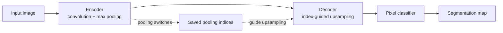

# General Segmentation Context: SegNet And PSPNet

This appendix gives compact background on two general semantic-segmentation
architectures that are useful for reading medical segmentation papers, but are
not core medical architectures in this book. They are not implemented locally,
not listed in `data/architectures.yml`, and not part of the main architecture
catalog.

Use this page as context after reading [FCN](../architectures/fcn.md), and
before comparing encoder-decoder and context-module ideas in
[U-Net](../architectures/unet.md) and
[DeepLabv3+](../architectures/deeplabv3plus.md).

## Why These Stay In The Appendix

SegNet and PSPNet are important general semantic-segmentation references. They
help explain design ideas that appear in later segmentation work, but this
repository keeps the central architecture list focused on medical image
segmentation and a small number of general roots.

| Model | Context role | Local status |
| --- | --- | --- |
| SegNet | General encoder-decoder segmentation with pooling-index-based upsampling. | Appendix only, not implemented locally |
| PSPNet | General scene parsing model that uses pyramid pooling for global context. | Appendix only, not implemented locally |

## SegNet

SegNet is an encoder-decoder segmentation architecture. The encoder applies
convolution and pooling to build compact feature maps. The decoder upsamples
those feature maps back toward image resolution and produces dense segmentation
predictions.

The distinctive SegNet idea is how decoder upsampling uses the max-pooling
indices saved by the corresponding encoder stage. During max pooling, the
encoder records which spatial location won inside each pooling window. During
upsampling, the decoder uses those recorded indices to place activations back
into sparse higher-resolution feature maps before later convolution refines
them.

Compared with [FCN](../architectures/fcn.md), SegNet emphasizes a more explicit
decoder path instead of only upsampling coarse logits. Compared with
[U-Net](../architectures/unet.md), SegNet reuses pooling indices rather than
concatenating full encoder feature maps at matching resolutions. That makes it a
useful contrast for understanding how different decoder designs restore spatial
detail.

## PSPNet

PSPNet, or Pyramid Scene Parsing Network, focuses on global context. A backbone
extracts a feature map, then a pyramid pooling module summarizes that feature
map at several spatial bin sizes. Those pooled summaries are resized back,
combined with the original features, and used to predict dense segmentation
labels.

The key idea is that local features can be ambiguous without broader scene
context. Pyramid pooling gives the model several context views, from coarse
global summaries to finer regional summaries, before the final prediction head.

Compared with [FCN](../architectures/fcn.md), PSPNet adds a structured context
aggregation module on top of dense prediction. Compared with
[DeepLabv3+](../architectures/deeplabv3plus.md), PSPNet is another way to build
multi-scale context: PSPNet pools features at multiple grid scales, while
DeepLab-style modules commonly use atrous convolutions and ASPP branches.

## Relationship To The Main Reading Path

| Idea | Main catalog anchor | How SegNet or PSPNet helps |
| --- | --- | --- |
| Dense pixel prediction | [FCN](../architectures/fcn.md) | Both models still produce per-pixel segmentation outputs. |
| Decoder-based localization | [U-Net](../architectures/unet.md) | SegNet shows a decoder that restores resolution using pooling indices instead of full skip-feature concatenation. |
| Multi-scale context | [DeepLabv3+](../architectures/deeplabv3plus.md) | PSPNet shows pyramid pooling as a different context module from ASPP. |

## References

- SegNet: *A Deep Convolutional Encoder-Decoder Architecture for Image
  Segmentation*, arXiv: [1511.00561](https://arxiv.org/abs/1511.00561).
- PSPNet: *Pyramid Scene Parsing Network*, arXiv:
  [1612.01105](https://arxiv.org/abs/1612.01105).
