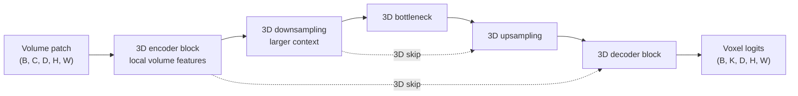

# 3D U-Net

## Plain-Language Overview

3D U-Net is the direct volumetric extension of [U-Net](unet.md). It keeps the
same encoder-decoder shape and skip-connection idea, but it processes volume
patches instead of single 2D images.

A 2D U-Net sees tensors shaped like `(B, C, H, W)`. A 3D U-Net sees tensors
shaped like `(B, C, D, H, W)`, where `D` is the depth axis through the volume.
That extra spatial axis lets the model learn features that continue across
neighboring CT or MRI slices.

## What Problem It Solved

CT, MRI, and microscopy studies are often acquired as volumes, not isolated
images. A slice-only model can miss structures whose shape is only clear when
several adjacent slices are viewed together. 3D U-Net addresses that by making
the convolution, pooling, upsampling, and prediction operations volumetric.

The original paper also targeted sparse annotation. Instead of requiring every
voxel in every training volume to be labeled, the method was designed around
learning dense volumetric predictions from partially labeled volumes or selected
annotated slices.

## Visual Architecture Schematic

This is an original schematic for this book, not a copied paper figure.



## Step-By-Step Walkthrough

1. A 3D volume patch enters the encoder with shape `(B, C, D, H, W)`.
2. 3D convolution blocks mix information across depth, height, and width.
3. 3D downsampling reduces all spatial axes so deeper layers see larger
   volumetric context.
4. The decoder upsamples the feature map back toward the input volume size.
5. Skip connections copy high-resolution 3D feature maps from encoder stages to
   matching decoder stages.
6. A final `1x1x1` convolution returns one logit vector per voxel.

## Minimum Architecture Form

Core building blocks:

- 3D convolution blocks.
- 3D downsampling, usually pooling or strided convolution.
- 3D upsampling, usually transposed convolution or interpolation plus projection.
- Volumetric skip connections between matching encoder and decoder resolutions.
- A `1x1x1` output projection to voxel logits.

Tensor shape flow:

```text
Input volume:      (B, C, D, H, W)
Encoder skip:      (B, F, D, H, W)
Bottleneck:        (B, 2F, D/2, H/2, W/2)
Decoder feature:   (B, F, D, H, W)
Output logits:     (B, K, D, H, W)
```

In this notation, `B` is batch size, `C` is the number of input channels or
modalities, `D` is depth, `H` is height, `W` is width, `F` is a feature width,
and `K` is the number of output classes or masks. See
[Tensor Shape Notation](../foundations/how-to-read-an-architecture.md#tensor-shape-notation)
for the general notation used across the book.

Repo-authored pseudocode:

```text
extract a high-resolution 3D encoder skip
downsample the volume feature map
process the 3D bottleneck
upsample back to the skip tensor size
concatenate 3D skip and decoder features
project to dense per-voxel logits
```

??? example "Minimum runnable PyTorch sketch"

    ```python
    import torch
    from torch import nn
    from torch.nn import functional as F


    class Minimum3DUNet(nn.Module):
        def __init__(self, in_channels: int, out_channels: int) -> None:
            super().__init__()
            self.enc = nn.Sequential(
                nn.Conv3d(in_channels, 8, kernel_size=3, padding=1),
                nn.ReLU(inplace=True),
            )
            self.bottleneck = nn.Sequential(
                nn.Conv3d(8, 16, kernel_size=3, padding=1),
                nn.ReLU(inplace=True),
            )
            self.up = nn.ConvTranspose3d(16, 8, kernel_size=2, stride=2)
            self.dec = nn.Sequential(
                nn.Conv3d(16, 8, kernel_size=3, padding=1),
                nn.ReLU(inplace=True),
            )
            self.out = nn.Conv3d(8, out_channels, kernel_size=1)

        def forward(self, x: torch.Tensor) -> torch.Tensor:
            skip = self.enc(x)
            x = F.max_pool3d(skip, kernel_size=2)
            x = self.bottleneck(x)
            x = self.up(x)
            if x.shape[-3:] != skip.shape[-3:]:
                x = F.interpolate(
                    x,
                    size=skip.shape[-3:],
                    mode="trilinear",
                    align_corners=False,
                )
            x = self.dec(torch.cat((skip, x), dim=1))
            return self.out(x)


    model = Minimum3DUNet(in_channels=1, out_channels=2)
    volume = torch.randn(1, 1, 17, 33, 35)
    logits = model(volume)
    assert logits.shape == (1, 2, 17, 33, 35)
    ```

## Tensor-Shape Intuition

The key difference from 2D U-Net is not the U shape. It is the spatial operator:

| Operation | 2D U-Net | 3D U-Net |
| --- | --- | --- |
| Input tensor | `(B, C, H, W)` | `(B, C, D, H, W)` |
| Local kernel | `k x k` | `k x k x k` |
| Output unit | Pixel logit | Voxel logit |
| Local context | Height and width | Depth, height, and width |

A 2D convolution learns patterns inside one image plane. A 3D convolution learns
patterns inside a small volume. That matters when anatomy, lesions, organs, or
boundaries are ambiguous in one slice but coherent across neighboring slices.

## Memory, Patches, And Sparse Annotation

3D context is useful but expensive. A 3D feature map stores depth, height, width,
channels, batch activations, and gradients. Doubling each spatial axis can make
the activation tensor much larger than the comparable 2D case.

Patch-based training is the practical response. Instead of feeding an entire CT
or MRI scan at once, training samples smaller 3D patches. Inference can use a
sliding-window strategy and stitch overlapping patch predictions back into a
full-volume segmentation. See
[Sliding-Window Inference](../foundations/training-and-evaluation-basics.md#sliding-window-inference)
for the general workflow.

Sparse annotation changes the supervision problem. Full voxel-level labeling is
expensive, so a method that can learn from selected labeled slices or partially
labeled volumes can reduce annotation burden. In practice, the training loss
must be defined so unlabeled voxels do not pretend to be known negatives or
known background.

## When To Prefer Each Approach

| Approach | Prefer when | Main tradeoff |
| --- | --- | --- |
| [2D U-Net](unet.md) | Slices are close to independent, annotations are 2D, memory is limited, or a small tested local baseline is needed. | Misses through-plane context unless preprocessing or postprocessing adds it. |
| 2.5D | Nearby slices help, but full 3D convolutions are too expensive or the output target is still one slice. | Gives limited depth context without true volumetric feature learning. |
| 3D U-Net | The target structure is volumetric and adjacent slices clarify boundaries or shape. | Higher memory cost usually requires patch-based training and inference. |
| [V-Net](vnet.md) | A volumetric encoder-decoder is desired with V-Net-style design choices such as its residual blocks and Dice-style objective. | Also memory intensive, and it is a related 3D branch rather than the direct 2D U-Net translation. |

## Implementation Walkthrough

This repository does not provide a tested local 3D U-Net implementation yet. The
minimum code sketch above is educational only. It is not registered as a package
model, does not include a demo, and does not claim to reproduce the full paper.

## Learning Notes For Practitioners

- 3D U-Net is best understood after the 2D [U-Net](unet.md) chapter because the
  main change is dimensionality, not a new high-level encoder-decoder pattern.
- Use patch size, feature width, and batch size as memory controls.
- Keep voxel spacing and resampling decisions explicit because physical spacing
  changes what a `3x3x3` kernel means anatomically.
- Sparse labels require a loss mask or equivalent supervision policy so
  unlabeled voxels do not distort training.
- Any future local implementation should use small synthetic volumes for CPU
  shape tests and demos.

## What Changed Relative To U-Net

3D U-Net replaces U-Net's 2D operations with 3D counterparts. The encoder,
decoder, bottleneck, output projection, and skip connections remain familiar,
but each stage now operates on depth, height, and width together.

## Strengths

- Models volumetric context directly.
- Preserves the familiar U-Net encoder-decoder and skip-connection structure.
- Fits CT, MRI, and other volume data more naturally than independent 2D slices.
- Makes sparse volumetric annotation a central training motivation.

## Limitations

- The local page is reference-only and does not include tested package code.
- Full 3D training is memory intensive.
- Patch-based workflows can introduce boundary and stitching considerations.
- Volumetric models depend heavily on preprocessing choices such as spacing,
  orientation, cropping, and intensity normalization.

## Implementation Status

| Field | Value |
| --- | --- |
| Status | reference-only |
| Code | Not implemented locally |
| Tests | Not implemented locally |
| Demo | Not implemented locally |
| Data used in examples | synthetic tensors only |
| Metadata ID | `3d_unet` |

!!! note "Educational scope"
    This repository is for education and research. This page does not claim
    clinical readiness.

## Model Details

| Field | Value |
| --- | --- |
| Year | 2016 |
| Parent | U-Net |
| Family | U-Net family, 3D |
| Paper title | 3D U-Net: Learning Dense Volumetric Segmentation from Sparse Annotation |
| DOI | `10.1007/978-3-319-46723-8_49` |
| arXiv | `1606.06650` |

## Read The Original Paper

- DOI: [10.1007/978-3-319-46723-8_49](https://doi.org/10.1007/978-3-319-46723-8_49)
- arXiv: [1606.06650](https://arxiv.org/abs/1606.06650)
