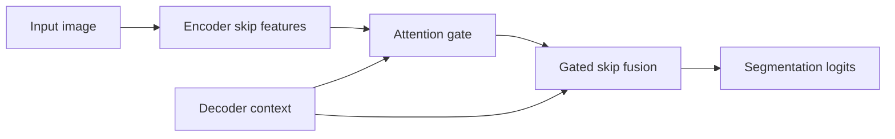

# Attention U-Net

## Plain-Language Overview

Attention U-Net keeps the U-Net encoder-decoder structure and adds attention
gates that filter skip-connection features before the decoder uses them.

## What Problem It Solved

U-Net skip connections copy high-resolution features into the decoder. Attention
U-Net adds a learned gate so the decoder can emphasize skip features that align
with the current decoder context.

## Visual Architecture Schematic

This is an original schematic for this book, not a copied paper figure.



## Step-By-Step Walkthrough

1. The encoder produces skip features.
2. The decoder produces a coarser context feature map.
3. An attention gate combines skip and decoder context to create a mask.
4. The decoder fuses gated skip features and returns logits.

## Minimum Architecture Form

Core building blocks:

- A U-Net-style encoder skip tensor.
- A decoder context tensor.
- An attention gate that produces skip weights.
- A skip-fusion decoder block.

Tensor shape flow:

```text
Input image:       (B, C, H, W)
Skip features:     (B, F, H, W)
Decoder context:   (B, F, H, W)
Gated skip:        (B, F, H, W)
Output logits:     (B, K, H, W)
```

Repo-authored pseudocode:

```text
extract encoder skip features
build decoder context features
predict attention weights from skip and context
multiply skip features by attention weights
fuse gated skip and decoder context
return logits
```

??? example "Minimum runnable PyTorch sketch"

    ```python
    import torch
    from torch import nn
    from torch.nn import functional as F


    class AttentionGate(nn.Module):
        def __init__(self, channels: int) -> None:
            super().__init__()
            self.skip_proj = nn.Conv2d(channels, channels, kernel_size=1)
            self.gate_proj = nn.Conv2d(channels, channels, kernel_size=1)
            self.mask = nn.Conv2d(channels, 1, kernel_size=1)

        def forward(self, skip: torch.Tensor, gate: torch.Tensor) -> torch.Tensor:
            gate = F.interpolate(gate, size=skip.shape[-2:], mode="bilinear", align_corners=False)
            weights = torch.sigmoid(self.mask(torch.relu(self.skip_proj(skip) + self.gate_proj(gate))))
            return skip * weights


    class MinimumAttentionUNet(nn.Module):
        def __init__(self, in_channels: int, out_channels: int) -> None:
            super().__init__()
            self.enc = nn.Conv2d(in_channels, 8, kernel_size=3, padding=1)
            self.down = nn.Conv2d(8, 8, kernel_size=3, stride=2, padding=1)
            self.gate = AttentionGate(8)
            self.fuse = nn.Conv2d(16, 8, kernel_size=3, padding=1)
            self.out = nn.Conv2d(8, out_channels, kernel_size=1)

        def forward(self, x: torch.Tensor) -> torch.Tensor:
            skip = torch.relu(self.enc(x))
            context = torch.relu(self.down(skip))
            context = F.interpolate(context, size=skip.shape[-2:], mode="bilinear", align_corners=False)
            gated_skip = self.gate(skip, context)
            fused = torch.relu(self.fuse(torch.cat((gated_skip, context), dim=1)))
            return self.out(fused)


    model = MinimumAttentionUNet(in_channels=1, out_channels=2)
    image = torch.randn(1, 1, 32, 40)
    logits = model(image)
    assert logits.shape == (1, 2, 32, 40)
    ```

## Implementation Walkthrough

This repository does not provide a tested local Attention U-Net implementation
yet. The minimum code sketch above is educational only. It is not registered as
a package model, does not include a demo, and does not claim to reproduce the
full paper.

## Learning Notes For Practitioners

- The gate is easiest to understand as a learned mask over skip features.
- The decoder still needs shape alignment before gated skip fusion.
- Future local tests should verify gate output shape and output-logit shape.

## What Changed Relative To U-Net

Attention U-Net adds an attention gate between encoder skip features and decoder
fusion.

## Strengths

- Makes skip filtering explicit.
- Keeps the U-Net structure while adding a focused feature-selection step.

## Limitations

- The local page is reference-only and does not include tested package code.
- Attention gates add parameters and shape-alignment requirements.

## Implementation Status

| Field | Value |
| --- | --- |
| Status | reference-only |
| Code | Not implemented locally |
| Tests | Not implemented locally |
| Demo | Not implemented locally |
| Data used in examples | synthetic tensors only |
| Metadata ID | `attention_unet` |

!!! note "Educational scope"
    This repository is for education and research. This page does not claim
    clinical readiness.

## Model Details

| Field | Value |
| --- | --- |
| Year | 2018 |
| Parent | U-Net |
| Family | U-Net family, attention gates |
| Paper title | Attention U-Net: Learning Where to Look for the Pancreas |
| DOI | Not listed |
| arXiv | `1804.03999` |

## Read The Original Paper

- arXiv: [1804.03999](https://arxiv.org/abs/1804.03999)
