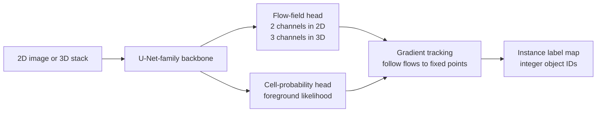

# Cellpose

## Plain-Language Overview

Cellpose is an instance segmentation method for cellular microscopy images.
Instead of asking a network to draw a boundary or predict a fixed object shape,
it asks the network to predict a direction of travel for every pixel.

The training target is motivated by heat diffusion. For each annotated cell
mask, Cellpose treats the object centre as a heat source and computes a vector
field that points pixels back toward that centre. At inference time, pixels
follow the predicted flow. Pixels whose paths end at the same fixed point are
grouped into one instance.

This representation matters because it avoids the star-convex shape assumption
used by [StarDist-3D](stardist-3d.md). A cell can be irregular, non-convex, or
moderately elongated and still be recoverable if the predicted flow field leads
its pixels back to a common centre.

## What Problem It Solved

Plain semantic segmentation predicts foreground and background, but it does not
directly assign separate IDs to touching cells. StarDist-style instance
segmentation solves that by predicting object geometry, but its polygons or
polyhedra assume objects can be described from a centre by rays to the boundary.

Cellpose changes the representation. It keeps a U-Net-family dense predictor,
but the output is a learned flow field plus a cell-probability map. This makes
the grouping step depend on where pixels flow, not on a fixed shape template.

## Visual Architecture Schematic

This is an original schematic for this book, not a copied paper figure.



## Step-By-Step Walkthrough

1. A microscopy image or volume enters a U-Net-family backbone.
2. The network predicts a dense flow vector at every pixel or voxel.
3. A second head predicts cell probability, separating likely cell pixels from
   background.
4. During inference, candidate cell pixels are moved through the predicted
   vector field by gradient tracking.
5. Pixels whose trajectories converge to the same fixed point are assigned the
   same instance ID.
6. The final output is an integer-valued instance label image or volume.

## Architecture Description

Backbone:

- Cellpose uses a U-Net-family encoder-decoder as the dense image-to-image
  predictor.
- The backbone preserves spatial resolution at the output so each input pixel
  receives a flow vector and a cell-probability value.

Flow-field output head:

- In 2D, the flow head predicts two channels, one horizontal and one vertical
  component, for every pixel.
- In 3D, the combined flow representation has three components for every voxel.
- The target flow is derived from the heat diffusion solution inside each
  ground-truth instance mask, with the object centre acting as the heat source.

Cell-probability head:

- The probability head predicts whether each pixel belongs to a cell.
- It gates the gradient-tracking step so background pixels are not forced into
  instance trajectories.

Gradient-tracking inference:

- Cell pixels are iteratively moved along the predicted flow field.
- Pixels that converge to the same endpoint are clustered into one object.
- The output is an instance label map rather than semantic class logits.

## Minimum Architecture Form

Core building blocks:

- U-Net-family dense feature extractor.
- Flow-field prediction head.
- Cell-probability prediction head.
- Heat-diffusion-derived training targets for instance masks.
- Gradient tracking to group pixels into object instances.
- Orthogonal-plane averaging for 3D use.

Tensor shape flow:

```text
2D input image:      (B, C, H, W)
Backbone features:   (B, F, H, W)
2D flow map:         (B, 2, H, W)
Cell probability:    (B, 1, H, W)
Gradient tracking:   follow 2D vectors to fixed points
Instance labels:     (B, 1, H, W)

3D input volume:     (B, C, D, H, W)
Orthogonal slices:   XY, XZ, and YZ views processed by the 2D model
3D flow map:         (B, 3, D, H, W)
Cell probability:    (B, 1, D, H, W)
Gradient tracking:   follow 3D vectors to fixed points
Instance labels:     (B, 1, D, H, W)
```

`B` is batch size, `C` is input channels, `F` is feature width, and `D`, `H`,
and `W` are spatial depth, height, and width. See
[Tensor Shape Notation](../foundations/how-to-read-an-architecture.md#tensor-shape-notation)
for the general notation used across the book.

Repo-authored pseudocode:

```text
compute heat-diffusion flow targets inside each training instance mask
train a U-Net-family model to predict flow vectors and cell probability
threshold or weight pixels by predicted cell probability
move each cell pixel through the predicted flow field
cluster pixels whose trajectories end at the same fixed point
return an integer-valued instance label map
```

??? example "Minimum educational PyTorch shape sketch"

    ```python
    import torch
    from torch import nn


    class MinimumCellposeHeads(nn.Module):
        """Shape-only sketch of Cellpose-style dense prediction heads."""

        def __init__(self, in_channels: int) -> None:
            super().__init__()
            self.features = nn.Sequential(
                nn.Conv2d(in_channels, 8, kernel_size=3, padding=1),
                nn.ReLU(inplace=True),
                nn.Conv2d(8, 8, kernel_size=3, padding=1),
                nn.ReLU(inplace=True),
            )
            self.flow = nn.Conv2d(8, 2, kernel_size=1)
            self.cell_probability = nn.Conv2d(8, 1, kernel_size=1)

        def forward(self, image: torch.Tensor) -> tuple[torch.Tensor, torch.Tensor]:
            features = self.features(image)
            flow = self.flow(features)
            cell_probability = torch.sigmoid(self.cell_probability(features))
            return flow, cell_probability


    model = MinimumCellposeHeads(in_channels=1)
    image = torch.randn(1, 1, 64, 64)
    flow, probability = model(image)
    assert flow.shape == (1, 2, 64, 64)
    assert probability.shape == (1, 1, 64, 64)
    ```

This sketch only shows the prediction-head shape contract. It does not implement
Cellpose training targets, gradient tracking, 3D orthogonal-plane averaging,
model restoration, or the official package behavior.

## Tensor-Shape Intuition

For a 2D image, Cellpose starts with an image-shaped tensor and returns two
dense predictions:

```text
Input image:      H x W image
U-Net features:   dense feature map aligned to H x W
Flow map:         2 x H x W
Probability map:  1 x H x W
Tracking output:  H x W integer-valued instance label map
```

For a 3D volume, the final representation is volumetric:

```text
Input volume:     D x H x W volume
U-Net features:   2D features computed on orthogonal slice planes
Flow map:         3 x D x H x W
Probability map:  1 x D x H x W
Tracking output:  D x H x W integer-valued instance label map
```

The flow channels are not semantic classes. They are vector components that
tell each cell pixel where to move next. The probability channel identifies
which pixels should participate in the flow-tracking step.

## Implementation Walkthrough

This repository does not provide a tested local Cellpose implementation. The
shape sketch above is educational only. It is not registered as a package model,
does not include a demo, and does not claim to reproduce the full paper or the
official package.

Heat-diffusion flow targets:

- Training starts from instance masks, where each cell has its own object ID.
- For each object, Cellpose computes a target vector field from a heat diffusion
  construction with the object centre as the source.
- The resulting vectors point pixels through the object interior toward that
  centre.
- The network learns to reproduce those vectors from the raw image, plus a
  separate cell-probability map.

3D orthogonal-plane averaging:

- The 3D extension applies the same 2D model to slices in the XY, XZ, and YZ
  planes.
- Each plane predicts in-plane flow components.
- The six resulting directional components are averaged into a full 3D vector
  gradient for each voxel.
- Because the model is still trained from 2D masks and applied across
  orthogonal views, this avoids requiring 3D-labelled training data for the 3D
  extension.

Cellpose 2.0:

- Cellpose 2.0 adds a human-in-the-loop retraining workflow.
- Practitioners can start from a pretrained model, correct outputs on their own
  images, and train a custom model for the local imaging protocol.

Cellpose 3.0:

- Cellpose 3.0 adds image restoration as part of the workflow and improves 3D
  handling.
- The `flow3D_smooth` option targets smoother 3D flow behavior.
- The `pretrained_model_ortho` variant is relevant for improved 3D stacks and
  should be tested explicitly when evaluating volumetric elongated-cell
  segmentation.

## Implementation Resources

- Official code: [MouseLand/cellpose](https://github.com/MouseLand/cellpose)

## Learning Notes For Practitioners

- Cellpose is a strong candidate when objects are irregular, not well described
  by a star-convex shape prior, or moderately elongated.
- StarDist-3D is often easier to reason about when objects are round or ovoid
  and a centre-to-boundary ray representation is adequate.
- Cellpose is different from plain semantic segmentation because it recovers
  individual object IDs by tracking flows, not by only classifying foreground
  pixels.
- For other elongated structures, treat Cellpose as a measurable baseline rather
  than an assumed solution. Flow tracking toward a centre point works well for
  cells with aspect ratios up to about 5:1, but the gradient may not propagate
  reliably over longer distances.
- That limitation is characterisable: run Cellpose on the elongated structures
  of interest, measure the aspect-ratio breakpoint, and report that behavior in
  the PhD work.
- For 3D stacks, test Cellpose 3.0 with `pretrained_model_ortho` explicitly
  because it was added for improved 3D handling.

## What Changed Relative To StarDist-3D And Semantic Segmentation

Relative to [StarDist-3D](stardist-3d.md), Cellpose replaces explicit shape
parameters with a flow field. StarDist-3D predicts star-convex polyhedra and
uses NMS to prune overlapping candidates. Cellpose predicts where each pixel
should flow and groups pixels by convergence.

Relative to semantic segmentation, Cellpose keeps dense per-pixel prediction but
changes the output contract. A semantic model returns class logits. Cellpose
returns a vector field and a cell-probability map, then uses a non-neural
tracking step to produce instance IDs.

## Strengths

- Produces instance labels rather than only foreground masks.
- Avoids an explicit star-convex shape prior.
- Handles irregular, non-convex, and moderately elongated cell shapes better
  than fixed polygon or polyhedron representations.
- Extends to 3D by reusing a 2D model across orthogonal planes instead of
  requiring 3D-labelled training data.
- Supports human-in-the-loop adaptation through the Cellpose 2.0 retraining
  workflow.

## Limitations

- The local page is reference-only and does not include tested package code.
- Flow field integration can fail for very elongated objects.
- The 3D extension assumes the object appears coherently in XY, XZ, and YZ
  planes, which can break down for objects with extreme aspect ratios.
- Performance on densely packed elongated structures is not well characterised
  in the original paper.
- Reported paper behavior does not establish clinical readiness for a new
  modality, annotation protocol, or deployment setting.

## Implementation Status

| Field | Value |
| --- | --- |
| Status | reference-only |
| Code in `src/` | No local `src/` implementation |
| Tests | No local tests |
| Demo | No local demo |
| Documentation-only page | Yes |
| Data scope | Synthetic examples only |
| Metadata ID | `cellpose` |

!!! note "Educational scope"
    This repository is for education and research. This page does not claim
    clinical readiness.

## Model Details

| Field | Value |
| --- | --- |
| Year | 2021 |
| Parent | StarDist-3D |
| Family | instance-segmentation |
| Paper title | Cellpose: a generalist algorithm for cellular segmentation |
| Authors | Carsen Stringer, Tim Wang, Michalis Michaelos, Marius Pachitariu |
| Venue | Nature Methods, 2021 |
| DOI | `10.1038/s41592-020-01018-x` |
| PMID | `33318659` |
| arXiv | `null` |

## Read The Original Paper

- DOI: [10.1038/s41592-020-01018-x](https://doi.org/10.1038/s41592-020-01018-x)
- Official code: [MouseLand/cellpose](https://github.com/MouseLand/cellpose)

Related Cellpose versions:

- Cellpose 2.0: Cellpose 2.0: how to train your own model,
  DOI [10.1038/s41592-022-01663-4](https://doi.org/10.1038/s41592-022-01663-4),
  2022.
- Cellpose 3.0: Cellpose3: one-click image restoration for improved
  segmentation,
  DOI [10.1038/s41592-025-02604-7](https://doi.org/10.1038/s41592-025-02604-7),
  2025.

```text
Cellpose citation
Title: Cellpose: a generalist algorithm for cellular segmentation
Authors: Carsen Stringer, Tim Wang, Michalis Michaelos, Marius Pachitariu
Venue: Nature Methods, 2021
Year: 2021
DOI: 10.1038/s41592-020-01018-x
PMID: 33318659
```
