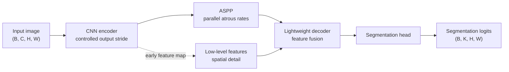

# DeepLabv3+

## Plain-Language Overview

DeepLabv3+ is a general computer-vision semantic segmentation architecture. It
is not medical-specific, but it is useful background for medical segmentation
readers because it shows how atrous convolution, multi-scale context, and a
decoder for sharper boundaries can be combined in one dense prediction model.

## Core idea

DeepLabv3+ keeps a convolutional encoder at a controlled output stride, uses
Atrous Spatial Pyramid Pooling (ASPP) to inspect features at multiple dilation
rates, and adds a simple decoder that fuses high-level context with lower-level
spatial features.

Atrous, or dilated, convolution increases the effective receptive field without
requiring extra pooling. ASPP applies several such views in parallel so the
model can use both smaller and larger context windows before producing dense
segmentation logits.

## What Problem It Solved

Earlier dense prediction models often had to choose between coarse but
context-rich features and sharper but less semantic spatial detail. DeepLabv3+
combined spatial pyramid pooling with encoder-decoder refinement so the model
could keep multi-scale context while improving object-boundary detail.

## Visual Architecture Schematic

This is an original schematic for this book, not a copied paper figure.



## Step-By-Step Walkthrough

1. A convolutional encoder extracts feature maps while preserving more spatial
   resolution than a heavily downsampled classification backbone.
2. ASPP applies parallel atrous convolutions with different dilation rates to
   collect multi-scale context.
3. A low-level feature map from the encoder is projected to fewer channels.
4. The ASPP output is upsampled and fused with the low-level feature map.
5. A lightweight decoder refines the fused representation and returns dense
   logits at the input resolution.

## Minimum Architecture Form

Core building blocks:

- A convolutional encoder that produces high-level features and a low-level
  feature map.
- Parallel atrous convolution branches for ASPP.
- A projection for low-level spatial features.
- A decoder that fuses ASPP context with spatial detail.
- A final per-pixel prediction head.

Tensor shape flow:

```text
Input image:          (B, C, H, W)
Low-level features:   (B, L, H/4, W/4)
Encoder features:     (B, F, H/16, W/16)
ASPP context:         (B, A, H/16, W/16)
Decoder features:     (B, D, H/4, W/4)
Output logits:        (B, K, H, W)
```

Where `B` is batch size, `C` is input channels or modalities, `K` is output
classes, and `H` and `W` are spatial dimensions. See
[Tensor Shape Notation](../foundations/how-to-read-an-architecture.md#tensor-shape-notation)
for the shared notation used across this book.

Repo-authored pseudocode:

```text
extract low-level and high-level encoder features
run high-level features through parallel atrous convolution branches
combine ASPP branches into a context feature map
project low-level features to a compact channel count
upsample ASPP context and concatenate it with low-level features
refine fused features with a lightweight decoder
upsample logits to the input spatial size
```

??? example "Minimum runnable PyTorch sketch"

    ```python
    import torch
    from torch import nn
    from torch.nn import functional as F


    class AtrousSeparableConv(nn.Module):
        def __init__(self, channels: int, dilation: int) -> None:
            super().__init__()
            self.depthwise = nn.Conv2d(
                channels,
                channels,
                kernel_size=3,
                padding=dilation,
                dilation=dilation,
                groups=channels,
            )
            self.pointwise = nn.Conv2d(channels, channels, kernel_size=1)

        def forward(self, x: torch.Tensor) -> torch.Tensor:
            return torch.relu(self.pointwise(self.depthwise(x)))


    class MinimumDeepLabV3Plus(nn.Module):
        def __init__(self, in_channels: int, out_channels: int) -> None:
            super().__init__()
            self.low = nn.Conv2d(in_channels, 8, kernel_size=3, stride=4, padding=1)
            self.encoder = nn.Conv2d(8, 16, kernel_size=3, stride=4, padding=1)
            self.aspp = nn.ModuleList(
                AtrousSeparableConv(16, dilation=rate) for rate in (1, 2, 4)
            )
            self.low_project = nn.Conv2d(8, 8, kernel_size=1)
            self.decoder = nn.Sequential(
                nn.Conv2d(16 * 3 + 8, 24, kernel_size=3, padding=1),
                nn.ReLU(inplace=True),
                nn.Conv2d(24, out_channels, kernel_size=1),
            )

        def forward(self, x: torch.Tensor) -> torch.Tensor:
            input_size = x.shape[-2:]
            low = torch.relu(self.low(x))
            high = torch.relu(self.encoder(low))
            context = torch.cat([branch(high) for branch in self.aspp], dim=1)
            context = F.interpolate(
                context, size=low.shape[-2:], mode="bilinear", align_corners=False
            )
            low = torch.relu(self.low_project(low))
            logits = self.decoder(torch.cat((context, low), dim=1))
            return F.interpolate(logits, size=input_size, mode="bilinear", align_corners=False)


    model = MinimumDeepLabV3Plus(in_channels=1, out_channels=3)
    image = torch.randn(2, 1, 64, 80)
    logits = model(image)
    assert logits.shape == (2, 3, 64, 80)
    ```

## What changed compared with FCN/U-Net-style decoders

Compared with a basic FCN, DeepLabv3+ does more than classify a coarse feature
map and upsample it. The ASPP module explicitly gathers context at several
effective receptive-field sizes before decoding.

Compared with a classic U-Net-style decoder, DeepLabv3+ uses a lighter decoder.
It does not rely on a full symmetric expansion path with skip connections at
every resolution. Instead, it mainly combines high-level ASPP context with a
low-level feature map to improve localization and boundary detail.

## Why medical segmentation readers should know it

- It teaches atrous convolution, a common way to increase context without
  losing as much spatial resolution.
- It makes ASPP concrete: several dilation rates inspect the same feature map at
  different scales.
- It separates multi-scale context from decoder refinement, which helps readers
  compare context modules with U-Net-style skip pathways.
- It is useful vocabulary for papers that adapt DeepLab-style context modules
  to organs, lesions, cells, or other medical targets.

## When it may or may not be a good baseline

DeepLabv3+ may be a reasonable baseline when the task is 2D semantic
segmentation, multi-scale appearance is important, and a general computer-vision
encoder-decoder reference is acceptable.

It may be a weak baseline when the task needs native 3D context, very small
structures dominate the metric, domain-specific preprocessing is more important
than the model block, or a project requires a locally implemented model from
this repository.

## Limitations

- DeepLabv3+ was introduced for general semantic segmentation, not specifically
  for medical imaging.
- The ASPP dilation rates and output stride need task-specific tuning.
- A 2D DeepLabv3+ baseline does not automatically capture volumetric CT, MRI, or
  ultrasound context across slices.
- Boundary refinement is helpful, but it does not replace dataset-specific
  annotation quality, preprocessing, loss design, or clinical validation.
- The local page is reference-only and does not include tested package code.

## Implementation Status

| Field | Value |
| --- | --- |
| Status | reference-only |
| Code in `src/` | No local `src/` implementation |
| Tests | No local tests |
| Demo | No local demo |
| Documentation-only page | Yes |
| Data scope | Synthetic examples only |
| Metadata ID | `deeplabv3plus` |

!!! note "Educational scope"
    This repository is for education and research. This page does not claim
    clinical readiness.

## Model Details

| Field | Value |
| --- | --- |
| Year | 2018 |
| Parent | FCN |
| Family | General CV dense prediction, atrous encoder-decoder |
| Paper title | Encoder-Decoder with Atrous Separable Convolution for Semantic Image Segmentation |
| DOI | `10.1007/978-3-030-01234-2_49` |
| arXiv | `1802.02611` |

## Read The Original Paper

- DOI: [10.1007/978-3-030-01234-2_49](https://doi.org/10.1007/978-3-030-01234-2_49)
- arXiv: [1802.02611](https://arxiv.org/abs/1802.02611)
