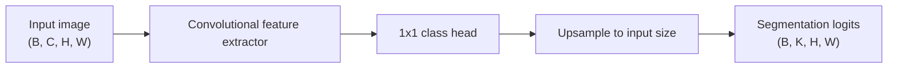

# Fully Convolutional Network

## Plain-Language Overview

Fully Convolutional Networks turn image classification-style feature maps into
dense pixel predictions. Instead of returning one label for the whole image, the
network returns one logit vector per pixel.

## What Problem It Solved

FCN made dense semantic segmentation practical with convolutional networks by
replacing fixed fully connected classifiers with convolutional prediction heads
and upsampling coarse feature maps back to image resolution.

## Visual Architecture Schematic

This is an original schematic for this book, not a copied paper figure.



## Step-By-Step Walkthrough

1. A convolutional feature extractor converts the image into lower-resolution
   feature maps.
2. A `1x1` convolution maps feature channels to output classes.
3. Upsampling restores the class logits to the input height and width.

## Minimum Architecture Form

Core building blocks:

- A convolutional feature extractor.
- A per-pixel `1x1` prediction head.
- An upsampling operation that restores the input spatial size.

Tensor shape flow:

```text
Input image:      (B, C, H, W)
Coarse features:  (B, F, H/2, W/2)
Coarse logits:    (B, K, H/2, W/2)
Output logits:    (B, K, H, W)
```

Repo-authored pseudocode:

```text
save input spatial size
extract coarse convolutional features
project features to class logits with 1x1 convolution
interpolate logits back to input height and width
return raw logits
```

??? example "Minimum runnable PyTorch sketch"

    ```python
    import torch
    from torch import nn
    from torch.nn import functional as F


    class MinimumFCN(nn.Module):
        def __init__(self, in_channels: int, out_channels: int) -> None:
            super().__init__()
            self.features = nn.Sequential(
                nn.Conv2d(in_channels, 8, kernel_size=3, stride=2, padding=1),
                nn.ReLU(inplace=True),
                nn.Conv2d(8, 16, kernel_size=3, padding=1),
                nn.ReLU(inplace=True),
            )
            self.classifier = nn.Conv2d(16, out_channels, kernel_size=1)

        def forward(self, x: torch.Tensor) -> torch.Tensor:
            input_size = x.shape[-2:]
            x = self.features(x)
            x = self.classifier(x)
            return F.interpolate(x, size=input_size, mode="bilinear", align_corners=False)


    model = MinimumFCN(in_channels=1, out_channels=3)
    image = torch.randn(2, 1, 32, 40)
    logits = model(image)
    assert logits.shape == (2, 3, 32, 40)
    ```

## Implementation Walkthrough

This repository does not provide a tested local FCN implementation yet. The
minimum code sketch above is educational only. It is not registered as a package
model, does not include a demo, and does not claim to reproduce the full paper.

## Learning Notes For Practitioners

- FCN is the parent concept for dense prediction in this catalog.
- The minimum form exposes the central idea: classify each spatial location,
  then restore the prediction map to image resolution.
- Training, pretrained backbones, skip variants, and benchmark settings are out
  of scope for this reference-only page.

## What Changed Relative To Classification CNNs

FCN keeps spatial feature maps through the prediction head so the network can
produce dense segmentation logits instead of one image-level class vector.

## Strengths

- Introduces a direct convolutional path from image features to dense logits.
- Provides a foundation for later encoder-decoder segmentation architectures.

## Limitations

- The local page is reference-only and does not include tested package code.
- Coarse feature maps can lose boundary detail unless additional refinement or
  skip connections are added.

## Implementation Status

| Field | Value |
| --- | --- |
| Status | reference-only |
| Code | Not implemented locally |
| Tests | Not implemented locally |
| Demo | Not implemented locally |
| Data used in examples | synthetic tensors only |
| Metadata ID | `fcn` |

!!! note "Educational scope"
    This repository is for education and research. This page does not claim
    clinical readiness.

## Model Details

| Field | Value |
| --- | --- |
| Year | 2015 |
| Parent | None |
| Family | Dense prediction |
| Paper title | Fully Convolutional Networks for Semantic Segmentation |
| DOI | `10.1109/CVPR.2015.7298965` |
| arXiv | `1411.4038` |

## Read The Original Paper

- DOI: [10.1109/CVPR.2015.7298965](https://doi.org/10.1109/CVPR.2015.7298965)
- arXiv: [1411.4038](https://arxiv.org/abs/1411.4038)
