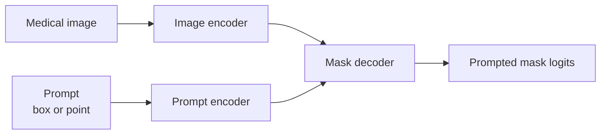

# MedSAM

## Plain-Language Overview

MedSAM represents promptable medical image segmentation. Instead of predicting a
fixed task-specific mask from only an image, a prompt such as a box guides the
segmentation output.

In this book, MedSAM is the general medical SAM-style reference page. Related
reference-only pages cover [SAM-Med2D](sam-med2d.md) for 2D medical adaptation,
[SAM-Med3D](sam-med3d.md) for volumetric prompting, and [MedSAM2](medsam2.md)
for 3D image and video-style prompting.

## What Problem It Solved

Promptable segmentation changes the workflow from one fixed class head to an
image encoder plus prompt-conditioned mask decoder.

## Visual Architecture Schematic

This is an original schematic for this book, not a copied paper figure.



## Step-By-Step Walkthrough

1. Encode the image into spatial features.
2. Encode the prompt into conditioning features.
3. Combine image and prompt features in a mask decoder.
4. Upsample the prompted mask logits to image resolution.

## Minimum Architecture Form

Core building blocks:

- Image encoder.
- Prompt encoder.
- Prompt-conditioned mask decoder.
- Upsampling to image resolution.

Tensor shape flow:

```text
Input image:       (B, C, H, W)
Prompt vector:     (B, 4)
Image features:    (B, F, H/4, W/4)
Prompt features:   (B, F, H/4, W/4)
Mask logits:       (B, 1, H, W)
```

Repo-authored pseudocode:

```text
encode the image
encode the prompt into feature channels
broadcast prompt features over the image-feature grid
decode image-plus-prompt features into mask logits
upsample logits to image size
```

??? example "Minimum runnable PyTorch sketch"

    ```python
    import torch
    from torch import nn
    from torch.nn import functional as F


    class MinimumPromptSegmenter(nn.Module):
        def __init__(self, in_channels: int) -> None:
            super().__init__()
            self.image_encoder = nn.Sequential(
                nn.Conv2d(in_channels, 16, kernel_size=3, stride=4, padding=1),
                nn.ReLU(inplace=True),
            )
            self.prompt_encoder = nn.Linear(4, 16)
            self.mask_decoder = nn.Sequential(
                nn.Conv2d(32, 16, kernel_size=3, padding=1),
                nn.ReLU(inplace=True),
                nn.Conv2d(16, 1, kernel_size=1),
            )

        def forward(self, image: torch.Tensor, box_prompt: torch.Tensor) -> torch.Tensor:
            image_size = image.shape[-2:]
            image_features = self.image_encoder(image)
            prompt_features = self.prompt_encoder(box_prompt).view(image.shape[0], 16, 1, 1)
            prompt_features = prompt_features.expand_as(image_features)
            logits = self.mask_decoder(torch.cat((image_features, prompt_features), dim=1))
            return F.interpolate(logits, size=image_size, mode="bilinear", align_corners=False)


    model = MinimumPromptSegmenter(in_channels=1)
    image = torch.randn(1, 1, 32, 32)
    box_prompt = torch.tensor([[4.0, 4.0, 24.0, 24.0]])
    logits = model(image, box_prompt)
    assert logits.shape == (1, 1, 32, 32)
    ```

## Implementation Walkthrough

This repository does not provide a tested local MedSAM implementation yet. The
minimum code sketch above is educational only. It is not registered as a package
model, does not include a demo, does not load model weights, and does not claim
to reproduce the full paper.

## Learning Notes For Practitioners

- The minimum form shows the image-plus-prompt conditioning pattern.
- Full promptable systems include much larger encoders, prompt handling, and
  mask decoding behavior than this educational snippet.
- This page does not load private medical images, clinical data, or pretrained
  weights.

## What Changed Relative To Fixed-Task Segmentation

MedSAM-style segmentation conditions the mask on a prompt rather than using only
a fixed output head for one predefined task.

Classic fully supervised segmentation usually follows `image -> fixed task mask`.
SAM-style prompting changes the interface to `image + prompt -> prompted mask`.
The prompt can be a point, box, or mask-like cue, but it is conditioning input,
not a ground-truth label or a clinical decision.

## Strengths

- Makes prompt-conditioned segmentation explicit.
- Separates image representation from prompt guidance.

## Limitations

- The local page is reference-only and does not include tested package code.
- The minimum sketch is not a foundation-model implementation and does not load
  pretrained weights.
- Medical deployment requires independent validation for the modality, scanner,
  site, annotator policy, prompt policy, and clinical workflow.

## Implementation Status

| Field | Value |
| --- | --- |
| Status | reference-only |
| Code in `src/` | No local `src/` implementation |
| Tests | No local tests |
| Demo | No local demo |
| Documentation-only page | Yes |
| Data scope | Synthetic examples only |
| Metadata ID | `medsam` |

!!! note "Educational scope"
    This repository is for education and research. This page does not claim
    clinical readiness.

## Model Details

| Field | Value |
| --- | --- |
| Year | 2024 |
| Parent | None |
| Family | Promptable foundation model |
| Paper title | Segment Anything in Medical Images |
| DOI | `10.1038/s41467-024-44824-z` |
| arXiv | `2304.12306` |

## Read The Original Paper

- DOI: [10.1038/s41467-024-44824-z](https://doi.org/10.1038/s41467-024-44824-z)
- arXiv: [2304.12306](https://arxiv.org/abs/2304.12306)
