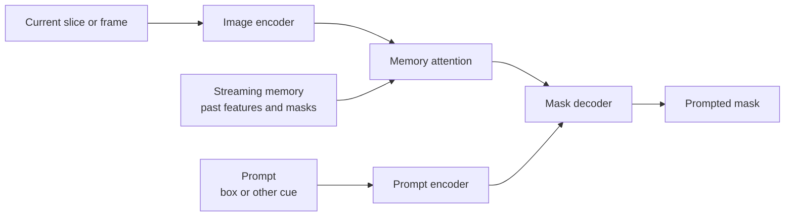

# MedSAM2

## Plain-Language Overview

MedSAM2 is a promptable foundation-model adaptation for 3D medical images and
medical videos. It extends the SAM-style interface from single 2D images toward
slice sequences, volume-like data, and temporal frames.

Classic fully supervised segmentation usually predicts a fixed task mask from an
image or volume:

```text
image or volume -> fixed task mask
```

MedSAM2-style prompting conditions the mask on an input prompt and on information
from nearby slices or frames:

```text
3D image or video + prompt + memory -> prompted masks
```

The prompt helps specify the intended target. It is not a clinical truth label
and it does not remove the need for task-specific validation.

## What Problem It Solved

2D promptable medical models can treat each slice or frame independently. That
can be limiting when anatomy, lesions, instruments, or organs continue across
adjacent slices or video frames. MedSAM2 adapts the SAM2-style idea of memory and
frame continuity to 3D medical images and medical videos.

## Visual Architecture Schematic

This is an original schematic for this book, not a copied paper figure.



## Step-By-Step Walkthrough

1. Encode the current 2D slice or video frame.
2. Encode the prompt that identifies the target region.
3. Condition current features on memory from previous slices, frames, or masks.
4. Decode the prompted mask for the current step.
5. Propagate or refine predictions across a slice or frame sequence.

## Minimum Architecture Form

Core building blocks:

- Image encoder for each slice or frame.
- Prompt encoder.
- Memory module that carries information across slices or frames.
- Memory-conditioned mask decoder.

Tensor shape flow:

```text
Current slice:      (B, C, H, W)
Prompt features:    (B, P)
Memory features:    (B, T, F, H/s, W/s)
Current features:   (B, F, H/s, W/s)
Mask logits:        (B, 1, H, W)
```

Where `T` is the number of remembered slices or frames, `P` is a compact prompt
representation, `F` is the feature-channel count, and `s` is the encoder stride.
See
[Tensor Shape Notation](../foundations/how-to-read-an-architecture.md#tensor-shape-notation)
for the general shape notation.

Repo-authored pseudocode:

```text
encode the current slice or frame
encode the prompt
read memory from previous slices or frames
condition current features on memory
decode a prompted mask for the current slice or frame
update memory with the new prediction
```

??? example "Minimum runnable PyTorch sketch"

    ```python
    import torch
    from torch import nn
    from torch.nn import functional as F


    class MinimumMedSAM2StyleSegmenter(nn.Module):
        def __init__(self, in_channels: int) -> None:
            super().__init__()
            self.image_encoder = nn.Sequential(
                nn.Conv2d(in_channels, 16, kernel_size=3, stride=4, padding=1),
                nn.ReLU(inplace=True),
            )
            self.prompt_encoder = nn.Linear(4, 16)
            self.memory_projection = nn.Conv2d(16, 16, kernel_size=1)
            self.mask_decoder = nn.Sequential(
                nn.Conv2d(48, 16, kernel_size=3, padding=1),
                nn.ReLU(inplace=True),
                nn.Conv2d(16, 1, kernel_size=1),
            )

        def forward(
            self,
            image: torch.Tensor,
            box_prompt: torch.Tensor,
            memory: torch.Tensor,
        ) -> torch.Tensor:
            image_size = image.shape[-2:]
            image_features = self.image_encoder(image)
            prompt_features = self.prompt_encoder(box_prompt).view(image.shape[0], 16, 1, 1)
            prompt_features = prompt_features.expand_as(image_features)
            memory_features = self.memory_projection(memory.mean(dim=1))
            logits = self.mask_decoder(
                torch.cat((image_features, prompt_features, memory_features), dim=1)
            )
            return F.interpolate(logits, size=image_size, mode="bilinear", align_corners=False)


    model = MinimumMedSAM2StyleSegmenter(in_channels=1)
    image = torch.randn(1, 1, 32, 32)
    box_prompt = torch.tensor([[4.0, 4.0, 28.0, 28.0]])
    memory = torch.randn(1, 3, 16, 8, 8)
    logits = model(image, box_prompt, memory)
    assert logits.shape == (1, 1, 32, 32)
    ```

## Prompt Types And Memory

Points, boxes, and masks are different ways to condition a promptable segmenter.
A box gives a coarse region, a point gives sparse location feedback, and a mask
can provide a previous or draft segmentation. MedSAM2-style systems add a memory
path so predictions can use context from earlier slices or frames.

Memory is not a guarantee of correctness. It can help preserve continuity, but it
can also propagate earlier mistakes if prompts, predictions, or image context are
wrong.

## Implementation Walkthrough

This repository does not provide a tested local MedSAM2 implementation. The
minimum code sketch above is educational only. It is not registered as a package
model, does not include a demo, does not load model weights, and does not claim
to reproduce the full paper.

## Learning Notes For Practitioners

- MedSAM2 represents the 3D image and video-style promptable branch in this book.
- The important idea is not just "larger SAM"; it is prompt-conditioned
  segmentation with memory across slices or frames.
- 3D and video-style extensions must be validated for propagation errors,
  discontinuities, missing small structures, and domain shift across modalities
  and institutions.
- A prompt policy should be part of the validation protocol. Results from box
  prompts, point prompts, and mask prompts are not interchangeable by default.

## What Changed Relative To 2D Promptable Segmentation

MedSAM2 adds sequence context to the promptable segmentation workflow. A 2D
promptable adaptation can segment one image or slice at a time, while MedSAM2
uses memory-conditioned features to support 3D medical images and videos where
targets persist across neighboring slices or frames.

## Strengths

- Makes 3D and video-style promptable segmentation explicit.
- Uses memory to represent continuity across slices or frames.
- Keeps the prompt-conditioned segmentation interface visible to users.

## Limitations

- The local page is reference-only and does not include tested package code.
- The minimum sketch is not a foundation-model implementation and does not load
  pretrained weights.
- Memory can propagate errors when an early prompt or mask is wrong.
- Validation must account for modality, scanner, institution, anatomy, pathology,
  annotator, and prompt-policy shift.
- This page does not claim clinical readiness, regulatory approval, or safety for
  diagnosis or treatment decisions.

## Implementation Status

| Field | Value |
| --- | --- |
| Status | reference-only |
| Code in `src/` | No local `src/` implementation |
| Tests | No local tests |
| Demo | No local demo |
| Documentation-only page | Yes |
| Data scope | Synthetic examples only |
| Metadata ID | `medsam2` |

!!! note "Educational scope"
    This repository is for education and research. This page does not claim
    clinical readiness.

## Model Details

| Field | Value |
| --- | --- |
| Year | 2025 |
| Parent | None |
| Family | Promptable foundation model, 3D and video |
| Paper title | MedSAM2: Segment Anything in 3D Medical Images and Videos |
| DOI | Not listed |
| arXiv | `2504.03600` |

## Read The Original Paper

- arXiv: [2504.03600](https://arxiv.org/abs/2504.03600)
