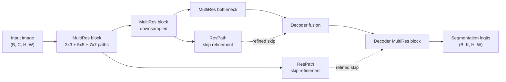

# MultiResUNet

## Plain-Language Overview

MultiResUNet is a U-Net-style architecture that changes both the local feature
blocks and the skip paths. It uses MultiRes blocks to collect multi-scale
features inside a single encoder or decoder level, then uses ResPaths to refine
features as they travel across skip connections.

## What Problem It Solved

U-Net captures multi-scale information mainly by moving down and back up the
encoder-decoder pyramid. MultiResUNet adds multi-scale feature extraction inside
each level through parallel 3x3, 5x5, and 7x7-style receptive fields, implemented
cheaply as stacked 3x3 convolutions.

The supplied source description also states that ResPaths reduce the semantic
gap between encoder and decoder features, which is a different approach to a
problem also addressed by Attention U-Net.

## Visual Architecture Schematic

This is an original schematic for this book, not a copied paper figure.



## Step-By-Step Walkthrough

1. Each encoder stage uses a MultiRes block instead of a plain U-Net block.
2. The MultiRes block combines features with multiple effective receptive field
   sizes at the same resolution.
3. Encoder features pass through ResPaths before reaching decoder fusion points.
4. The decoder upsamples deeper features and combines them with refined skip
   features.
5. Decoder stages use MultiRes-style feature extraction before the final head.
6. A final projection returns segmentation logits.

## Minimum Architecture Form

Core building blocks:

- MultiRes blocks with multi-scale convolution paths approximated by stacked
  3x3 convolutions.
- ResPaths on skip connections.
- U-Net-style downsampling, upsampling, and decoder fusion.
- A final segmentation head.

Tensor shape flow:

```text
Input image:        (B, C, H, W)
MultiRes encoder:   (B, F, H, W)
Deeper feature:     (B, 2F, H/2, W/2)
Refined ResPath:    (B, F, H, W)
Decoder fusion:     (B, G, H, W)
Output logits:      (B, K, H, W)
```

`B` is batch size, `C` is input channels, `F` and `G` are feature-channel
counts, and `K` is the number of output classes or masks. See
[Tensor Shape Notation](../foundations/how-to-read-an-architecture.md#tensor-shape-notation)
for the general notation used across the book.

Repo-authored pseudocode:

```text
replace plain U-Net blocks with MultiRes blocks
inside each block, concatenate multiple receptive-field paths
send skip tensors through ResPaths before decoder fusion
upsample deeper features and fuse with refined skips
project the final decoder feature to logits
```

??? example "Minimum runnable PyTorch sketch"

    ```python
    import torch
    from torch import nn
    from torch.nn import functional as F


    class MultiResBlock(nn.Module):
        def __init__(self, in_channels: int, out_channels: int) -> None:
            super().__init__()
            branch = out_channels // 3
            self.conv3 = nn.Conv2d(in_channels, branch, kernel_size=3, padding=1)
            self.conv5_step = nn.Conv2d(branch, branch, kernel_size=3, padding=1)
            self.conv7_step = nn.Conv2d(branch, out_channels - 2 * branch, kernel_size=3, padding=1)

        def forward(self, x: torch.Tensor) -> torch.Tensor:
            path3 = torch.relu(self.conv3(x))
            path5 = torch.relu(self.conv5_step(path3))
            path7 = torch.relu(self.conv7_step(path5))
            return torch.cat((path3, path5, path7), dim=1)


    class MinimumMultiResUNetStyleSegmenter(nn.Module):
        def __init__(self, in_channels: int, out_channels: int) -> None:
            super().__init__()
            self.enc = MultiResBlock(in_channels, 9)
            self.respath = nn.Conv2d(9, 9, kernel_size=3, padding=1)
            self.bottleneck = MultiResBlock(9, 18)
            self.up = nn.ConvTranspose2d(18, 9, kernel_size=2, stride=2)
            self.dec = MultiResBlock(18, 9)
            self.out = nn.Conv2d(9, out_channels, kernel_size=1)

        def forward(self, x: torch.Tensor) -> torch.Tensor:
            skip = self.enc(x)
            refined_skip = torch.relu(self.respath(skip) + skip)
            x = self.bottleneck(F.max_pool2d(skip, kernel_size=2))
            x = self.up(x)
            if x.shape[-2:] != refined_skip.shape[-2:]:
                x = F.interpolate(x, size=refined_skip.shape[-2:], mode="bilinear", align_corners=False)
            x = self.dec(torch.cat((refined_skip, x), dim=1))
            return self.out(x)


    model = MinimumMultiResUNetStyleSegmenter(in_channels=1, out_channels=2)
    image = torch.randn(1, 1, 34, 42)
    logits = model(image)
    assert logits.shape == (1, 2, 34, 42)
    ```

## Tensor-Shape Intuition

MultiResUNet adds multi-scale channels within a level. ResPaths keep the skip
feature at the same spatial size while refining its representation before
decoder fusion.

```text
Skip before ResPath: (B, F, H, W)
Skip after ResPath:  (B, F, H, W)
Decoder feature:     (B, F, H, W)
Fusion input:        (B, 2F, H, W)
```

## Implementation Walkthrough

This repository does not provide a tested local MultiResUNet implementation. The
minimum code sketch above is educational only. It is not registered as a package
model, does not include a demo, and does not claim to reproduce the full paper.

## Learning Notes For Practitioners

- MultiResUNet is useful for learning the difference between multi-scale
  extraction inside a block and multi-scale extraction across encoder levels.
- ResPaths are skip-connection refiners, not standalone segmentation heads.
- The supplied source description states that MultiResUNet outperforms classical
  U-Net across multiple modalities with slightly fewer parameters.
- Future implementation work should test shape preservation through both
  MultiRes blocks and ResPaths.

## What Changed Relative To Residual U-Net / ResUNet-Style Variants

MultiResUNet keeps the U-Net-style encoder-decoder scaffold but changes the
local block into a multi-resolution feature extractor and adds residual paths
across skip connections.

## Strengths

- Demonstrates multi-scale feature extraction inside each U-Net level.
- Addresses encoder-decoder semantic gap through ResPaths.
- Offers a contrast to Attention U-Net, which filters skip features with
  attention gates.

## Limitations

- The local page is reference-only and does not include tested package code.
- The minimum sketch is not the full MultiResUNet architecture.
- Multi-resolution blocks and ResPaths add design choices for width allocation
  and skip refinement depth.
- Reported paper behavior does not establish clinical readiness for a new
  modality, scanner, institution, or annotation protocol.

## Implementation Status

| Field | Value |
| --- | --- |
| Status | reference-only |
| Code in `src/` | No local `src/` implementation |
| Tests | No local tests |
| Demo | No local demo |
| Documentation-only page | Yes |
| Data scope | Synthetic examples only |
| Metadata ID | `multiresunet` |

!!! note "Educational scope"
    This repository is for education and research. This page does not claim
    clinical readiness.

## Model Details

| Field | Value |
| --- | --- |
| Year | 2020 |
| Parent | Residual U-Net / ResUNet-style variants |
| Family | unet |
| Paper title | MultiResUNet: Rethinking the U-Net Architecture for Multimodal Biomedical Image Segmentation |
| DOI | `10.1016/j.neunet.2019.08.025` |
| arXiv | `1902.04049` |
| Source note | Ibtehaz and Rahman, Neural Networks 2020 |

## Read The Original Paper

- DOI: [10.1016/j.neunet.2019.08.025](https://doi.org/10.1016/j.neunet.2019.08.025)
- arXiv: [1902.04049](https://arxiv.org/abs/1902.04049)
