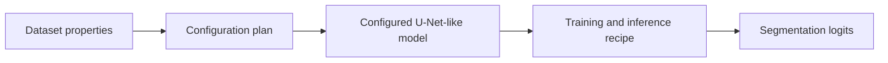

# nnU-Net

## Plain-Language Overview

nnU-Net is a self-configuring segmentation pipeline. Its central lesson is that
architecture, preprocessing, patch size, training, and inference settings should
be selected together from dataset properties instead of tuned independently.

## What Problem It Solved

Many medical segmentation projects use U-Net-like models but require manual
choices for patch size, normalization, spacing, model dimensionality, and
training setup. nnU-Net organizes those choices into an adaptive pipeline.

## Visual Architecture Schematic

This is an original schematic for this book, not a copied paper figure.



## Step-By-Step Walkthrough

1. Inspect dataset properties and task shape.
2. Derive a segmentation plan from those properties.
3. Build a U-Net-like model using that plan.
4. Train and infer with the planned preprocessing and model settings.

## Minimum Architecture Form

Core building blocks:

- A configuration step based on input shape and channel counts.
- A U-Net-like model assembled from that configuration.
- A dense output head that preserves the target shape.

Tensor shape flow:

```text
Dataset sample shape:  (C, H, W)
Configuration:         features, depth, patch shape
Input image:           (B, C, H, W)
Output logits:         (B, K, H, W)
```

Repo-authored pseudocode:

```text
read a tiny set of dataset properties
choose minimal U-Net widths from those properties
build a U-Net-like model from the plan
run a synthetic tensor through the configured model
return raw logits
```

??? example "Minimum runnable PyTorch sketch"

    ```python
    from dataclasses import dataclass

    import torch
    from torch import nn
    from torch.nn import functional as F


    @dataclass(frozen=True)
    class TinyPlan:
        in_channels: int
        out_channels: int
        base_features: int


    def make_tiny_plan(sample_shape: tuple[int, int, int], out_channels: int) -> TinyPlan:
        in_channels, height, width = sample_shape
        base_features = 8 if min(height, width) <= 64 else 16
        return TinyPlan(in_channels=in_channels, out_channels=out_channels, base_features=base_features)


    class PlannedTinyUNet(nn.Module):
        def __init__(self, plan: TinyPlan) -> None:
            super().__init__()
            f = plan.base_features
            self.enc = nn.Conv2d(plan.in_channels, f, kernel_size=3, padding=1)
            self.down = nn.Conv2d(f, f * 2, kernel_size=3, stride=2, padding=1)
            self.up = nn.ConvTranspose2d(f * 2, f, kernel_size=2, stride=2)
            self.out = nn.Conv2d(f * 2, plan.out_channels, kernel_size=1)

        def forward(self, x: torch.Tensor) -> torch.Tensor:
            skip = torch.relu(self.enc(x))
            x = torch.relu(self.down(skip))
            x = self.up(x)
            if x.shape[-2:] != skip.shape[-2:]:
                x = F.interpolate(x, size=skip.shape[-2:], mode="bilinear", align_corners=False)
            return self.out(torch.cat((skip, x), dim=1))


    plan = make_tiny_plan(sample_shape=(1, 48, 48), out_channels=2)
    model = PlannedTinyUNet(plan)
    image = torch.randn(1, 1, 48, 48)
    logits = model(image)
    assert logits.shape == (1, 2, 48, 48)
    ```

## Implementation Walkthrough

This repository does not provide a tested local nnU-Net implementation yet. The
minimum code sketch above is educational only. It is not registered as a package
model, does not include a demo, and does not claim to reproduce the full system.

## Learning Notes For Practitioners

- The minimum form is a configuration pattern, not a new convolution block.
- Real nnU-Net-style systems include far more planning and training behavior
  than this page can show safely in a small snippet.
- Future local work should treat nnU-Net as a pipeline milestone, not only a
  model-class milestone.

## What Changed Relative To U-Net

nnU-Net shifts focus from one fixed architecture to a self-configuring
segmentation pipeline built around U-Net-like models.

## Strengths

- Makes dataset-specific configuration part of the system design.
- Emphasizes reproducible planning around model, preprocessing, and inference.

## Limitations

- The local page is reference-only and does not include tested package code.
- The minimum sketch omits the full training, preprocessing, and inference
  machinery that define the complete system.

## Implementation Status

| Field | Value |
| --- | --- |
| Status | reference-only |
| Code | Not implemented locally |
| Tests | Not implemented locally |
| Demo | Not implemented locally |
| Data used in examples | synthetic tensors only |
| Metadata ID | `nnunet` |

!!! note "Educational scope"
    This repository is for education and research. This page does not claim
    clinical readiness.

## Model Details

| Field | Value |
| --- | --- |
| Year | 2021 |
| Parent | U-Net |
| Family | Self-configuring pipeline |
| Paper title | nnU-Net: a self-configuring method for deep learning-based biomedical image segmentation |
| DOI | `10.1038/s41592-020-01008-z` |
| arXiv | `1809.10486` |

## Read The Original Paper

- DOI: [10.1038/s41592-020-01008-z](https://doi.org/10.1038/s41592-020-01008-z)
- arXiv: [1809.10486](https://arxiv.org/abs/1809.10486)
