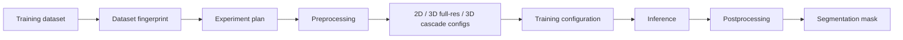

# nnU-Net

## Plain-Language Overview

nnU-Net is included in this book because it is one of the clearest examples that
medical image segmentation performance is often a pipeline problem, not only an
architecture problem. It uses U-Net-like networks, but its main contribution is a
self-configuring process that adapts preprocessing, model configuration,
training, inference, and postprocessing to a dataset.

!!! note "Architecture vs pipeline"
    nnU-Net is not best understood as one new convolution block or one fixed
    network diagram. It is a pipeline that chooses and trains U-Net-like
    configurations from dataset evidence. The architecture matters, but the
    surrounding decisions often determine whether the architecture has the right
    spacing, context, memory use, and inference behavior for the task.

## What Problem It Solved

Many medical segmentation projects start from a U-Net variant, then spend much
of the real work on choices outside the model class:

- how to resample anisotropic scans;
- how to normalize each imaging modality;
- whether to train on 2D slices, full-resolution 3D patches, or a cascade;
- how large patches should be;
- how many patches can fit in a batch;
- how to train, validate, infer, ensemble, and postprocess predictions.

nnU-Net made those choices part of the system. Instead of treating each dataset
as a hand-tuned experiment, it computes a dataset fingerprint, derives an
experiment plan, and applies a consistent training and inference recipe.

## Visual Architecture Schematic

This is an original schematic for this book, not a copied paper figure.



## Step-By-Step Walkthrough

1. Inspect the dataset and summarize its fingerprint: image sizes, voxel
   spacings, modalities, label structure, and intensity behavior where relevant.
2. Convert that fingerprint into a plan. The plan records preprocessing choices,
   target spacing, patch size, batch size, network depth, and which
   configurations should be trained.
3. Preprocess the data according to the plan. This can include resampling,
   cropping, modality-aware normalization, and storage in a form suitable for
   patch-based training.
4. Train the selected configurations. nnU-Net can use 2D, 3D full-resolution,
   and, for large 3D tasks where it is useful, a low-resolution to
   full-resolution cascade.
5. Run inference with the matching preprocessing and prediction strategy, often
   using sliding-window prediction for volumes that do not fit into memory at
   once.
6. Apply postprocessing selected from validation behavior, then export the final
   segmentation in the expected image space.

## Minimum Architecture Form

The minimum form of nnU-Net is not just a model graph. It is a repeatable
planning loop around U-Net-like models.

Core building blocks:

- A dataset fingerprint that summarizes task-relevant image and label
  properties.
- A planning step that turns the fingerprint into preprocessing, patch, batch,
  and model configuration decisions.
- One or more U-Net-like configurations, such as 2D, 3D full-resolution, and
  eligible 3D cascade variants.
- A training recipe tied to the selected configuration.
- An inference and postprocessing recipe that matches the training plan.

Pipeline flow:

```text
dataset -> fingerprint -> plan -> preprocessing -> configured model(s)
        -> training -> inference -> postprocessing -> segmentation
```

Shape intuition:

```text
2D configuration input:       (B, C, H, W)
2D configuration logits:      (B, K, H, W)

3D configuration input:       (B, C, D, H, W)
3D configuration logits:      (B, K, D, H, W)

Patch size:                   spatial crop used for each training sample
Batch size:                   number of patches processed together
```

The important point is that patch size and batch size are planned together.
Larger patches give the network more anatomical context but use more memory.
Smaller patches can increase batch size but may hide larger spatial context.
nnU-Net treats this memory and context tradeoff as part of the pipeline design.

Repo-authored pseudocode:

```text
collect dataset fingerprint
derive preprocessing and target spacing from the fingerprint
choose valid 2D, 3D full-resolution, or 3D cascade configurations
select patch size and batch size within memory constraints
train each selected configuration with the planned recipe
run matching inference and validation-driven postprocessing
return segmentation masks in the expected output space
```

## Dataset Fingerprinting And Planning

The dataset fingerprint is the evidence nnU-Net uses before training. It
summarizes properties such as image dimensions, voxel spacing, modality count,
label classes, and intensity statistics. In the upstream nnU-Net workflow, this
planning information is materialized in files such as
`dataset_fingerprint.json` and `nnUNetPlans.json`.

That planning step matters because medical datasets differ sharply. A CT volume
with thick slices, a near-isotropic MRI volume, and a 2D microscopy dataset do
not need the same spacing, patch geometry, or normalization policy. nnU-Net
turns those differences into explicit configuration choices.

## Configuration Family

nnU-Net commonly organizes experiments around these configuration types:

- `2d`: trains on 2D slices or images when slice-wise processing is appropriate
  or when the task is naturally 2D.
- `3d_fullres`: trains a 3D U-Net-like model on full-resolution volumetric
  patches when 3D context is useful and memory permits.
- `3d_lowres` plus `3d_cascade_fullres`: uses a low-resolution 3D model to
  provide coarse context, then a full-resolution model refines the segmentation
  when the dataset size and memory tradeoff justify the cascade.

Not every dataset needs every configuration. The point is that nnU-Net makes the
choice systematic rather than leaving it as an unrelated manual architecture
decision.

## Preprocessing, Training, Inference, And Postprocessing

Preprocessing is part of the model behavior in practice. Resampling changes the
spatial scale of structures, normalization changes the intensity distribution
seen by the network, and cropping changes how much background dominates each
training sample.

Training configuration is also part of the system. nnU-Net ties the selected
configuration to patch sampling, augmentation, optimization, validation, and
checkpoint selection. These details are not decorative: they affect what the
network sees, how stable training is, and how fairly configurations are compared.

Inference must match the plan. Large medical images and volumes are often
predicted with sliding windows, then stitched back together. Postprocessing can
then use validation evidence to decide whether simple cleanup rules improve the
final masks for a task.

## When Should I Start With nnU-Net?

Start with nnU-Net when you need a strong, reproducible baseline for a real
medical segmentation dataset and you do not yet know which preprocessing,
spacing, patch size, dimensionality, or inference policy should be used.

It is especially useful when:

- the dataset is 3D or has anisotropic voxel spacing;
- memory limits make full-volume training impractical;
- the comparison you care about is a full segmentation workflow, not a single
  layer change;
- you need a baseline that makes fewer hidden manual choices;
- you want to understand whether a new architecture idea actually beats a strong
  pipeline baseline.

Start with a smaller local architecture page, such as [U-Net](unet.md), when the
goal is to learn tensor shapes, encoder-decoder mechanics, skip connections, or
the implementation of a compact model class.

## Why This Repository Does Not Reimplement nnU-Net From Scratch

This repository does not provide a maintained local nnU-Net implementation. A
faithful implementation would need dataset conversion, fingerprint extraction,
experiment planning, preprocessing, multi-configuration training, validation,
inference, ensembling or model selection, postprocessing, and export behavior.
That is substantially larger than a single architecture module.

The local goal is therefore educational: explain why nnU-Net belongs in an
architecture book, link it to the U-Net lineage, and show why pipeline choices
can dominate architecture choices in medical segmentation. Readers who need the
full system should use the upstream nnU-Net project and read the original paper.

## Implementation Walkthrough

There is no package model, registry entry, test, or demo for nnU-Net in this
repository. The chapter is reference-only because the repo does not maintain the
full preprocessing, planning, training, inference, and postprocessing stack that
defines nnU-Net.

## Learning Notes For Practitioners

- Treat nnU-Net as a benchmark for full workflow discipline, not only as a U-Net
  variant.
- When comparing a new model to nnU-Net, compare against the whole nnU-Net
  pipeline, not only against a bare U-Net architecture.
- Report preprocessing, patch size, batch size, dimensionality, inference, and
  postprocessing details because they can change conclusions.
- A simpler architecture with the right pipeline can outperform a more novel
  architecture with weak planning.

## What Changed Relative To U-Net

U-Net defines an encoder-decoder architecture with skip connections. nnU-Net
keeps that family of models but shifts the contribution to self-configuration:
it adapts the segmentation pipeline to dataset properties before training and
uses the same plan through inference and postprocessing.

## Strengths

- Makes dataset-specific configuration part of the method.
- Emphasizes reproducible preprocessing, training, inference, and postprocessing.
- Gives researchers a strong baseline before proposing new architecture changes.
- Makes pipeline decisions visible instead of leaving them as hidden experiment
  details.

## Limitations

- The local page is reference-only and does not include tested package code.
- nnU-Net is a full framework-style pipeline, so reimplementing it safely is much
  larger than adding one model class.
- The best configuration still depends on valid dataset formatting, task
  definition, compute limits, and careful evaluation.
- This page does not claim clinical readiness or task-specific superiority.

## Implementation Status

| Field | Value |
| --- | --- |
| Status | reference-only |
| Code | Not implemented locally |
| Tests | Not implemented locally |
| Demo | Not implemented locally |
| Data used in examples | synthetic tensors only |
| Metadata ID | `nnunet` |

!!! note "Educational scope"
    This repository is for education and research. This page does not claim
    clinical readiness.

## Model Details

| Field | Value |
| --- | --- |
| Year | 2021 |
| Parent | U-Net |
| Family | Self-configuring pipeline |
| Paper title | nnU-Net: a self-configuring method for deep learning-based biomedical image segmentation |
| DOI | `10.1038/s41592-020-01008-z` |
| arXiv | `1809.10486` |

## Read The Original Paper

- DOI: [10.1038/s41592-020-01008-z](https://doi.org/10.1038/s41592-020-01008-z)
- arXiv: [1809.10486](https://arxiv.org/abs/1809.10486)
