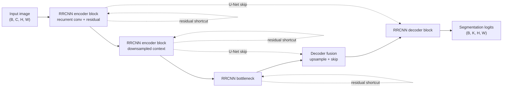

# R2U-Net

## Plain-Language Overview

R2U-Net is a U-Net-style segmentation architecture that changes the local
feature blocks. It replaces plain double-convolution blocks with Recurrent
Residual Convolutional Neural Network blocks, often abbreviated as RRCNN blocks.

The overall encoder-decoder shape stays recognizable as U-Net. The main change
is that each stage can reuse a recurrent convolutional unit across time steps
while also keeping a residual shortcut.

## What Problem It Solved

Plain U-Net blocks extract features with a short stack of convolutions. R2U-Net
adds recurrence inside those blocks so a stage can accumulate context across
time steps, and it adds residual connections to stabilize deeper training.

The supplied source description notes that this bridges residual connections and
recurrence, and reports superior performance on retinal vessel, skin lesion, and
lung lesion segmentation.

## Visual Architecture Schematic

This is an original schematic for this book, not a copied paper figure.



## Step-By-Step Walkthrough

1. The encoder receives the image and processes it with RRCNN blocks.
2. Within each RRCNN block, recurrent convolutional updates refine the feature
   representation over time steps.
3. A residual shortcut carries the block input around the recurrent path.
4. U-Net-style skip tensors are stored for decoder fusion.
5. The decoder upsamples deeper features and fuses them with matching encoder
   features.
6. A final projection returns dense segmentation logits.

## Minimum Architecture Form

Core building blocks:

- U-Net encoder, bottleneck, decoder, and long skip connections.
- Recurrent convolutional units inside each local block.
- Residual shortcuts around the recurrent feature path.
- Upsampling and skip fusion in the decoder.
- A final segmentation head.

Tensor shape flow:

```text
Input image:      (B, C, H, W)
RRCNN encoder:    (B, F, H, W)
Bottleneck:       (B, 2F, H/2, W/2)
Decoder fusion:   (B, F, H, W)
Output logits:    (B, K, H, W)
```

`B` is batch size, `C` is input channels, `F` is feature width, and `K` is the
number of output classes or masks. See
[Tensor Shape Notation](../foundations/how-to-read-an-architecture.md#tensor-shape-notation)
for the general notation used across the book.

Repo-authored pseudocode:

```text
replace each plain U-Net block with an RRCNN block
for each recurrent step:
    update the block feature with a shared recurrent convolution
add the residual shortcut to the recurrent path
use U-Net downsampling, upsampling, and long skips
project the final decoder feature to logits
```

??? example "Minimum runnable PyTorch sketch"

    ```python
    import torch
    from torch import nn
    from torch.nn import functional as F


    class RecurrentResidualBlock(nn.Module):
        def __init__(self, in_channels: int, out_channels: int, steps: int = 2) -> None:
            super().__init__()
            self.steps = steps
            self.input_proj = nn.Conv2d(in_channels, out_channels, kernel_size=1)
            self.recurrent = nn.Conv2d(out_channels, out_channels, kernel_size=3, padding=1)

        def forward(self, x: torch.Tensor) -> torch.Tensor:
            shortcut = self.input_proj(x)
            state = shortcut
            for _ in range(self.steps):
                state = torch.relu(self.recurrent(state) + shortcut)
            return torch.relu(state + shortcut)


    class MinimumR2UNetStyleSegmenter(nn.Module):
        def __init__(self, in_channels: int, out_channels: int) -> None:
            super().__init__()
            self.enc = RecurrentResidualBlock(in_channels, 8)
            self.bottleneck = RecurrentResidualBlock(8, 16)
            self.up = nn.ConvTranspose2d(16, 8, kernel_size=2, stride=2)
            self.dec = RecurrentResidualBlock(16, 8)
            self.out = nn.Conv2d(8, out_channels, kernel_size=1)

        def forward(self, x: torch.Tensor) -> torch.Tensor:
            skip = self.enc(x)
            x = self.bottleneck(F.max_pool2d(skip, kernel_size=2))
            x = self.up(x)
            if x.shape[-2:] != skip.shape[-2:]:
                x = F.interpolate(x, size=skip.shape[-2:], mode="bilinear", align_corners=False)
            x = self.dec(torch.cat((skip, x), dim=1))
            return self.out(x)


    model = MinimumR2UNetStyleSegmenter(in_channels=1, out_channels=2)
    image = torch.randn(1, 1, 33, 41)
    logits = model(image)
    assert logits.shape == (1, 2, 33, 41)
    ```

## Tensor-Shape Intuition

R2U-Net does not require a new input-output tensor contract. The recurrent steps
operate inside a feature block and preserve the block's spatial size.

```text
Block input:      (B, F, H, W)
Recurrent state:  (B, F, H, W)
Block output:     (B, F, H, W)
```

## Implementation Walkthrough

This repository does not provide a tested local R2U-Net implementation. The
minimum code sketch above is educational only. It is not registered as a package
model, does not include a demo, and does not claim to reproduce the full paper.

## Learning Notes For Practitioners

- R2U-Net is best read after the residual U-Net family page because it combines
  U-Net's long skips with residual shortcuts inside local blocks.
- The recurrence is a block-level change, not a change to the dense segmentation
  output contract.
- The supplied source description states that R2U-Net uses the same parameter
  count as U-Net while improving feature representation at every scale.
- Future implementation work should make the number of recurrent steps explicit
  and test that odd input sizes still return logits at the input spatial size.

## What Changed Relative To Residual U-Net / ResUNet-Style Variants

R2U-Net specializes the residual U-Net idea by replacing plain local convolution
blocks with recurrent residual blocks. The U-Net encoder-decoder layout remains,
but each stage gains recurrent feature refinement.

## Strengths

- Shows residual connections and recurrence inside the same U-Net-style block.
- Keeps the familiar U-Net encoder-decoder shape.
- Widely cited as a baseline in the ResUNet family according to the supplied
  source description.

## Limitations

- The local page is reference-only and does not include tested package code.
- The minimum sketch is not the full R2U-Net architecture.
- Recurrent blocks add implementation choices, including recurrent step count
  and whether weights are shared.
- Reported paper behavior does not establish clinical readiness for a new
  modality, scanner, institution, or annotation protocol.

## Implementation Status

| Field | Value |
| --- | --- |
| Status | reference-only |
| Code in `src/` | No local `src/` implementation |
| Tests | No local tests |
| Demo | No local demo |
| Documentation-only page | Yes |
| Data scope | Synthetic examples only |
| Metadata ID | `r2unet` |

!!! note "Educational scope"
    This repository is for education and research. This page does not claim
    clinical readiness.

## Model Details

| Field | Value |
| --- | --- |
| Year | 2018 |
| Parent | Residual U-Net / ResUNet-style variants |
| Family | unet |
| Paper title | Recurrent Residual Convolutional Neural Network based on U-Net (R2U-Net) for Medical Image Segmentation |
| DOI | Not listed |
| arXiv | `1802.06955` |
| Source note | Alom et al., arXiv 2018 |

## Read The Original Paper

- arXiv: [1802.06955](https://arxiv.org/abs/1802.06955)
