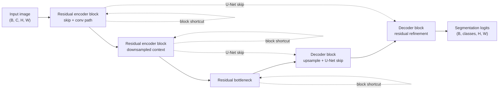

# Residual U-Net / ResUNet-Style Variants

## Plain-Language Overview

Residual U-Net / ResUNet-style variants are a practical category of U-Net-like
segmentation models. They keep the encoder-decoder shape and skip connections of
[U-Net](unet.md), but replace some plain convolution blocks with residual
blocks inspired by ResNet.

This page is a family overview, not a claim that there is one canonical ResUNet
implementation in this repository. Different papers and codebases use names
such as ResUNet, Residual U-Net, R2U-Net, MultiResUNet, or ResUNet++ for related
but non-identical designs.

## What Problem It Solved

Plain U-Net blocks stack convolutions directly. As models become deeper or wider,
optimization can become harder because each block must learn the full feature
transformation. Residual blocks add an identity or projection shortcut around the
main convolution path so a stage can learn a residual correction instead of a
complete replacement.

For segmentation, the goal is usually practical: keep the familiar U-Net layout
while making the local feature blocks easier to train or more expressive.

## Visual Architecture Schematic

This is an original schematic for this book, not a copied paper figure.



## Step-By-Step Walkthrough

1. The encoder processes the input with residual blocks instead of plain
   double-convolution blocks.
2. Each residual block keeps a shortcut path around its convolution path. If the
   channel count changes, the shortcut usually uses a `1x1` projection.
3. The encoder still stores U-Net-style skip tensors before or around
   downsampling.
4. The bottleneck uses the deepest residual feature representation.
5. The decoder upsamples, fuses matching encoder skip tensors, and may also use
   residual blocks after fusion.
6. A final `1x1` convolution maps decoder features to segmentation logits.

## Minimum Architecture Form

Core building blocks:

- U-Net-style encoder, bottleneck, decoder, and skip connections.
- Residual blocks that add a shortcut path to a convolution path.
- Optional `1x1` projection shortcuts when channel counts differ.
- Upsampling and skip fusion in the decoder.
- A final segmentation head that returns raw logits.

Tensor shape flow:

```text
Input image:         (B, C, H, W)
Residual encoder:    (B, F, H, W)
Bottleneck:          (B, 2F, H/2, W/2)
Decoder fusion:      (B, F, H, W)
Output logits:       (B, K, H, W)
```

In this notation, `B` is batch size, `C` is input image channels, `F` is the
feature width, and `K` is the number of output classes or masks. See
[Tensor Shape Notation](../foundations/how-to-read-an-architecture.md#tensor-shape-notation)
for the general notation used across the book.

Repo-authored pseudocode:

```text
build encoder stages from residual blocks
store U-Net skip tensors at matching resolutions
pool or stride into deeper residual stages
process the bottleneck with a residual block
upsample and concatenate matching encoder skips
refine fused decoder features with residual blocks
project final decoder features to raw logits
```

??? example "Minimum runnable PyTorch sketch"

    ```python
    import torch
    from torch import nn
    from torch.nn import functional as F


    class ResidualBlock(nn.Module):
        def __init__(self, in_channels: int, out_channels: int) -> None:
            super().__init__()
            self.main = nn.Sequential(
                nn.Conv2d(in_channels, out_channels, kernel_size=3, padding=1),
                nn.ReLU(inplace=True),
                nn.Conv2d(out_channels, out_channels, kernel_size=3, padding=1),
            )
            if in_channels == out_channels:
                self.shortcut = nn.Identity()
            else:
                self.shortcut = nn.Conv2d(in_channels, out_channels, kernel_size=1)

        def forward(self, x: torch.Tensor) -> torch.Tensor:
            return torch.relu(self.main(x) + self.shortcut(x))


    class MinimumResidualUNet(nn.Module):
        def __init__(self, in_channels: int, out_channels: int) -> None:
            super().__init__()
            self.enc = ResidualBlock(in_channels, 8)
            self.bottleneck = ResidualBlock(8, 16)
            self.up = nn.ConvTranspose2d(16, 8, kernel_size=2, stride=2)
            self.dec = ResidualBlock(16, 8)
            self.out = nn.Conv2d(8, out_channels, kernel_size=1)

        def forward(self, x: torch.Tensor) -> torch.Tensor:
            skip = self.enc(x)
            x = F.max_pool2d(skip, kernel_size=2)
            x = self.bottleneck(x)
            x = self.up(x)
            if x.shape[-2:] != skip.shape[-2:]:
                x = F.interpolate(x, size=skip.shape[-2:], mode="bilinear", align_corners=False)
            x = self.dec(torch.cat((skip, x), dim=1))
            return self.out(x)


    model = MinimumResidualUNet(in_channels=1, out_channels=2)
    image = torch.randn(1, 1, 33, 41)
    logits = model(image)
    assert logits.shape == (1, 2, 33, 41)
    ```

## Implementation Walkthrough

This repository does not provide a tested local Residual U-Net implementation
yet. The minimum code sketch above is educational only. It is not registered as
a package model, does not include a demo, and does not claim to reproduce R2U-Net
or any other named ResUNet paper.

## Learning Notes For Practitioners

- There are two different skip ideas here: the long U-Net encoder-to-decoder
  skips and the short residual shortcuts inside a block.
- Residual blocks can make deeper U-Net-style models easier to optimize, but
  they do not remove the need for careful normalization, loss choice,
  augmentation, and validation.
- When comparing papers, inspect the actual block diagram or code. The name
  ResUNet alone does not tell you whether the model uses plain residual blocks,
  recurrent residual blocks, multi-resolution blocks, attention,
  squeeze-and-excitation, or another addition.

## Relationship To Related Architectures

| Related architecture | Relationship |
| --- | --- |
| [U-Net](unet.md) | Provides the encoder-decoder shape, long skip connections, and dense segmentation output pattern. |
| ResNet | Provides the residual shortcut idea used inside local feature blocks. |
| [V-Net](vnet.md) | Also uses residual-style volumetric block design, but it is a 3D branch with its own architecture and Dice-style training focus. |
| [U-Net++](unetpp.md) | Changes skip pathways with nested dense skip nodes rather than primarily replacing the local block type. |
| [Attention U-Net](attention-unet.md) | Adds attention gates that filter skip features; residual U-Net variants usually focus on block optimization instead. |

## Typical Use Cases

- Starting from U-Net when a deeper encoder-decoder is desired but plain blocks
  are difficult to train.
- Medical segmentation tasks where local boundary detail still matters, but the
  model benefits from stronger feature extraction within each stage.
- Educational comparisons that isolate the effect of changing the block type
  while keeping the U-Net layout recognizable.

## What Changed Relative To U-Net

Residual U-Net-style variants keep U-Net's overall encoder-decoder layout and
long skip connections, then replace selected plain convolution blocks with
residual blocks.

The architectural change is local to the feature block, while the input-output
contract remains the same: image or volume tensors go in, dense segmentation
logits come out at the target spatial resolution.

## Strengths

- Keeps the familiar U-Net data flow while adding residual shortcut paths inside
  blocks.
- Can make deeper U-Net-style networks easier to optimize than a comparable
  stack of plain convolution blocks.
- Offers a practical stepping stone from a basic U-Net baseline toward more
  specialized U-Net variants.

## Limitations

- This page is reference-only and does not include tested package code.
- The name ResUNet is ambiguous across papers and codebases.
- Residual blocks add parameters when projection shortcuts or wider channels are
  used.
- Residual connections help optimization, but they do not guarantee better
  segmentation quality on a specific dataset.

## Implementation Status

| Field | Value |
| --- | --- |
| Status | reference-only |
| Code | Not implemented locally |
| Tests | Not implemented locally |
| Demo | Not implemented locally |
| Data used in examples | synthetic tensors only |
| Metadata ID | `resunet_style_variants` |

!!! note "Educational scope"
    This repository is for education and research. This page does not claim
    clinical readiness.

## Model Details

| Field | Value |
| --- | --- |
| Year | 2018 |
| Parent | U-Net |
| Family | U-Net family, residual variants |
| Paper title | Recurrent Residual Convolutional Neural Network based on U-Net (R2U-Net) for Medical Image Segmentation |
| DOI | Not listed |
| arXiv | `1802.06955` |

## Read Representative Sources

Because this is a family page, the sources below should be read as representative
anchors rather than a single canonical ResUNet definition.

- R2U-Net representative medical source:
  [1802.06955](https://arxiv.org/abs/1802.06955)
- ResNet residual learning background:
  [1512.03385](https://arxiv.org/abs/1512.03385)
- Original U-Net baseline:
  [1505.04597](https://arxiv.org/abs/1505.04597)
