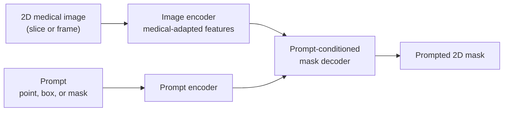

# SAM-Med2D

## Plain-Language Overview

SAM-Med2D is a promptable 2D medical image segmentation adaptation of the
Segment Anything Model idea. Instead of learning one fixed medical segmentation
task, a SAM-style model predicts a mask from an image plus a user or algorithm
prompt.

In classic fully supervised segmentation, the usual interface is:

```text
image -> fixed task mask
```

In promptable segmentation, the interface becomes:

```text
image + prompt -> prompted mask
```

The prompt is a conditioning signal. It is not the ground-truth clinical answer
and it is not automatically a class label.

## What Problem It Solved

General natural-image foundation models do not automatically transfer cleanly to
medical images. Medical images differ in modality, contrast, anatomy, pathology,
scanner protocol, site distribution, and annotation conventions. SAM-Med2D
studies how to adapt SAM-style prompting to 2D medical images with medical-domain
fine-tuning and broader prompt handling.

## Visual Architecture Schematic

This is an original schematic for this book, not a copied paper figure.



## Step-By-Step Walkthrough

1. Convert a 2D medical image or slice into image features.
2. Encode a point, box, or mask prompt as conditioning information.
3. Decode a mask using both image features and prompt features.
4. Return a prompted 2D mask for the requested region or object.

## Minimum Architecture Form

Core building blocks:

- 2D image encoder.
- Prompt encoder for point, box, or mask prompts.
- Prompt-conditioned mask decoder.
- Upsampling or projection to 2D mask resolution.

Tensor shape flow:

```text
Input image:       (B, C, H, W)
Prompt features:   (B, P)
Image features:    (B, F, H/s, W/s)
Mask logits:       (B, 1, H, W)
```

Where `P` is a compact prompt representation, `F` is the feature-channel count,
and `s` is the image-encoder stride. See
[Tensor Shape Notation](../foundations/how-to-read-an-architecture.md#tensor-shape-notation)
for the general shape notation.

Repo-authored pseudocode:

```text
encode the 2D medical image
encode point, box, or mask prompt information
condition the mask decoder on image and prompt features
return a prompted 2D mask
```

??? example "Minimum runnable PyTorch sketch"

    ```python
    import torch
    from torch import nn
    from torch.nn import functional as F


    class MinimumSAMMed2DStyleSegmenter(nn.Module):
        def __init__(self, in_channels: int) -> None:
            super().__init__()
            self.image_encoder = nn.Sequential(
                nn.Conv2d(in_channels, 16, kernel_size=3, stride=4, padding=1),
                nn.ReLU(inplace=True),
            )
            self.prompt_encoder = nn.Linear(6, 16)
            self.mask_decoder = nn.Sequential(
                nn.Conv2d(32, 16, kernel_size=3, padding=1),
                nn.ReLU(inplace=True),
                nn.Conv2d(16, 1, kernel_size=1),
            )

        def forward(self, image: torch.Tensor, prompt: torch.Tensor) -> torch.Tensor:
            image_size = image.shape[-2:]
            image_features = self.image_encoder(image)
            prompt_features = self.prompt_encoder(prompt).view(image.shape[0], 16, 1, 1)
            prompt_features = prompt_features.expand_as(image_features)
            logits = self.mask_decoder(torch.cat((image_features, prompt_features), dim=1))
            return F.interpolate(logits, size=image_size, mode="bilinear", align_corners=False)


    model = MinimumSAMMed2DStyleSegmenter(in_channels=1)
    image = torch.randn(1, 1, 32, 32)
    prompt = torch.tensor([[16.0, 16.0, 1.0, 4.0, 4.0, 28.0]])
    logits = model(image, prompt)
    assert logits.shape == (1, 1, 32, 32)
    ```

## Prompt Types

- Point prompts identify positive or negative locations that should influence the
  mask proposal.
- Box prompts provide a coarse region of interest around the object or anatomy.
- Mask prompts provide a previous or coarse mask that the model can refine.

These prompts are input conditions. A good prompt can help localize a target, but
it does not replace ground-truth annotation, independent validation, or clinical
review.

## Implementation Walkthrough

This repository does not provide a tested local SAM-Med2D implementation. The
minimum code sketch above is educational only. It is not registered as a package
model, does not include a demo, does not load model weights, and does not claim
to reproduce the full paper.

## Learning Notes For Practitioners

- SAM-Med2D belongs to the 2D promptable medical segmentation branch.
- A 2D slice model can be useful for learning prompt conditioning, but it does not
  automatically model through-plane context in CT, MRI, PET, or ultrasound
  volumes.
- Medical adaptation is needed because natural-image pretraining does not remove
  modality shift, scanner shift, site shift, or annotation-policy shift.
- A promptable model should be evaluated under the same prompt policy expected at
  use time, because point, box, and mask prompts can produce different behavior.

## What Changed Relative To Fixed-Task Segmentation

SAM-Med2D keeps the SAM-style image-plus-prompt interface and adapts it to 2D
medical images. This differs from fixed-task supervised segmentation, where a
model is trained to map an image directly to a task-specific mask without an
interactive prompt at inference time.

## Strengths

- Makes prompt-conditioned 2D medical segmentation explicit.
- Supports the learning concept of point, box, and mask prompt conditioning.
- Separates localization guidance from the image representation.

## Limitations

- The local page is reference-only and does not include tested package code.
- The minimum sketch is not a foundation-model implementation and does not load
  pretrained weights.
- 2D adaptation can miss continuity across slices or frames when the clinical
  target is volumetric or temporal.
- Reported paper results do not establish clinical readiness for a new scanner,
  institution, modality, or annotation protocol.
- Domain shift and prompt-policy differences can invalidate assumptions about
  expected performance.

## Implementation Status

| Field | Value |
| --- | --- |
| Status | reference-only |
| Code in `src/` | No local `src/` implementation |
| Tests | No local tests |
| Demo | No local demo |
| Documentation-only page | Yes |
| Data scope | Synthetic examples only |
| Metadata ID | `sam_med2d` |

!!! note "Educational scope"
    This repository is for education and research. This page does not claim
    clinical readiness.

## Model Details

| Field | Value |
| --- | --- |
| Year | 2023 |
| Parent | None |
| Family | Promptable foundation model, 2D medical adaptation |
| Paper title | SAM-Med2D |
| DOI | Not listed |
| arXiv | `2308.16184` |

## Read The Original Paper

- arXiv: [2308.16184](https://arxiv.org/abs/2308.16184)
