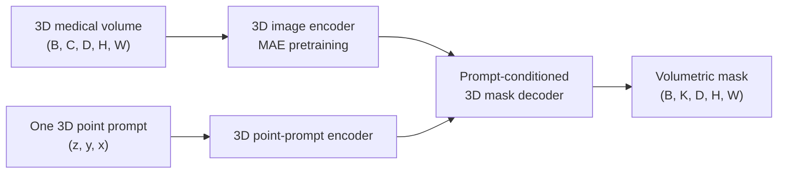

# SAM-Med3D

## Plain-Language Overview

SAM-Med3D is a promptable medical segmentation architecture for 3D volumes. It
takes the Segment Anything Model idea and rebuilds the interaction for native
volumetric data: a user gives one 3D point inside the target structure, and the
model predicts the structure across the whole volume.

This is different from slice-by-slice prompting. In a 2D workflow, a stack may
need separate prompts on many slices. SAM-Med3D treats the target as a 3D object
from the beginning.

## What Problem It Solved

SAM-style models were originally designed around 2D images and 2D prompts.
Medical CT and MRI scans are often 3D volumes, so processing them as independent
2D slices can lose through-plane context and can make interactive annotation
laborious.

SAM-Med3D addresses that gap by replacing the 2D image encoder, 2D prompt
encoder, and 2D mask output path with 3D counterparts, then training on
large-scale 3D medical data.

## Visual Architecture Schematic

This is an original schematic for this book, not a copied paper figure.



## Step-By-Step Walkthrough

1. The input volume is represented as a 3D tensor rather than a set of
   independent 2D slices.
2. A 3D image encoder extracts volumetric image embeddings.
3. A single point prompt is encoded in `(z, y, x)` volume coordinates.
4. The 3D mask decoder combines image embeddings and prompt embeddings.
5. The output is a binary volumetric mask aligned to the input volume.

## Key Modification Relative To SAM And SAM-Med2D

SAM is a general 2D promptable segmentation model. SAM-Med2D adapts that
promptable interface to 2D medical images, but it still works slice by slice for
volumetric data. SAM-Med3D changes the architecture so the image representation,
prompt representation, and mask prediction are all volumetric.

The practical interaction changes from "click on each relevant 2D slice" to
"click once in the 3D volume." That makes SAM-Med3D a useful starting point for
rapid 3D annotation workflows.

## Architecture Description

### 3D Image Encoder

SAM-Med3D replaces SAM's 2D MAE-pretrained ViT image encoder with a 3D encoder.
The encoder is trained on a curated large-scale 3D medical dataset covering
diverse anatomical structures, modalities, and segmentation targets.

The important architectural shift is that features are computed in volumetric
space, so the model can use through-plane context instead of treating each slice
as an independent image.

### 3D Prompt Encoder

The prompt encoder accepts a single 3D point in the volume. The point is
specified in `(z, y, x)` coordinates, matching the depth, height, and width axes
of the medical image volume.

This replaces the need for `N` independent 2D prompts across slices when a target
extends through the stack.

### 3D Mask Decoder

The mask decoder is adapted to produce 3D volumetric output. Instead of returning
a 2D mask for one image or one slice, it conditions volumetric image embeddings
on the prompt embedding and predicts a 3D mask over the target region.

### Two-Stage Training

Training proceeds in two stages:

1. Pretrain the 3D encoder with masked image modelling on unlabelled 3D volumes.
2. Fine-tune the full SAM-Med3D model end to end on labelled volumetric data.

The paper evaluates the model on 16 diverse 3D medical datasets and reports
strong zero-shot transfer to unseen segmentation targets.

## Minimum Architecture Form

Core building blocks:

- 3D image encoder.
- 3D point-prompt encoder.
- Prompt-conditioned 3D mask decoder.
- Volumetric output projection.

Tensor shape flow:

```text
Input volume:       (B, C, D, H, W)
Point prompt:       (B, 3) for (z, y, x)
Image embeddings:   (B, F, D/s, H/s, W/s)
Prompt embedding:   (B, P)
Mask logits:        (B, K, D, H, W)
```

`B` is batch size, `C` is input channels or modalities, `D`, `H`, and `W` are
spatial dimensions, `F` is the image feature width, `P` is the prompt feature
width, `s` is the encoder stride, and `K` is the number of output masks or
classes. See
[Tensor Shape Notation](../foundations/how-to-read-an-architecture.md#tensor-shape-notation)
for the general notation used across the book.

Repo-authored pseudocode:

```text
encode a 1 x D x H x W medical volume with a 3D image encoder
encode one point prompt in z, y, x coordinates
condition the 3D mask decoder on image and prompt embeddings
return a binary D x H x W volumetric mask
```

??? example "Minimum runnable PyTorch sketch"

    ```python
    import torch
    from torch import nn
    from torch.nn import functional as F


    class MinimumSAMMed3DStyleSegmenter(nn.Module):
        def __init__(self, in_channels: int, out_channels: int) -> None:
            super().__init__()
            self.image_encoder = nn.Sequential(
                nn.Conv3d(in_channels, 12, kernel_size=3, stride=2, padding=1),
                nn.ReLU(inplace=True),
            )
            self.prompt_encoder = nn.Linear(3, 12)
            self.mask_decoder = nn.Sequential(
                nn.Conv3d(24, 12, kernel_size=3, padding=1),
                nn.ReLU(inplace=True),
                nn.Conv3d(12, out_channels, kernel_size=1),
            )

        def forward(self, volume: torch.Tensor, point_prompt: torch.Tensor) -> torch.Tensor:
            volume_size = volume.shape[-3:]
            image_features = self.image_encoder(volume)
            prompt_features = self.prompt_encoder(point_prompt).view(volume.shape[0], 12, 1, 1, 1)
            prompt_features = prompt_features.expand_as(image_features)
            decoder_input = torch.cat((image_features, prompt_features), dim=1)
            logits = self.mask_decoder(decoder_input)
            return F.interpolate(logits, size=volume_size, mode="trilinear", align_corners=False)


    model = MinimumSAMMed3DStyleSegmenter(in_channels=1, out_channels=1)
    volume = torch.randn(1, 1, 12, 32, 32)
    point = torch.tensor([[6.0, 16.0, 16.0]])
    logits = model(volume, point)
    assert logits.shape == (1, 1, 12, 32, 32)
    ```

## Tensor Shape Walkthrough

The intended interaction is:

```text
Input:                  1 x D x H x W volume
Prompt:                 one 3D point (z, y, x)
3D encoder:             volumetric image embeddings
3D prompt encoder:      prompt embedding
3D mask decoder:        prompt-conditioned volumetric logits
Output:                 binary mask D x H x W
```

The point prompt identifies the target structure in the same coordinate system
as the image volume. The output mask should be evaluated as a 3D object, not as
independent per-slice predictions.

## Implementation Walkthrough

This repository does not provide a tested local SAM-Med3D implementation. The
minimum code sketch above is educational only. It is not registered as a package
model, does not include a demo, does not load model weights, and does not claim
to reproduce the full paper.

| Step | SAM | SAM-Med2D | SAM-Med3D |
| --- | --- | --- | --- |
| Image input | 2D natural image | 2D medical image or slice | Native 3D medical volume |
| Image encoder | 2D ViT image encoder | 2D medical-domain SAM-style encoder | 3D image encoder |
| Prompt | 2D points, boxes, or masks | 2D medical prompts | One 3D point prompt |
| Output | 2D mask | 2D medical mask | Volumetric 3D mask |
| Volumetric workflow | Slice-wise if used on stacks | Slice-wise prompting for stacks | One prompt can address the whole volume |

For real use, start from the official implementation rather than this page's
educational sketch:

- Official code: [uni-medical/SAM-Med3D](https://github.com/uni-medical/SAM-Med3D)

Large 3D microscopy volumes may exceed GPU memory because the image encoder and
mask decoder operate on volumetric tensors. Practical experiments should use
patch-based inference or a sliding-window strategy, then stitch predictions back
into the full volume. Overlap between windows helps reduce boundary artifacts,
but the prompt location and coordinate mapping must remain consistent with the
windowed volume passed to the model.

## Learning Notes For Practitioners

- Using SAM-Med3D as an annotation accelerator for confocal stacks is an
  exploratory hypothesis, not a recommended workflow in this book. It would
  require local validation, manual error review, and comparison with
  task-specific microscopy methods.
- The model has not been evaluated on fluorescence microscopy in the original
  paper. Testing SAM-Med3D zero-shot on 3D cell volumes remains an open project
  gap.
- Single-point prompting is convenient, but it should not be treated as a
  substitute for task-specific validation.
- For densely packed objects, separate instances may need additional prompts,
  manual correction, or a task-specific instance-segmentation model.

## What Changed Relative To MedSAM

MedSAM represents promptable medical segmentation in the SAM-style family.
SAM-Med3D moves that idea to native 3D volumes by replacing 2D image and prompt
encoders with 3D counterparts and by adapting the mask decoder to return
volumetric output.

## Strengths

- Makes promptable segmentation volumetric instead of slice-by-slice.
- Uses a single 3D point prompt for a 3D target.
- Represents the native 3D promptable branch of medical foundation models in
  this repository.
- Provides a practical starting point for rapidly generating draft 3D training
  annotations.

## Limitations

- This repository does not provide local SAM-Med3D code, tests, demos, weights,
  or a clinical deployment pipeline.
- SAM-Med3D requires significantly more GPU memory than 2D SAM variants because
  the encoder and mask decoder operate on 3D tensors.
- The model was trained on organ-scale CT/MRI-style medical images; performance
  on microscopy-scale 3D volumes is not characterised in the original paper and
  needs empirical evaluation.
- Single-point prompting may be insufficient for multi-instance segmentation of
  densely packed structures.
- Reported paper behavior does not establish clinical readiness for a new
  modality, scanner, institution, or annotation protocol.

## Implementation Status

| Field | Value |
| --- | --- |
| Status | reference-only |
| Code in `src/` | No local `src/` implementation |
| Tests | No local tests |
| Demo | No local demo |
| Documentation-only page | Yes |
| Data scope | Synthetic examples only |
| Metadata ID | `sam-med3d` |

!!! note "Educational scope"
    This repository is for education and research. This page does not claim
    clinical readiness.

## Model Details

| Field | Value |
| --- | --- |
| Year | 2023 |
| Parent | MedSAM |
| Family | foundation-models |
| Paper title | SAM-Med3D: Towards General-purpose Segmentation Models for Volumetric Medical Images |
| Authors | Haoyu Wang, Sizheng Guo, Jin Ye, Zhongying Deng, Junlong Cheng, Tianbin Li, Jianpin Chen, Yanzhou Su, Ziyan Huang, Yiqing Shen, Bin Fu, Shaoting Zhang, Junjun He, Yu Qiao |
| Venue | ECCV Workshops 2024 (arXiv submitted Oct 2023) |
| DOI | Not listed |
| arXiv | `2310.15161` |

## Citation

```bibtex
@article{wang2023sam_med3d,
  author = {Wang, Haoyu and Guo, Sizheng and Ye, Jin and Deng, Zhongying and Cheng, Junlong and Li, Tianbin and Chen, Jianpin and Su, Yanzhou and Huang, Ziyan and Shen, Yiqing and Fu, Bin and Zhang, Shaoting and He, Junjun and Qiao, Yu},
  title = {SAM-Med3D: Towards General-purpose Segmentation Models for Volumetric Medical Images},
  journal = {arXiv preprint arXiv:2310.15161},
  year = {2023},
  eprint = {2310.15161},
  archivePrefix = {arXiv},
  url = {https://arxiv.org/abs/2310.15161}
}
```

## Read The Original Paper

- arXiv: [2310.15161](https://arxiv.org/abs/2310.15161)
- Official code: [uni-medical/SAM-Med3D](https://github.com/uni-medical/SAM-Med3D)
