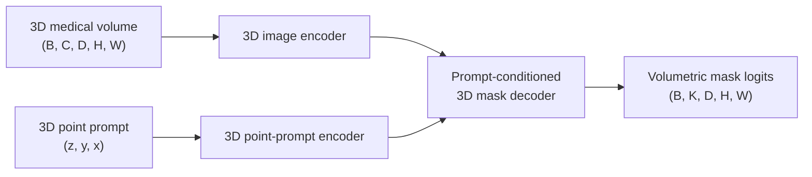

# SAM-Med3D

## Plain-Language Overview

SAM-Med3D is a promptable medical segmentation architecture for 3D volumes. It
extends the SAM-style image-plus-prompt interface from 2D slice processing to a
native volumetric model.

Instead of prompting each slice separately, SAM-Med3D uses a point prompt in 3D
volume space.

## What Problem It Solved

2D SAM-style medical models can require separate prompts for separate slices
when the target is volumetric. SAM-Med3D changes the architecture so the image
encoder and prompt encoder operate in 3D, allowing the prompt and segmentation
target to live in volume space.

The supplied source description states that SAM-Med3D replaces the 2D ViT image
encoder with a 3D encoder, replaces the 2D prompt encoder with a 3D point-prompt
encoder, and retrains on a large-scale 3D medical dataset.

## Visual Architecture Schematic

This is an original schematic for this book, not a copied paper figure.



## Step-By-Step Walkthrough

1. A 3D volume is passed into a 3D image encoder.
2. A point prompt is encoded in 3D volume coordinates.
3. The mask decoder combines volumetric image features with prompt features.
4. The model returns a prompted 3D segmentation mask.

## Minimum Architecture Form

Core building blocks:

- 3D image encoder.
- 3D point-prompt encoder.
- Prompt-conditioned 3D mask decoder.
- Volumetric output projection.

Tensor shape flow:

```text
Input volume:      (B, C, D, H, W)
3D image feature:  (B, F, D/s, H/s, W/s)
Prompt feature:    (B, P)
Mask logits:       (B, K, D, H, W)
```

`B` is batch size, `C` is input channels or modalities, `D`, `H`, and `W` are
spatial dimensions, `F` is feature width, `P` is prompt feature size, `s` is
encoder stride, and `K` is the number of output masks or classes. See
[Tensor Shape Notation](../foundations/how-to-read-an-architecture.md#tensor-shape-notation)
for the general notation used across the book.

Repo-authored pseudocode:

```text
encode the 3D medical volume
encode one point prompt in 3D coordinates
condition the 3D mask decoder on volume and prompt features
upsample or project to volumetric mask logits
return the prompted 3D mask
```

??? example "Minimum runnable PyTorch sketch"

    ```python
    import torch
    from torch import nn
    from torch.nn import functional as F


    class MinimumSAMMed3DStyleSegmenter(nn.Module):
        def __init__(self, in_channels: int, out_channels: int) -> None:
            super().__init__()
            self.image_encoder = nn.Sequential(
                nn.Conv3d(in_channels, 12, kernel_size=3, stride=2, padding=1),
                nn.ReLU(inplace=True),
            )
            self.prompt_encoder = nn.Linear(3, 12)
            self.mask_decoder = nn.Sequential(
                nn.Conv3d(24, 12, kernel_size=3, padding=1),
                nn.ReLU(inplace=True),
                nn.Conv3d(12, out_channels, kernel_size=1),
            )

        def forward(self, volume: torch.Tensor, point_prompt: torch.Tensor) -> torch.Tensor:
            volume_size = volume.shape[-3:]
            image_features = self.image_encoder(volume)
            prompt_features = self.prompt_encoder(point_prompt).view(volume.shape[0], 12, 1, 1, 1)
            prompt_features = prompt_features.expand_as(image_features)
            logits = self.mask_decoder(torch.cat((image_features, prompt_features), dim=1))
            return F.interpolate(logits, size=volume_size, mode="trilinear", align_corners=False)


    model = MinimumSAMMed3DStyleSegmenter(in_channels=1, out_channels=1)
    volume = torch.randn(1, 1, 12, 32, 32)
    point = torch.tensor([[6.0, 16.0, 16.0]])
    logits = model(volume, point)
    assert logits.shape == (1, 1, 12, 32, 32)
    ```

## Tensor-Shape Intuition

SAM-Med3D moves promptable segmentation from 2D tensors to 3D tensors. The prompt
is no longer only an `(x, y)` or slice-local point; it can identify a location in
`(z, y, x)` volume space.

```text
2D prompted mask:  (B, K, H, W)
3D prompted mask:  (B, K, D, H, W)
```

## Implementation Walkthrough

This repository does not provide a tested local SAM-Med3D implementation. The
minimum code sketch above is educational only. It is not registered as a package
model, does not include a demo, does not load model weights, and does not claim
to reproduce the full paper.

## Learning Notes For Practitioners

- SAM-Med3D closes the learning gap between 2D SAM-Med2D-style prompting and
  native volumetric prompting.
- A single 3D point prompt is a different interaction contract from one prompt
  per 2D slice.
- The supplied source description states that SAM-Med3D was evaluated on 16
  datasets covering diverse anatomical structures, modalities, and zero-shot
  targets.
- Prompt policy matters: a model prompted with one 3D point should be evaluated
  under the same prompting assumptions expected at use time.

## What Changed Relative To MedSAM

MedSAM represents promptable medical segmentation in the SAM-style family.
SAM-Med3D moves that idea to native 3D volumes by replacing 2D image and prompt
encoders with 3D counterparts.

## Strengths

- Makes promptable segmentation volumetric instead of slice-by-slice.
- Uses 3D prompt coordinates for 3D targets.
- Represents the native 3D promptable branch of medical foundation models in
  this repository.

## Limitations

- The local page is reference-only and does not include tested package code.
- The minimum sketch is not a foundation-model implementation and does not load
  pretrained weights.
- 3D prompting and inference can be memory intensive.
- Reported paper behavior does not establish clinical readiness for a new
  modality, scanner, institution, or annotation protocol.

## Implementation Status

| Field | Value |
| --- | --- |
| Status | reference-only |
| Code in `src/` | No local `src/` implementation |
| Tests | No local tests |
| Demo | No local demo |
| Documentation-only page | Yes |
| Data scope | Synthetic examples only |
| Metadata ID | `sam-med3d` |

!!! note "Educational scope"
    This repository is for education and research. This page does not claim
    clinical readiness.

## Model Details

| Field | Value |
| --- | --- |
| Year | 2023 |
| Parent | MedSAM |
| Family | foundation-models |
| Paper title | SAM-Med3D: Towards General-purpose Segmentation Models for Volumetric Medical Images |
| DOI | Not listed |
| arXiv | `2310.15161` |
| Source note | Wang et al., ECCV Workshop 2024; arXiv submitted Oct 2023 |

## Read The Original Paper

- arXiv: [2310.15161](https://arxiv.org/abs/2310.15161)
- Official code: [uni-medical/SAM-Med3D](https://github.com/uni-medical/SAM-Med3D)
