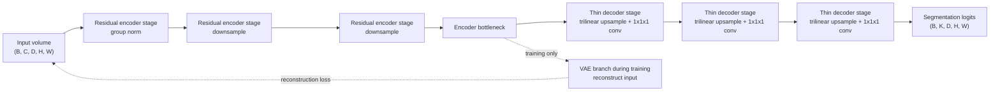

# SegResNet

## Plain-Language Overview

SegResNet is a 3D brain-tumour segmentation architecture from Andriy
Myronenko's 2018 BrainLes Workshop paper, "3D MRI Brain Tumor Segmentation
Using Autoencoder Regularization." It is best understood as a residual
U-Net-style volumetric model that adds a self-reconstruction side task during
training.

The encoder learns segmentation features while a variational autoencoder (VAE)
branch reconstructs the input image from the bottleneck representation. That
auxiliary reconstruction loss regularizes the shared encoder when labelled 3D
medical data is limited, and the VAE branch is discarded at inference.

## What Problem It Solved

Full 3D segmentation models need enough context to label volumetric structures,
but deep symmetric encoder-decoder networks can be expensive on large MRI
volumes. SegResNet keeps a deep residual encoder for feature extraction and uses
a deliberately lightweight decoder to reduce memory pressure.

The architecture also addresses small labelled-dataset conditions by asking the
encoder bottleneck to support input reconstruction during training. This does
not replace supervised segmentation loss; it adds a regularizing side objective
that encourages the encoder to preserve useful volumetric information.

## Visual Architecture Schematic

This is an original schematic for this book, not a copied paper figure.



## Step-By-Step Walkthrough

1. A 3D input volume enters an encoder built from residual convolutional blocks.
2. Group normalization is used inside the residual path so the model does not
   depend on large batch sizes.
3. The encoder progressively reduces spatial resolution while increasing
   feature capacity.
4. The bottleneck feeds two paths during training: the segmentation decoder and
   the VAE reconstruction branch.
5. The decoder upsamples with trilinear interpolation and uses a `1x1x1`
   convolution at each level instead of mirroring the encoder depth.
6. The segmentation head returns dense 3D logits at the target output
   resolution.
7. At inference, only the segmentation path is used; the VAE branch is removed.

## Minimum Architecture Form

Core building blocks:

- 3D residual encoder blocks.
- Group normalization inside the residual stages.
- A shared encoder bottleneck.
- A training-only VAE reconstruction branch from the bottleneck.
- A shallow decoder using trilinear upsampling plus `1x1x1` convolutions.
- A segmentation head that returns raw volumetric logits.

Tensor shape flow:

```text
Input volume:          (B, C, D, H, W)
Encoder stage 1:       (B, F1, D, H, W)
Encoder stage 2:       (B, F2, D/2, H/2, W/2)
Encoder stage 3:       (B, F3, D/4, H/4, W/4)
Bottleneck:            (B, Fb, D/8, H/8, W/8)
VAE reconstruction:    (B, C, D, H, W) during training only
Decoder logits:        (B, K, D, H, W)
```

`B` is batch size, `C` is input channels or modalities, `K` is the number of
segmentation classes, `D`, `H`, and `W` are spatial dimensions, and `F1`, `F2`,
`F3`, and `Fb` are feature widths. See
[Tensor Shape Notation](../foundations/how-to-read-an-architecture.md#tensor-shape-notation)
for the general notation used across the book.

Repo-authored pseudocode:

```text
encode the 3D volume with residual blocks and group normalization
store the encoder bottleneck representation
if training, decode the bottleneck through a VAE branch to reconstruct the input
decode segmentation features with lightweight upsampling stages
project decoder features to class logits at the target 3D resolution
discard the VAE branch for inference
```

??? example "Minimum runnable PyTorch sketch"

    ```python
    import torch
    from torch import nn
    from torch.nn import functional as F


    class ResidualBlock3D(nn.Module):
        def __init__(self, in_channels: int, out_channels: int, groups: int = 4) -> None:
            super().__init__()
            self.main = nn.Sequential(
                nn.Conv3d(in_channels, out_channels, kernel_size=3, padding=1),
                nn.GroupNorm(groups, out_channels),
                nn.ReLU(inplace=True),
                nn.Conv3d(out_channels, out_channels, kernel_size=3, padding=1),
                nn.GroupNorm(groups, out_channels),
            )
            self.shortcut = (
                nn.Identity()
                if in_channels == out_channels
                else nn.Conv3d(in_channels, out_channels, kernel_size=1)
            )

        def forward(self, x: torch.Tensor) -> torch.Tensor:
            return torch.relu(self.main(x) + self.shortcut(x))


    class MinimumSegResNetShapeSketch(nn.Module):
        def __init__(self, in_channels: int, out_channels: int) -> None:
            super().__init__()
            self.enc1 = ResidualBlock3D(in_channels, 8)
            self.enc2 = ResidualBlock3D(8, 16)
            self.enc3 = ResidualBlock3D(16, 32)
            self.seg_head = nn.Conv3d(32, out_channels, kernel_size=1)
            self.reconstruct = nn.Conv3d(32, in_channels, kernel_size=1)

        def forward(self, x: torch.Tensor) -> tuple[torch.Tensor, torch.Tensor | None]:
            input_size = x.shape[-3:]
            x = self.enc1(x)
            x = self.enc2(F.avg_pool3d(x, kernel_size=2))
            x = self.enc3(F.avg_pool3d(x, kernel_size=2))

            logits = self.seg_head(x)
            logits = F.interpolate(logits, size=input_size, mode="trilinear", align_corners=False)

            reconstruction = None
            if self.training:
                reconstruction = self.reconstruct(x)
                reconstruction = F.interpolate(
                    reconstruction,
                    size=input_size,
                    mode="trilinear",
                    align_corners=False,
                )

            return logits, reconstruction


    model = MinimumSegResNetShapeSketch(in_channels=1, out_channels=3)
    volume = torch.randn(1, 1, 16, 32, 32)
    logits, reconstruction = model(volume)
    assert logits.shape == (1, 3, 16, 32, 32)
    assert reconstruction is not None and reconstruction.shape == volume.shape
    model.eval()
    logits, reconstruction = model(volume)
    assert logits.shape == (1, 3, 16, 32, 32)
    assert reconstruction is None
    ```

## Tensor-Shape Intuition

For a representative 3D volume:

```text
Input:                  1 x 1 x 128 x 128 x 128
Residual encoder 1:     1 x F1 x 128 x 128 x 128
Residual encoder 2:     1 x F2 x 64 x 64 x 64
Residual encoder 3:     1 x F3 x 32 x 32 x 32
Bottleneck:             1 x Fb x 16 x 16 x 16
Training VAE output:    1 x 1 x 128 x 128 x 128
Segmentation output:    1 x K x 128 x 128 x 128
```

The important shape idea is asymmetry. The encoder spends capacity compressing
the volume into deeper residual features, while the decoder uses simple
upsampling and `1x1x1` projections to recover a dense segmentation grid without
duplicating every encoder block.

## Implementation Walkthrough

This repository does not provide a tested local SegResNet implementation. The
sketch above is educational only; it is not registered as a package model, does
not include a demo, does not load MONAI, and does not claim to reproduce the
full paper.

The VAE branch is a training-time regularizer. It forks from the encoder
bottleneck and reconstructs the input image, so the encoder is trained both for
segmentation and for preserving information that supports reconstruction. At
inference, the reconstruction path is discarded and only segmentation logits are
computed.

Group normalization is useful in this setting because 3D medical volumes often
force small batch sizes. Instead of relying on statistics across a large batch,
group normalization normalizes channel groups within each sample.

The asymmetric decoder keeps memory use lower than a symmetric U-Net-style
decoder at the same encoder depth. Its tradeoff is that spatial detail recovery
depends heavily on the encoder features and lightweight upsampling path.

## Implementation Resources

- Official code: [Project-MONAI/MONAI](https://github.com/Project-MONAI/MONAI)
- MONAI class name: `monai.networks.nets.SegResNet`

## Learning Notes For Practitioners

- The VAE branch helps most when labelled data is scarce enough that an
  auxiliary reconstruction target can regularize the encoder. It can hurt or
  distract training when the reconstruction objective is overweighted, when its
  KL-divergence term is poorly tuned, or when the model spends capacity on image
  details that do not help the segmentation target.
- In MONAI, use `monai.networks.nets.SegResNet` when you want the maintained
  framework implementation rather than an educational sketch. Keep preprocessing
  and inference in the same MONAI pipeline so spacing, patch sampling, and
  sliding-window inference choices remain consistent.
- For 3D microscopy segmentation, SegResNet is a practical backbone to reach for
  when moving from 2D U-Net slices to full 3D volumetric confocal stacks. Its
  MONAI integration handles anisotropic patch sampling and sliding-window
  inference out of the box.

## What Changed Relative To Residual U-Net / ResUNet-Style Variants

SegResNet keeps the residual U-Net-style idea of using residual convolutional
blocks inside an encoder-decoder segmentation model. Its key change is the
training-time VAE branch from the bottleneck, which reconstructs the input image
and regularizes the shared encoder.

SegResNet also uses an asymmetric encoder-decoder. The encoder is deep and
residual, while the decoder is intentionally shallow and uses trilinear
upsampling plus `1x1x1` convolutions to manage memory on full 3D volumes.

## Strengths

- Provides a practical residual 3D segmentation backbone for volumetric MRI.
- Adds a reconstruction side task that can help under limited labelled data.
- Keeps inference lighter by discarding the VAE branch after training.
- Has a maintained implementation in MONAI.

## Limitations

- VAE regularization adds training complexity and a KL-divergence hyperparameter
  that must be tuned.
- The asymmetric decoder recovers less spatial detail than a symmetric decoder
  at the same depth.
- Performance degrades on highly anisotropic voxel spacings unless input is
  resampled to isotropic resolution before training.
- This local page is reference-only and does not include tested package code.

## Implementation Status

| Field | Value |
| --- | --- |
| Status | reference-only |
| Code in `src/` | No local `src/` implementation |
| Tests | No local tests |
| Demo | No local demo |
| Documentation-only page | Yes |
| Data scope | Synthetic examples only |
| Metadata ID | `segresnet` |

!!! note "Educational scope"
    This repository is for education and research. This page does not claim
    clinical readiness.

## Model Details

| Field | Value |
| --- | --- |
| Year | 2018 |
| Parent | Residual U-Net / ResUNet-style variants |
| Family | unet |
| Paper title | 3D MRI Brain Tumor Segmentation Using Autoencoder Regularization |
| Authors | Andriy Myronenko |
| Venue | BrainLes Workshop, MICCAI 2018 |
| DOI | `10.1007/978-3-030-11726-9_28` |
| arXiv | `1810.11654` |

## Citation

```bibtex
@inproceedings{myronenko2018_3d_mri_brain_tumor_segmentation,
  author = {Myronenko, Andriy},
  title = {3D MRI Brain Tumor Segmentation Using Autoencoder Regularization},
  booktitle = {BrainLes Workshop, MICCAI 2018},
  year = {2018},
  doi = {10.1007/978-3-030-11726-9_28},
  eprint = {1810.11654},
  archivePrefix = {arXiv},
  url = {https://arxiv.org/abs/1810.11654}
}
```

## Read The Original Paper

- DOI: [10.1007/978-3-030-11726-9_28](https://doi.org/10.1007/978-3-030-11726-9_28)
- arXiv: [1810.11654](https://arxiv.org/abs/1810.11654)
- Official code: [Project-MONAI/MONAI](https://github.com/Project-MONAI/MONAI)
