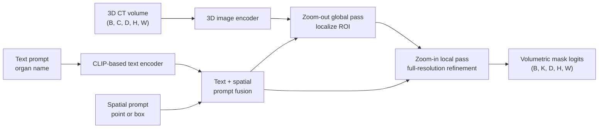

# SegVol

## Plain-Language Overview

SegVol is a promptable 3D medical segmentation foundation model for volumetric
CT. It accepts semantic text prompts, such as an organ name, and spatial prompts,
such as a point or bounding box.

This gives SegVol a different interface from promptable models that require only
spatial prompts.

## What Problem It Solved

Direct full-volume inference can run into a memory wall. SegVol introduces a
zoom-out-zoom-in inference mechanism: a global pass localizes the region of
interest, and a local pass refines the segmentation at full resolution.

The supplied source description also states that SegVol explicitly fuses a
CLIP-based text encoder with the image encoder, enabling text-driven
segmentation without any spatial prompt.

## Visual Architecture Schematic

This is an original schematic for this book, not a copied paper figure.



## Step-By-Step Walkthrough

1. The 3D image encoder extracts volumetric features from the CT volume.
2. A CLIP-based text encoder represents the semantic text prompt.
3. Spatial prompts, when present, provide point or bounding-box guidance.
4. Prompt features are fused with volumetric image features.
5. A zoom-out global pass localizes the region of interest.
6. A zoom-in local pass refines the mask at full resolution.
7. The model returns volumetric segmentation logits.

## Minimum Architecture Form

Core building blocks:

- 3D image encoder.
- CLIP-based text encoder.
- Spatial prompt encoder for point or bounding-box prompts.
- Prompt fusion between semantic and spatial conditions.
- Zoom-out-zoom-in inference flow.
- Volumetric mask decoder.

Tensor shape flow:

```text
Input volume:       (B, C, D, H, W)
Image features:     (B, F, D/s, H/s, W/s)
Text features:      (B, T)
Spatial prompt:     (B, P)
ROI-local feature:  (B, F, d, h, w)
Mask logits:        (B, K, D, H, W)
```

`B` is batch size, `C` is input channels, `D`, `H`, and `W` are full-volume
spatial dimensions, `d`, `h`, and `w` are local region dimensions, `F` is image
feature width, `T` is text feature width, `P` is spatial prompt feature width,
and `K` is the number of output masks or classes. See
[Tensor Shape Notation](../foundations/how-to-read-an-architecture.md#tensor-shape-notation)
for the general notation used across the book.

Repo-authored pseudocode:

```text
encode the 3D CT volume
encode semantic text prompts with a text encoder
encode optional point or box prompts
fuse image, text, and spatial prompt features
run a global pass to localize the region of interest
run a local pass to refine the full-resolution segmentation
return volumetric mask logits
```

??? example "Minimum runnable PyTorch sketch"

    ```python
    import torch
    from torch import nn
    from torch.nn import functional as F


    class MinimumSegVolStyleSegmenter(nn.Module):
        def __init__(self, in_channels: int, text_features: int, out_channels: int) -> None:
            super().__init__()
            self.image_encoder = nn.Sequential(
                nn.Conv3d(in_channels, 16, kernel_size=3, stride=2, padding=1),
                nn.ReLU(inplace=True),
            )
            self.text_projection = nn.Linear(text_features, 16)
            self.spatial_projection = nn.Linear(6, 16)
            self.global_decoder = nn.Conv3d(48, 16, kernel_size=3, padding=1)
            self.local_decoder = nn.Conv3d(16, out_channels, kernel_size=1)

        def forward(
            self,
            volume: torch.Tensor,
            text_prompt: torch.Tensor,
            spatial_prompt: torch.Tensor,
        ) -> torch.Tensor:
            volume_size = volume.shape[-3:]
            image_features = self.image_encoder(volume)
            text = self.text_projection(text_prompt).view(volume.shape[0], 16, 1, 1, 1)
            spatial = self.spatial_projection(spatial_prompt).view(volume.shape[0], 16, 1, 1, 1)
            text = text.expand_as(image_features)
            spatial = spatial.expand_as(image_features)
            fused = torch.cat((image_features, text, spatial), dim=1)
            global_roi = torch.relu(self.global_decoder(fused))
            logits = self.local_decoder(global_roi)
            return F.interpolate(logits, size=volume_size, mode="trilinear", align_corners=False)


    model = MinimumSegVolStyleSegmenter(in_channels=1, text_features=8, out_channels=1)
    volume = torch.randn(1, 1, 12, 32, 32)
    text = torch.randn(1, 8)
    spatial = torch.tensor([[6.0, 16.0, 16.0, 2.0, 8.0, 8.0]])
    logits = model(volume, text, spatial)
    assert logits.shape == (1, 1, 12, 32, 32)
    ```

## Tensor-Shape Intuition

SegVol combines semantic and spatial prompting with volumetric image features.
The text prompt is not a spatial map by itself; it must be projected and fused
with volume features before mask decoding.

```text
Text prompt feature:     (B, T)
Volume feature map:      (B, F, D/s, H/s, W/s)
Broadcast prompt feature:(B, F, D/s, H/s, W/s)
Prompted mask logits:    (B, K, D, H, W)
```

## Implementation Walkthrough

This repository does not provide a tested local SegVol implementation. The
minimum code sketch above is educational only. It is not registered as a package
model, does not include a demo, does not load model weights, and does not claim
to reproduce the full paper.

## Learning Notes For Practitioners

- SegVol is distinct from SAM-Med3D because it adds semantic text prompting
  through a CLIP-based text encoder.
- Treat dataset-size and category-count claims as paper-reported context, not
  as guarantees for a new dataset or scanner.
- Text prompts require careful evaluation of vocabulary, category definitions,
  and prompt policy; they are not equivalent to clinical validation.

## What Changed Relative To MedSAM

MedSAM represents the medical SAM-style promptable segmentation branch. SegVol
adds native volumetric segmentation, semantic text prompts, spatial prompts, and
zoom-out-zoom-in inference for full-volume medical segmentation.

## Strengths

- Represents the text-promptable branch of 3D medical foundation models.
- Can combine semantic text prompts and spatial prompts.
- Uses zoom-out-zoom-in inference to avoid direct full-volume memory pressure.

## Limitations

- The local page is reference-only and does not include tested package code.
- The minimum sketch is not a foundation-model implementation and does not load
  pretrained weights.
- The supplied source description focuses on CT; transfer to other modalities
  would require validation.
- Reported paper behavior does not establish clinical readiness for a new
  scanner, institution, modality, or annotation protocol.

## Implementation Status

| Field | Value |
| --- | --- |
| Status | reference-only |
| Code in `src/` | No local `src/` implementation |
| Tests | No local tests |
| Demo | No local demo |
| Documentation-only page | Yes |
| Data scope | Synthetic examples only |
| Metadata ID | `segvol` |

!!! note "Educational scope"
    This repository is for education and research. This page does not claim
    clinical readiness.

## Model Details

| Field | Value |
| --- | --- |
| Year | 2023 |
| Parent | MedSAM |
| Family | foundation-models |
| Paper title | SegVol: Universal and Interactive Volumetric Medical Image Segmentation |
| DOI | `10.48550/arXiv.2311.13385` |
| arXiv | `2311.13385` |
| Source note | Du et al., arXiv 2023; revised Feb 2025 |

## Read The Original Paper

- DOI: [10.48550/arXiv.2311.13385](https://doi.org/10.48550/arXiv.2311.13385)
- arXiv: [2311.13385](https://arxiv.org/abs/2311.13385)
- Official code: [BAAI-DCAI/SegVol](https://github.com/BAAI-DCAI/SegVol)
