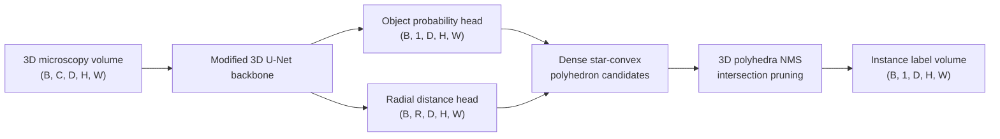

# StarDist-3D

## Plain-Language Overview

StarDist-3D is an instance segmentation architecture for 3D microscopy. Instead
of assigning only a semantic class to each voxel, it predicts object candidates:
an object probability plus distances from each voxel to an object boundary along
a fixed set of 3D directions.

Those distances define a star-convex polyhedron around each candidate center.
The model then keeps the strongest non-overlapping candidates with non-maximum
suppression, producing an instance label volume where each nucleus can receive a
separate object ID.

## What Problem It Solved

Dense semantic segmentation answers "which voxels belong to foreground?" but it
does not by itself separate touching nuclei into individual objects. A watershed
or connected-component post-processing step can help, but dense and overlapping
3D microscopy objects often need a representation that predicts object shape and
objectness directly.

StarDist-3D addresses this by changing the output target. It uses a modified 3D
U-Net-style backbone to produce dense object proposals as star-convex
polyhedra, then removes duplicate overlapping proposals with NMS. This makes the
architecture a useful baseline for object-level microscopy segmentation and for
studying where shape assumptions fail.

## Visual Architecture Schematic

This is an original schematic for this book, not a copied paper figure.



## Step-By-Step Walkthrough

1. A 3D microscopy volume enters a 3D U-Net-like encoder-decoder backbone.
2. The shared features feed an object probability head and a radial distance
   head.
3. For each voxel, the probability head estimates whether that voxel is a good
   object center.
4. For each voxel, the distance head predicts `R` radial distances to the object
   boundary along fixed directions on the unit sphere.
5. The probability and distance predictions define dense star-convex polyhedron
   candidates.
6. Non-maximum suppression compares overlapping 3D polyhedra and removes weaker
   duplicates.
7. The retained polyhedra are rasterized or assigned into a final instance label
   volume.

## Architecture Description

Backbone:

- A modified 3D U-Net variant extracts volumetric features from the input stack.
- The U-Net-style path provides local 3D context and restores spatial
  resolution for dense per-voxel prediction.

Output heads:

- The probability head returns one objectness value per voxel.
- The distance head returns an `R`-channel vector per voxel, where each channel
  is a radial distance along one fixed 3D direction.
- Together, these heads replace the usual semantic segmentation logits with
  dense instance proposals.

NMS step:

- Candidate polyhedra are generated densely, so many voxels can propose the same
  object.
- NMS keeps high-confidence candidates and suppresses lower-confidence
  candidates that overlap too much.
- The paper introduced an efficient differentiable polyhedra intersection
  algorithm for the 3D overlap calculation needed by NMS.

## Minimum Architecture Form

Core building blocks:

- 3D U-Net-style feature extractor.
- Object probability head with one channel.
- Radial distance head with `R` channels.
- Fixed 3D ray directions on the unit sphere.
- Candidate polyhedron construction from center voxels and radial distances.
- 3D polyhedra NMS.

Tensor shape flow:

```text
Input volume:        (B, C, D, H, W)
Backbone features:   (B, F, D, H, W)
Probability map:     (B, 1, D, H, W)
Distance map:        (B, R, D, H, W)
Candidates:          dense center + R-distance polyhedra
Instance labels:     (B, 1, D, H, W)
```

`B` is batch size, `C` is input channels, `D`, `H`, and `W` are depth, height,
and width, `F` is feature width, and `R` is the number of radial directions.
See
[Tensor Shape Notation](../foundations/how-to-read-an-architecture.md#tensor-shape-notation)
for the general notation used across the book.

Repo-authored pseudocode:

```text
extract 3D U-Net-style features from the microscopy volume
predict object probability at every voxel
predict R radial distances at every voxel
turn high-probability voxels into star-convex polyhedron candidates
compare candidate overlaps with 3D polyhedra intersection
apply non-maximum suppression
return an instance label volume
```

??? example "Minimum educational PyTorch shape sketch"

    ```python
    import torch
    from torch import nn


    class MinimumStarDist3DHeads(nn.Module):
        """Shape-only sketch of the two StarDist-3D prediction heads."""

        def __init__(self, in_channels: int, rays: int) -> None:
            super().__init__()
            self.features = nn.Sequential(
                nn.Conv3d(in_channels, 8, kernel_size=3, padding=1),
                nn.ReLU(inplace=True),
                nn.Conv3d(8, 8, kernel_size=3, padding=1),
                nn.ReLU(inplace=True),
            )
            self.probability = nn.Conv3d(8, 1, kernel_size=1)
            self.distances = nn.Conv3d(8, rays, kernel_size=1)

        def forward(self, volume: torch.Tensor) -> tuple[torch.Tensor, torch.Tensor]:
            features = self.features(volume)
            object_probability = torch.sigmoid(self.probability(features))
            radial_distances = torch.relu(self.distances(features))
            return object_probability, radial_distances


    model = MinimumStarDist3DHeads(in_channels=1, rays=32)
    volume = torch.randn(1, 1, 8, 32, 32)
    probability, distances = model(volume)
    assert probability.shape == (1, 1, 8, 32, 32)
    assert distances.shape == (1, 32, 8, 32, 32)
    ```

This sketch only shows the prediction-head shape contract. It does not implement
StarDist-3D training targets, polyhedron construction, anisotropy handling, or
NMS.

## Tensor-Shape Intuition

A semantic 3D segmenter usually returns `K` class logits per voxel:

```text
Semantic logits: (B, K, D, H, W)
```

StarDist-3D returns object proposal parameters instead:

```text
Object probability: (B, 1, D, H, W)
Radial distances:   (B, R, D, H, W)
```

The `R` distance channels are not classes. They are geometric measurements from
a candidate center to the object boundary along fixed directions. After NMS, the
output is no longer a probability tensor; it is an instance label volume where
different objects can have different integer labels.

## Implementation Walkthrough

This repository does not provide a tested local StarDist-3D implementation. The
shape sketch above is educational only. It is not registered as a package model,
does not include a demo, and does not claim to reproduce the full paper or the
official package.

Star-convex polyhedra parameterization:

- A voxel with high object probability is treated as a candidate object center.
- The model predicts `R` distances from that center to the boundary along fixed
  directions on the unit sphere.
- Connecting those radial boundary points forms a star-convex polyhedron.
- The assumption is that the object boundary can be reached by one ray in each
  direction from a center point.

Anisotropy handling:

- Confocal microscopy Z-stacks often have lower resolution along the axial
  direction than within the image plane.
- If voxel spacing is ignored, a sphere-like nucleus in physical space can look
  stretched or compressed in voxel coordinates.
- StarDist-3D explicitly handles anisotropic voxel spacing by adapting the
  star-convex representation for axial compression.

NMS and custom intersection:

- Dense prediction creates many candidate polyhedra around the same nucleus.
- NMS needs to decide whether two 3D polyhedra overlap enough that one should be
  suppressed.
- The 3D case is more complex than 2D polygon overlap, so the method uses an
  efficient differentiable algorithm for intersections between pairs of
  star-convex polyhedra.

## Implementation Resources

- Official code: [stardist/stardist](https://github.com/stardist/stardist)

## Learning Notes For Practitioners

- StarDist-3D is a good fit when the target objects are roughly round or ovoid,
  densely packed, and need separate instance labels, such as many cell nuclei in
  3D fluorescence microscopy.
- It is especially relevant when Z-resolution is anisotropic and the output must
  separate touching objects rather than only classify foreground voxels.
- It is not a direct tool for tube-shaped structures such as myotubes, axons, or
  blood vessels. The star-convex assumption breaks when no single center can
  describe the boundary with one radius per direction.
- That failure mode is useful for research on other 3D structures: run
  StarDist-3D as a baseline, measure where it fails, and use the failure
  analysis to motivate flow-based, self-supervised, or non-star-convex
  alternatives.
- The official `stardist` Python package integrates with TensorFlow and
  PyTorch; this repository still treats StarDist-3D as reference-only.

## What Changed Relative To 3D U-Net And 2D StarDist

Relative to [3D U-Net](3d-unet.md), StarDist-3D keeps a 3D U-Net-style backbone
but changes the output contract. A standard 3D U-Net predicts per-voxel semantic
class logits. StarDist-3D predicts objectness and geometry so that instances can
be recovered directly.

Relative to the 2D StarDist approach, StarDist-3D moves from star-convex
polygons in an image plane to star-convex polyhedra in a volume. That adds 3D
ray directions, anisotropy handling, and a 3D polyhedra intersection calculation
for NMS.

## Strengths

- Produces instance segmentation outputs rather than only semantic foreground
  labels.
- Represents dense, touching, round or ovoid microscopy objects with compact
  geometric predictions.
- Handles anisotropic voxel spacing, which is common in confocal microscopy
  Z-stacks.
- Avoids relying on a separate watershed step as the main instance separation
  mechanism.

## Limitations

- The local page is reference-only and does not include tested package code.
- Star-convex polyhedra cannot represent objects that are highly elongated along
  one axis, such as myotubes, axons, or blood vessels.
- Objects must be reasonably representable as star domains from candidate
  centers.
- Training requires fully annotated 3D instance labels, which are expensive to
  produce.
- The number of radial directions `R` is a memory/accuracy trade-off that must be
  set before training.
- Reported paper behavior does not establish clinical readiness for a new
  modality, annotation protocol, or deployment setting.

## Implementation Status

| Field | Value |
| --- | --- |
| Status | reference-only |
| Code in `src/` | No local `src/` implementation |
| Tests | No local tests |
| Demo | No local demo |
| Documentation-only page | Yes |
| Data scope | Synthetic examples only |
| Metadata ID | `stardist-3d` |

!!! note "Educational scope"
    This repository is for education and research. This page does not claim
    clinical readiness.

## Model Details

| Field | Value |
| --- | --- |
| Year | 2020 |
| Parent | 3D U-Net |
| Family | instance-segmentation |
| Paper title | Star-convex Polyhedra for 3D Object Detection and Segmentation in Microscopy |
| Authors | Martin Weigert, Uwe Schmidt, Robert Haase, Ko Sugawara, Gene Myers |
| Venue | WACV 2020 |
| DOI | `10.1109/WACV45572.2020.9093435` |
| arXiv | `1908.03636` |

## Read The Original Paper

- DOI: [10.1109/WACV45572.2020.9093435](https://doi.org/10.1109/WACV45572.2020.9093435)
- arXiv: [1908.03636](https://arxiv.org/abs/1908.03636)
- Official code: [stardist/stardist](https://github.com/stardist/stardist)

```text
StarDist-3D citation
Title: Star-convex Polyhedra for 3D Object Detection and Segmentation in Microscopy
Authors: Martin Weigert, Uwe Schmidt, Robert Haase, Ko Sugawara, Gene Myers
Venue: WACV 2020
Year: 2020
DOI: 10.1109/WACV45572.2020.9093435
arXiv: 1908.03636
```
