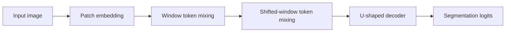

# Swin-Unet

## Plain-Language Overview

Swin-Unet keeps the U-shaped segmentation layout but builds the representation
around windowed Transformer-style blocks instead of ordinary convolution blocks.

## What Problem It Solved

Global self-attention can be expensive on image grids. Swin-style windowing
limits attention to local windows and shifts windows between blocks so nearby
regions can still exchange information across boundaries.

## Visual Architecture Schematic

This is an original schematic for this book, not a copied paper figure.



## Step-By-Step Walkthrough

1. Patch embedding converts the image into a grid of tokens.
2. Windowed token mixing processes local windows.
3. Shifted windows let information cross previous window boundaries.
4. A decoder restores dense segmentation logits.

## Minimum Architecture Form

Core building blocks:

- Patch embedding.
- Window partitioning.
- Window-local token mixing.
- A shifted-window step.
- Decoder upsampling.

Tensor shape flow:

```text
Input image:       (B, C, H, W)
Patch grid:        (B, F, H/4, W/4)
Window tokens:     (windows, tokens, F)
Output logits:     (B, K, H, W)
```

Repo-authored pseudocode:

```text
embed image patches
partition token grid into local windows
mix tokens inside each window
shift the grid and repeat window mixing
decode token grid to full-resolution logits
```

??? example "Minimum runnable PyTorch sketch"

    ```python
    import torch
    from torch import nn


    class WindowMixer(nn.Module):
        def __init__(self, channels: int, window_size: int = 4, shift: int = 0) -> None:
            super().__init__()
            self.window_size = window_size
            self.shift = shift
            self.norm = nn.LayerNorm(channels)
            self.attn = nn.MultiheadAttention(channels, num_heads=4, batch_first=True)

        def forward(self, x: torch.Tensor) -> torch.Tensor:
            if self.shift:
                x = torch.roll(x, shifts=(-self.shift, -self.shift), dims=(2, 3))
            batch, channels, height, width = x.shape
            w = self.window_size
            windows = x.unfold(2, w, w).unfold(3, w, w)
            windows = windows.permute(0, 2, 3, 4, 5, 1).reshape(-1, w * w, channels)
            mixed, _ = self.attn(self.norm(windows), self.norm(windows), self.norm(windows))
            mixed = mixed.reshape(batch, height // w, width // w, w, w, channels)
            x = mixed.permute(0, 5, 1, 3, 2, 4).reshape(batch, channels, height, width)
            if self.shift:
                x = torch.roll(x, shifts=(self.shift, self.shift), dims=(2, 3))
            return x


    class MinimumSwinUnet(nn.Module):
        def __init__(self, in_channels: int, out_channels: int) -> None:
            super().__init__()
            self.patch = nn.Conv2d(in_channels, 16, kernel_size=4, stride=4)
            self.mix1 = WindowMixer(16, window_size=4, shift=0)
            self.mix2 = WindowMixer(16, window_size=4, shift=2)
            self.decode = nn.ConvTranspose2d(16, 16, kernel_size=4, stride=4)
            self.out = nn.Conv2d(16, out_channels, kernel_size=1)

        def forward(self, x: torch.Tensor) -> torch.Tensor:
            x = self.patch(x)
            x = self.mix1(x)
            x = self.mix2(x)
            return self.out(self.decode(x))


    model = MinimumSwinUnet(in_channels=1, out_channels=2)
    image = torch.randn(1, 1, 32, 32)
    logits = model(image)
    assert logits.shape == (1, 2, 32, 32)
    ```

## Implementation Walkthrough

This repository does not provide a tested local Swin-Unet implementation yet.
The minimum code sketch above is educational only. It is not registered as a
package model, does not include a demo, and does not claim to reproduce the full
paper.

## Learning Notes For Practitioners

- The minimum form focuses on window partitioning and shifted-window mixing.
- Full Swin-style models include additional hierarchy, merging, expansion, and
  normalization details.
- Future tests should include shape checks where patch and window sizes divide
  the input size.

## What Changed Relative To TransUNet

Swin-Unet keeps a Transformer-based segmentation idea but uses a U-shaped design
with windowed token mixing.

## Strengths

- Makes window-local token mixing explicit.
- Preserves a dense segmentation decoder path.

## Limitations

- The local page is reference-only and does not include tested package code.
- Window and patch sizes constrain the simplest implementation shapes.

## Implementation Status

| Field | Value |
| --- | --- |
| Status | reference-only |
| Code | Not implemented locally |
| Tests | Not implemented locally |
| Demo | Not implemented locally |
| Data used in examples | synthetic tensors only |
| Metadata ID | `swin_unet` |

!!! note "Educational scope"
    This repository is for education and research. This page does not claim
    clinical readiness.

## Model Details

| Field | Value |
| --- | --- |
| Year | 2021 |
| Parent | TransUNet |
| Family | Transformer U-shape |
| Paper title | Swin-Unet: Unet-like Pure Transformer for Medical Image Segmentation |
| DOI | Not listed |
| arXiv | `2105.05537` |

## Read The Original Paper

- arXiv: [2105.05537](https://arxiv.org/abs/2105.05537)
