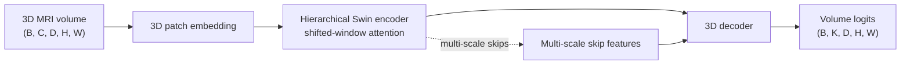

# Swin UNETR

## Plain-Language Overview

Swin UNETR adapts shifted-window Swin Transformer ideas to 3D medical image
segmentation. It keeps the volumetric segmentation goal of UNETR but uses a
hierarchical Swin Transformer encoder so attention can be computed inside local
3D windows while shifted windows let information cross window boundaries.

## What Problem It Solved

Plain 3D convolutional models are strong local feature extractors, but their
fixed kernel size can make long-range context harder to model. Full global
Transformer attention over a 3D volume can also be expensive. Swin UNETR sits
between those extremes: it uses windowed self-attention for tractable local
token mixing, shifted windows for cross-window communication, and a decoder path
for dense voxel-level prediction.

## Visual Architecture Schematic

This is an original schematic for this book, not a copied paper figure.



## Step-By-Step Walkthrough

1. A 3D input volume is divided into embedded patch tokens.
2. A hierarchical Swin Transformer encoder processes the token grid at multiple
   resolutions.
3. Window attention keeps token mixing local within each stage.
4. Shifted windows move the attention boundaries so neighboring windows can
   exchange information across blocks.
5. Multi-scale encoder features are connected into a 3D decoder.
6. The decoder upsamples features back to dense voxel-level segmentation logits.

## Minimum Architecture Form

Core building blocks:

- A 3D patch embedding step.
- Window partitioning over a 3D token grid.
- Shifted-window self-attention blocks.
- Hierarchical downsampling stages.
- A 3D decoder with multi-scale skip features.

Tensor shape flow:

```text
Input volume:        (B, C, D, H, W)
Patch grid:          (B, F, D/p, H/p, W/p)
Window tokens:       (windows, tokens_per_window, F)
Encoder features:    multi-scale 3D feature grids
Output logits:       (B, K, D, H, W)
```

Where `B` is batch size, `C` is input channels or modalities, `K` is output
classes, and `p` is the 3D patch size. See
[Tensor Shape Notation](../foundations/how-to-read-an-architecture.md#tensor-shape-notation)
for the general notation.

Repo-authored pseudocode:

```text
embed a 3D volume into patch tokens
partition the token grid into local 3D windows
run window attention, then shifted-window attention
collect multi-scale encoder features
decode with skip connections to full-resolution voxel logits
```

??? example "Minimum runnable PyTorch sketch"

    ```python
    import torch
    from torch import nn


    class Tiny3DWindowMixer(nn.Module):
        def __init__(self, channels: int, window_size: int = 2, shift: int = 0) -> None:
            super().__init__()
            self.window_size = window_size
            self.shift = shift
            self.norm = nn.LayerNorm(channels)
            self.attn = nn.MultiheadAttention(channels, num_heads=4, batch_first=True)

        def forward(self, x: torch.Tensor) -> torch.Tensor:
            if self.shift:
                x = torch.roll(x, shifts=(-self.shift, -self.shift, -self.shift), dims=(2, 3, 4))

            batch, channels, depth, height, width = x.shape
            w = self.window_size
            windows = x.unfold(2, w, w).unfold(3, w, w).unfold(4, w, w)
            windows = windows.permute(0, 2, 3, 4, 5, 6, 7, 1).reshape(-1, w**3, channels)
            mixed, _ = self.attn(self.norm(windows), self.norm(windows), self.norm(windows))
            mixed = mixed.reshape(batch, depth // w, height // w, width // w, w, w, w, channels)
            x = mixed.permute(0, 7, 1, 4, 2, 5, 3, 6).reshape(batch, channels, depth, height, width)

            if self.shift:
                x = torch.roll(x, shifts=(self.shift, self.shift, self.shift), dims=(2, 3, 4))
            return x


    class MinimumSwinUNETR(nn.Module):
        def __init__(self, in_channels: int, out_channels: int) -> None:
            super().__init__()
            self.patch = nn.Conv3d(in_channels, 16, kernel_size=2, stride=2)
            self.mix1 = Tiny3DWindowMixer(16, window_size=2, shift=0)
            self.mix2 = Tiny3DWindowMixer(16, window_size=2, shift=1)
            self.decode = nn.ConvTranspose3d(16, 16, kernel_size=2, stride=2)
            self.out = nn.Conv3d(16, out_channels, kernel_size=1)

        def forward(self, x: torch.Tensor) -> torch.Tensor:
            x = self.patch(x)
            x = self.mix1(x)
            x = self.mix2(x)
            return self.out(self.decode(x))


    model = MinimumSwinUNETR(in_channels=1, out_channels=2)
    volume = torch.randn(1, 1, 8, 8, 8)
    logits = model(volume)
    assert logits.shape == (1, 2, 8, 8, 8)
    ```

## Implementation Walkthrough

This repository does not provide a tested local Swin UNETR implementation yet.
The minimum code sketch above is educational only. It is not registered as a
package model, does not include a demo, and does not claim to reproduce the full
paper.

## Learning Notes For Practitioners

- Swin UNETR is closest to UNETR in task shape because both target 3D medical
  volumes.
- Its encoder is closer to Swin-style designs because it uses shifted-window
  token mixing rather than full global token attention.
- Full implementations need careful handling of 3D window sizes, hierarchy,
  skip features, memory, and volume dimensions.
- When comparing Transformer segmentation models, separate the question of
  dimensionality from the question of attention pattern.

## What Changed Relative To UNETR

UNETR uses a Transformer encoder over 3D patch tokens. Swin UNETR keeps the 3D
encoder-decoder segmentation target but replaces the encoder pattern with a
hierarchical shifted-window Swin Transformer encoder.

## Transformer Segmentation Branch Comparison

| Architecture | Main distinction |
| --- | --- |
| [TransUNet](transunet.md) | CNN/U-Net hybrid with Transformer context. |
| [Swin-Unet](swin-unet.md) | Swin Transformer U-shaped segmentation idea. |
| [UNETR](unetr.md) | Transformer encoder with U-Net-like decoder for 3D medical segmentation. |
| Swin UNETR | Shifted-window Transformer encoder for 3D medical segmentation. |

## Strengths

- Makes shifted-window attention explicit for volumetric segmentation.
- Keeps a 3D decoder path for dense voxel predictions.
- Connects Swin-style hierarchical features to the UNETR family of 3D medical
  segmentation models.

## Limitations

- The local page is reference-only and does not include tested package code.
- Window, patch, and volume sizes must be managed carefully in full
  implementations.
- Transformer memory use remains an important practical constraint for 3D
  medical images.

## Implementation Status

| Field | Value |
| --- | --- |
| Status | reference-only |
| Code in `src/` | No local `src/` implementation |
| Tests | No local tests |
| Demo | No local demo |
| Documentation-only page | Yes |
| Data scope | Synthetic examples only |
| Metadata ID | `swin_unetr` |

!!! note "Educational scope"
    This repository is for education and research. This page does not claim
    clinical readiness.

## Model Details

| Field | Value |
| --- | --- |
| Year | 2022 |
| Parent | UNETR |
| Family | 3D shifted-window Transformer |
| Paper title | Swin UNETR: Swin Transformers for Semantic Segmentation of Brain Tumors in MRI Images |
| DOI | Not listed |
| arXiv | `2201.01266` |

## Read The Original Paper

- arXiv: [2201.01266](https://arxiv.org/abs/2201.01266)
