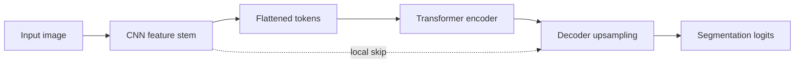

# TransUNet

## Plain-Language Overview

TransUNet combines convolutional image features with Transformer context and a
segmentation decoder. The convolutional part keeps local image structure visible,
while the Transformer part mixes information across token positions.

## What Problem It Solved

Plain convolutional U-Net blocks mainly mix local neighborhoods. TransUNet adds
a Transformer encoding step so the model can exchange information across a
larger token sequence before dense decoding.

## Visual Architecture Schematic

This is an original schematic for this book, not a copied paper figure.



## Step-By-Step Walkthrough

1. A CNN stem extracts local feature maps.
2. The feature map is flattened into tokens.
3. A Transformer encoder mixes token context.
4. Tokens are reshaped back to a feature map and decoded to logits.

## Minimum Architecture Form

Core building blocks:

- A convolutional stem.
- A tokenization step.
- A Transformer encoder.
- A decoder that restores image resolution.

Tensor shape flow:

```text
Input image:       (B, C, H, W)
CNN features:      (B, F, H/2, W/2)
Tokens:            (B, N, F)
Decoded logits:    (B, K, H, W)
```

Repo-authored pseudocode:

```text
extract CNN features
flatten features into a token sequence
run Transformer encoder on tokens
reshape tokens back to a feature map
upsample and project to segmentation logits
```

??? example "Minimum runnable PyTorch sketch"

    ```python
    import torch
    from torch import nn


    class MinimumTransUNet(nn.Module):
        def __init__(self, in_channels: int, out_channels: int) -> None:
            super().__init__()
            self.stem = nn.Conv2d(in_channels, 16, kernel_size=3, stride=2, padding=1)
            encoder_layer = nn.TransformerEncoderLayer(d_model=16, nhead=4, batch_first=True)
            self.transformer = nn.TransformerEncoder(encoder_layer, num_layers=1)
            self.decoder = nn.ConvTranspose2d(16, 16, kernel_size=2, stride=2)
            self.out = nn.Conv2d(16, out_channels, kernel_size=1)

        def forward(self, x: torch.Tensor) -> torch.Tensor:
            features = torch.relu(self.stem(x))
            batch, channels, height, width = features.shape
            tokens = features.flatten(2).transpose(1, 2)
            tokens = self.transformer(tokens)
            features = tokens.transpose(1, 2).reshape(batch, channels, height, width)
            return self.out(self.decoder(features))


    model = MinimumTransUNet(in_channels=1, out_channels=2)
    image = torch.randn(1, 1, 32, 32)
    logits = model(image)
    assert logits.shape == (1, 2, 32, 32)
    ```

## Implementation Walkthrough

This repository does not provide a tested local TransUNet implementation yet.
The minimum code sketch above is educational only. It is not registered as a
package model, does not include a demo, and does not claim to reproduce the full
paper.

## Learning Notes For Practitioners

- The minimum form shows the handoff between CNN feature maps and Transformer
  tokens.
- Full implementations need careful positional encoding, skip design, and memory
  management.
- Future local tests should cover token reshape correctness and output shape.

## What Changed Relative To U-Net

TransUNet adds Transformer-based token mixing to a U-Net-like segmentation path.

## Strengths

- Combines local convolutional features with global token mixing.
- Keeps dense decoding as the output mechanism.

## Limitations

- The local page is reference-only and does not include tested package code.
- Transformer token sequences can increase memory use.

## Implementation Status

| Field | Value |
| --- | --- |
| Status | reference-only |
| Code in `src/` | No local `src/` implementation |
| Tests | No local tests |
| Demo | No local demo |
| Documentation-only page | Yes |
| Data scope | Synthetic examples only |
| Metadata ID | `transunet` |

!!! note "Educational scope"
    This repository is for education and research. This page does not claim
    clinical readiness.

## Model Details

| Field | Value |
| --- | --- |
| Year | 2021 |
| Parent | U-Net |
| Family | Transformer hybrid |
| Paper title | TransUNet: Transformers Make Strong Encoders for Medical Image Segmentation |
| DOI | Not listed |
| arXiv | `2102.04306` |

## Read The Original Paper

- arXiv: [2102.04306](https://arxiv.org/abs/2102.04306)
