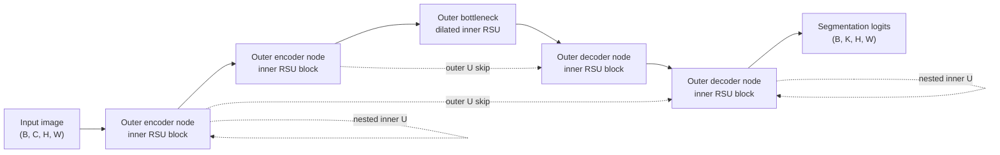

# U²-Net

## Plain-Language Overview

U²-Net is a nested U-shaped architecture. Its outer structure looks like a
U-Net, but each encoder and decoder node is itself a smaller U-Net-like block
called an RSU block.

This creates two levels of U-shape: the outer U handles multi-scale feature
fusion, and each inner U extracts richer features at its own resolution level.

## What Problem It Solved

U-Net-style variants often modify skip connections or add attention around the
encoder-decoder path. U²-Net changes the blocks themselves. Each stage becomes a
small nested U-structure that can combine local detail with broader context
before passing features to the next outer stage.

The supplied source description notes that innermost RSU blocks use dilated
convolutions to capture context without increasing memory cost.

## Visual Architecture Schematic

This is an original schematic for this book, not a copied paper figure.



## Step-By-Step Walkthrough

1. The outer encoder receives the image and processes each level with an RSU
   block.
2. Inside an RSU block, a small U-shaped path captures local and broader context
   at that level.
3. The outer encoder downsamples between levels.
4. The deepest RSU blocks can use dilated convolutions for context.
5. The outer decoder upsamples and fuses matching outer skip features.
6. Decoder RSU blocks refine the fused features before the final segmentation
   head.

## Minimum Architecture Form

Core building blocks:

- Outer U-Net-style encoder, bottleneck, decoder, and skip connections.
- RSU blocks inside outer encoder and decoder nodes.
- Inner U-shaped paths inside each RSU block.
- Dilated convolutions in innermost RSU blocks.
- A final segmentation head.

Tensor shape flow:

```text
Input image:       (B, C, H, W)
Outer RSU level:   (B, F, H, W)
Deep outer level:  (B, 2F, H/2, W/2)
Decoder RSU level: (B, F, H, W)
Output logits:     (B, K, H, W)
```

`B` is batch size, `C` is input channels, `F` is feature width, and `K` is the
number of output classes or masks. See
[Tensor Shape Notation](../foundations/how-to-read-an-architecture.md#tensor-shape-notation)
for the general notation used across the book.

Repo-authored pseudocode:

```text
define an RSU block as a small U-shaped feature extractor
replace each outer U-Net node with an RSU block
use outer encoder downsampling and decoder upsampling
fuse outer skip features at matching resolutions
project the final decoder feature to segmentation logits
```

??? example "Minimum runnable PyTorch sketch"

    ```python
    import torch
    from torch import nn
    from torch.nn import functional as F


    class TinyRSUBlock(nn.Module):
        def __init__(self, in_channels: int, out_channels: int) -> None:
            super().__init__()
            self.in_proj = nn.Conv2d(in_channels, out_channels, kernel_size=3, padding=1)
            self.down = nn.Conv2d(out_channels, out_channels, kernel_size=3, padding=1)
            self.inner = nn.Conv2d(out_channels, out_channels, kernel_size=3, padding=2, dilation=2)
            self.up_mix = nn.Conv2d(out_channels * 2, out_channels, kernel_size=3, padding=1)

        def forward(self, x: torch.Tensor) -> torch.Tensor:
            outer_skip = torch.relu(self.in_proj(x))
            inner = F.max_pool2d(outer_skip, kernel_size=2)
            inner = torch.relu(self.down(inner))
            inner = torch.relu(self.inner(inner))
            inner = F.interpolate(inner, size=outer_skip.shape[-2:], mode="bilinear", align_corners=False)
            return torch.relu(self.up_mix(torch.cat((outer_skip, inner), dim=1)) + outer_skip)


    class MinimumU2NetStyleSegmenter(nn.Module):
        def __init__(self, in_channels: int, out_channels: int) -> None:
            super().__init__()
            self.enc = TinyRSUBlock(in_channels, 8)
            self.bottleneck = TinyRSUBlock(8, 16)
            self.up = nn.ConvTranspose2d(16, 8, kernel_size=2, stride=2)
            self.dec = TinyRSUBlock(16, 8)
            self.out = nn.Conv2d(8, out_channels, kernel_size=1)

        def forward(self, x: torch.Tensor) -> torch.Tensor:
            skip = self.enc(x)
            x = self.bottleneck(F.max_pool2d(skip, kernel_size=2))
            x = self.up(x)
            if x.shape[-2:] != skip.shape[-2:]:
                x = F.interpolate(x, size=skip.shape[-2:], mode="bilinear", align_corners=False)
            x = self.dec(torch.cat((skip, x), dim=1))
            return self.out(x)


    model = MinimumU2NetStyleSegmenter(in_channels=1, out_channels=2)
    image = torch.randn(1, 1, 33, 41)
    logits = model(image)
    assert logits.shape == (1, 2, 33, 41)
    ```

## Tensor-Shape Intuition

U²-Net has two nested shape stories. The outer U changes resolution between
encoder and decoder levels. The inner RSU block temporarily moves to a smaller
feature map, then returns to the block's input resolution before leaving the
outer level.

```text
RSU input:         (B, F, H, W)
Inner U bottom:    (B, F, H/2, W/2)
RSU output:        (B, F, H, W)
Outer output:      (B, K, H, W)
```

## Implementation Walkthrough

This repository does not provide a tested local U²-Net implementation. The
minimum code sketch above is educational only. It is not registered as a package
model, does not include a demo, does not load model weights, and does not claim
to reproduce the full paper.

## Learning Notes For Practitioners

- U²-Net is architecturally distinct from U-Net++ and UNet 3+: those modify skip
  connections, while U²-Net modifies the blocks themselves.
- The supplied source description notes use in the MICCAI 2020 Thyroid Nodule
  Segmentation Challenge and use for salient region detection in pathology
  slides and microscopy.
- Dilated innermost RSU blocks are a context mechanism inside the nested block,
  not a replacement for the outer encoder-decoder path.
- Future implementation work should test both outer U-shape and inner RSU shape
  preservation.

## What Changed Relative To U-Net

U-Net uses plain convolutional blocks at each encoder and decoder node. U²-Net
replaces those nodes with RSU blocks, making each node a small U-shaped feature
extractor.

## Strengths

- Shows a block-level alternative to skip-connection-focused U-Net variants.
- Captures local detail and global context at each resolution level.
- Uses a clear two-level nested U-structure that is useful for teaching
  architecture composition.

## Limitations

- The local page is reference-only and does not include tested package code.
- The minimum sketch is not the full U²-Net architecture.
- Nested U-shaped blocks add implementation complexity and memory-planning
  choices.
- Reported paper behavior does not establish clinical readiness for a new
  modality, scanner, institution, or annotation protocol.

## Implementation Status

| Field | Value |
| --- | --- |
| Status | reference-only |
| Code in `src/` | No local `src/` implementation |
| Tests | No local tests |
| Demo | No local demo |
| Documentation-only page | Yes |
| Data scope | Synthetic examples only |
| Metadata ID | `u2net` |

!!! note "Educational scope"
    This repository is for education and research. This page does not claim
    clinical readiness.

## Model Details

| Field | Value |
| --- | --- |
| Year | 2020 |
| Parent | U-Net |
| Family | unet |
| Paper title | U2-Net: Going Deeper with Nested U-Structure for Salient Object Detection |
| DOI | `10.1016/j.patcog.2020.107404` |
| arXiv | `2005.09007` |
| Source note | Qin et al., Pattern Recognition 2020 |

## Read The Original Paper

- DOI: [10.1016/j.patcog.2020.107404](https://doi.org/10.1016/j.patcog.2020.107404)
- arXiv: [2005.09007](https://arxiv.org/abs/2005.09007)
- Official code: [xuebinqin/U-2-Net](https://github.com/xuebinqin/U-2-Net)
