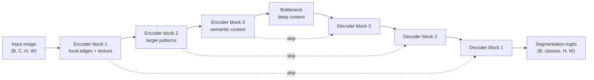

# U-Net

## Plain-Language Overview

U-Net is a segmentation architecture built around a simple idea: first compress
the image to understand context, then expand it back to the original resolution
while reusing fine details from earlier layers.

It became a core medical image segmentation baseline because medical boundaries
often require both global context and precise local information.

For the direct volumetric extension of this idea, see
[3D U-Net](3d-unet.md), which replaces 2D image operations with 3D volume
operations.

## What Problem It Solved

Early dense prediction models could produce pixel-level outputs, but medical
segmentation often needs sharper localization from limited annotated data. U-Net
made this easier by combining a contracting encoder, an expanding decoder, and
skip connections that copy high-resolution features into the decoder.

## Visual Architecture Schematic

This is an original schematic for this book, not a copied paper figure.



## Step-By-Step Walkthrough

1. The encoder applies convolution blocks and downsampling. Each stage reduces
   spatial resolution and increases feature channels.
2. The bottleneck processes the smallest feature map, where the model has the
   widest contextual view.
3. The decoder upsamples the feature map step by step.
4. At each decoder stage, the model concatenates the upsampled features with the
   matching encoder features.
5. A final 1x1 convolution maps decoder features to segmentation logits.

The equations behind each of these steps are in [Key Equations](#key-equations).

## Minimum Architecture Form

Core building blocks:

- Convolution blocks that preserve spatial size.
- Max pooling for the encoder path.
- Upsampling for the decoder path.
- Skip concatenation between matching resolutions.
- A `1x1` output projection to segmentation logits.

Tensor shape flow:

```text
Input image:       (B, C, H, W)
Encoder skip:      (B, F, H, W)
Bottleneck:        (B, 2F, H/2, W/2)
Decoder feature:   (B, F, H, W)
Output logits:     (B, K, H, W)
```

In this notation, `B` is the batch size, `C` is the number of input image
channels, `F` is the feature width chosen for this minimal U-Net block, and `K`
is the number of segmentation outputs. The encoder first changes channels from
`C` to `F` while keeping height and width. Pooling then shrinks the spatial size
to roughly `H/2` by `W/2` and the bottleneck widens channels to `2F`. The decoder
upsamples back to `(H, W)`, and the final `1x1` convolution turns features into
raw segmentation logits. See [Tensor Shape Notation](../foundations/how-to-read-an-architecture.md#tensor-shape-notation)
for the general notation used across the book.

Repo-authored pseudocode:

```text
extract a high-resolution encoder skip
pool the skip tensor into a smaller feature map
process the bottleneck
upsample back to the skip tensor size
concatenate skip and decoder features
project decoder features to raw logits
```

## Check Yourself

Before opening the runnable sketch, predict the output shape for an input shaped
`(1, 1, 33, 41)` and `out_channels=2`. Then explain why the skip tensor is saved
before pooling rather than after pooling.

??? example "Minimum runnable PyTorch sketch"

    ```python
    import torch
    from torch import nn
    from torch.nn import functional as F


    class MinimumUNet(nn.Module):
        def __init__(self, in_channels: int, out_channels: int) -> None:
            super().__init__()
            self.enc = nn.Sequential(
                nn.Conv2d(in_channels, 8, kernel_size=3, padding=1),
                nn.ReLU(inplace=True),
            )
            self.bottleneck = nn.Sequential(
                nn.Conv2d(8, 16, kernel_size=3, padding=1),
                nn.ReLU(inplace=True),
            )
            self.up = nn.ConvTranspose2d(16, 8, kernel_size=2, stride=2)
            self.dec = nn.Sequential(
                nn.Conv2d(16, 8, kernel_size=3, padding=1),
                nn.ReLU(inplace=True),
            )
            self.out = nn.Conv2d(8, out_channels, kernel_size=1)

        def forward(self, x: torch.Tensor) -> torch.Tensor:
            skip = self.enc(x)
            x = F.max_pool2d(skip, kernel_size=2)
            x = self.bottleneck(x)
            x = self.up(x)
            if x.shape[-2:] != skip.shape[-2:]:
                x = F.interpolate(x, size=skip.shape[-2:], mode="bilinear", align_corners=False)
            x = self.dec(torch.cat((skip, x), dim=1))
            return self.out(x)


    model = MinimumUNet(in_channels=1, out_channels=2)
    image = torch.randn(1, 1, 33, 41)
    logits = model(image)
    assert logits.shape == (1, 2, 33, 41)
    ```

## Key Equations

### Convolution Output Size

$$
H_{\text{out}} = \left\lfloor \frac{H_{\text{in}} + 2p - k}{s} \right\rfloor + 1
$$

| Symbol | Meaning |
| --- | --- |
| $H_{\text{in}}$ | Spatial height entering the convolution |
| $p$ | Zero-padding added to each side |
| $k$ | Kernel (filter) size |
| $s$ | Stride |
| $H_{\text{out}}$ | Spatial height leaving the convolution |

This equation computes the height of a feature map after a 2D convolution. With
$k=3$, $p=1$, and $s=1$, it becomes
$H_{\text{out}} = \lfloor H_{\text{in}} + 2 - 3 \rfloor + 1 = H_{\text{in}}$,
which is why `DoubleConv` is shape-preserving: two such convolutions in sequence
leave height and width exactly as they entered. The repository's `UNet2D`
implementation uses this padded form so spatial reduction happens only at
explicit max-pooling steps, making the resolution flow easy to reason about.
Misreading this formula often leads to expecting every convolution block to
shrink the tensor. The same formula applies independently to width, so
non-square inputs follow separate height and width calculations.

### Encoder Spatial Reduction

$$
H_l = \left\lfloor \frac{H_{l-1}}{2} \right\rfloor
$$

| Symbol | Meaning |
| --- | --- |
| $H_l$ | Height after pooling step $l$ |
| $H_{l-1}$ | Height before pooling step $l$ |
| $l$ | Pooling step index |

This equation computes the height after a `2x2` max-pooling step with stride
`2`. The floor means odd input sizes halve with rounding down: height 65 becomes
32 after one pooling step, then 16, then 8, which is the source of the off-by-one
spatial mismatch that the decoder must handle through the odd-size alignment
described later in the Implementation Walkthrough. For a three-stage encoder
with `features=(16, 32, 64)` and input $(1, 1, 65, 73)$, the bottleneck receives
$(1, 128, 8, 9)$, matching the Tensor Shape Example table. Pooling gives deeper
stages a wider view: each halving doubles the spatial context represented by one
feature position. If you assume exact division, odd inputs appear to violate the
skip connection shape contract.

### Skip Connection Channel Concatenation

$$
\mathbf{d}_l = \left[ \mathbf{e}_l \;\Big|\; \mathbf{u}_l \right]_{\text{channel}} \in \mathbb{R}^{B \times 2F_l \times H_l \times W_l}
$$

| Symbol | Meaning |
| --- | --- |
| $\mathbf{e}_l$ | Encoder skip tensor at stage $l$ |
| $\mathbf{u}_l$ | Upsampled decoder tensor projected to $F_l$ channels |
| $\mathbf{d}_l$ | Decoder feature map entering the `DoubleConv` block |
| $l$ | Encoder-decoder stage index |
| $B$ | Batch size |
| $F_l$ | Number of feature channels at encoder stage $l$ |
| $H_l, W_l$ | Spatial height and width of the matched skip resolution at stage $l$ |
| $[\cdot \mid \cdot]_{\text{channel}}$ | Concatenation along the channel dimension |
| $\mathbb{R}$ | Real-valued tensor space |

This equation computes the fused decoder input after a skip tensor meets the
upsampled decoder tensor. The concatenation doubles channel count:
$F_l$ skip channels plus $F_l$ upsampled channels yields $2F_l$ input channels
for the decoder `DoubleConv`, which is why every decoder `DoubleConv` is built
with `in_channels = feature_count * 2` in the repository implementation. U-Net
uses concatenation instead of immediately adding the tensors elementwise because
fine spatial detail and coarse semantic context are different signals; the next
convolution can learn how to combine them without collapsing them immediately.
Residual shortcuts, including those used inside ResNet blocks and ResUNet-style
variants, solve a different problem inside a block and can coexist with U-Net
long skips. Misreading this fusion as addition loses the separate
representations. The spatial dimensions $H_l$ and $W_l$ must match exactly, and
the odd-size alignment step in the forward pass ensures they do.

### Transposed Convolution Upsampling

$$
H_{\text{out}} = (H_{\text{in}} - 1) \cdot s - 2p + k
$$

| Symbol | Meaning |
| --- | --- |
| $H_{\text{in}}$ | Smaller decoder height entering the upsampling layer |
| $s$ | Stride |
| $p$ | Padding |
| $k$ | Kernel size |
| $H_{\text{out}}$ | Spatial height leaving the transposed convolution |
| $H_{\text{target}}$ | Explicit target height requested for bilinear interpolation |

This equation computes the height produced by a transposed convolution under the
unit-dilation, no-output-padding assumptions used by this implementation. In the
`UNet2D` decoder, $k=2$, $s=2$, and $p=0$ give
$H_{\text{out}} = (H_{\text{in}} - 1) \cdot 2 + 2 = 2H_{\text{in}}$, an exact
doubling that pairs naturally with encoder pooling by $\lfloor H/2 \rfloor$.
The asymmetry is that pooling rounded height 65 down to 32, but
$2 \times 32 = 64 \neq 65$; the transposed convolution is exact in theory, but
it cannot undo that rounding. Misreading it as a perfect inverse causes the
one-pixel skip mismatch. The `interpolate` fallback restores the skip tensor's
exact spatial size. With `up_mode="interpolate"`, bilinear interpolation has no
learnable spatial upsampling parameters and simply uses
$H_{\text{out}} = H_{\text{target}}$, followed by a learned $1 \times 1$
convolution.

### Logits To Probabilities

$$
\hat{p}_{i,j} = \sigma(z_{i,j}) = \frac{1}{1 + e^{-z_{i,j}}}
$$

$$
\hat{p}_{k,i,j} = \frac{e^{z_{k,i,j}}}{\displaystyle\sum_{c=1}^{K} e^{z_{c,i,j}}}
$$

| Symbol | Meaning |
| --- | --- |
| $i, j$ | Pixel row and column indices |
| $k$ | Class index for the predicted class |
| $c$ | Class index used inside the softmax denominator |
| $K$ | Total number of classes |
| $z_{i,j}$ | Raw logit at pixel $(i, j)$ for the binary case |
| $z_{k,i,j}$ | Raw logit for class $k$ at pixel $(i, j)$ |
| $z_{c,i,j}$ | Raw logit for denominator class $c$ at pixel $(i, j)$ |
| $z$ | Any raw logit returned by the model |
| $\hat{p}_{i,j}$ | Predicted foreground probability in binary segmentation |
| $\hat{p}_{k,i,j}$ | Predicted probability for class $k$ in multiclass segmentation |
| $\hat{p}$ | Any predicted probability after activation |
| $\sigma$ | Sigmoid function |
| $e$ | Base of the natural exponential |

These equations compute probabilities from raw logits for binary and multiclass
segmentation. The model returns $z$, not $\hat{p}$, because standard losses such
as `BCEWithLogitsLoss` and `CrossEntropyLoss` apply the activation internally in
a numerically stable way; applying sigmoid before `BCEWithLogitsLoss` doubles
the activation. At inference, apply sigmoid to a binary logit and threshold at
0.5 for a binary mask, or apply softmax and argmax to get the winning class per
pixel for multiclass. These are inference steps, not part of the architecture.
The softmax denominator makes all $K$ class probabilities at one pixel sum to 1,
enforcing exactly one class per pixel. Independent sigmoid outputs do not enforce
that constraint, so two channels could both exceed 0.5 if multiclass segmentation
were misread as $K$ separate binary tasks.

### Training Losses

$$
\mathcal{L}_{\text{BCE}} = -\frac{1}{N} \sum_{i,j} \Bigl[ t_{i,j} \log \hat{p}_{i,j} + (1 - t_{i,j}) \log(1 - \hat{p}_{i,j}) \Bigr]
$$

$$
\mathcal{L}_{\text{Dice}} = 1 - \frac{2\displaystyle\sum_{i,j} \hat{p}_{i,j} \cdot t_{i,j} + \varepsilon}{\displaystyle\sum_{i,j} \hat{p}_{i,j} + \sum_{i,j} t_{i,j} + \varepsilon}
$$

| Symbol | Meaning |
| --- | --- |
| $\mathcal{L}$ | Combined training loss |
| $\mathcal{L}_{\text{BCE}}$ | Binary cross-entropy loss |
| $\mathcal{L}_{\text{Dice}}$ | Soft Dice loss |
| $N = H \times W$ | Total pixel count |
| $H, W$ | Spatial height and width |
| $i, j$ | Pixel row and column indices |
| $t_{i,j} \in \{0, 1\}$ | Ground-truth label at pixel $(i, j)$ |
| $\hat{p}_{i,j} \in [0, 1]$ | Predicted probability at pixel $(i, j)$ |
| $\varepsilon$ | Small constant, such as $10^{-6}$, for numerical stability |

BCE computes average per-pixel classification error, while soft Dice computes a
differentiable overlap penalty between predicted probabilities and the target
mask. U-Net itself does not require one loss, but medical segmentation often
adds Dice loss because foreground structures may occupy only a small fraction of
an image: BCE treats every pixel equally, so an all-background prediction can
achieve low BCE while producing a useless segmentation. Dice loss is not
dominated by the large background count; if the prediction misses the foreground
entirely, the loss stays close to 1.0 regardless of how many background pixels
were ignored.
The $\varepsilon$ term handles empty masks: if prediction and target are both
zero everywhere, numerator and denominator are both $\varepsilon$, so the loss is
$1 - 1 = 0$ instead of $0/0$. In practice, combined losses such as
$\mathcal{L} = \mathcal{L}_{\text{BCE}} + \mathcal{L}_{\text{Dice}}$ are common:
BCE provides per-pixel gradient signal and Dice enforces overlap. The weighting
is an experiment setting, not an architecture property. For the hard,
non-differentiable Dice metric used at evaluation time, see
[Evaluation Metrics](../foundations/evaluation-metrics.md), and see
[Training And Evaluation Basics](../foundations/training-and-evaluation-basics.md)
for the current overview.

## Implementation Walkthrough

The repository implementation lives in
`src/medseg_architectures/models/unet.py`. It is a compact 2D PyTorch baseline,
not a full training pipeline and not a claim to reproduce every detail from the
paper.

### Module Structure

`DoubleConv` is the repeated local feature extractor. It applies two `3x3`
convolutions with configurable activation, optional normalization, and optional
dropout. Both convolutions use padding, so the block changes channel count but
preserves height and width.

The core block is intentionally small: padding keeps each block shape-preserving,
while the second convolution gives the model another local mixing step before
any pooling or upsampling changes resolution. The defaults keep the original
compact behavior: no normalization, ReLU activations, and no dropout.

??? example "Code: `DoubleConv` block"

    ```python
    class DoubleConv(nn.Module):
        def __init__(
            self,
            in_channels: int,
            out_channels: int,
            *,
            norm: str = "none",
            activation: str = "relu",
            dropout: float = 0.0,
        ) -> None:
            super().__init__()
            layers: list[nn.Module] = []
            _add_conv_step(
                layers,
                in_channels,
                out_channels,
                norm,
                activation,
                dropout,
            )
            _add_conv_step(
                layers,
                out_channels,
                out_channels,
                norm,
                activation,
                dropout,
            )
            self.layers = nn.Sequential(*layers)

        def forward(self, x: torch.Tensor) -> torch.Tensor:
            return self.layers(x)
    ```

`UNet2D` wires those blocks into an encoder, bottleneck, decoder, and output
head. The `features` argument controls the encoder widths from shallow to deep.
For example, `features=(16, 32, 64)` creates three encoder stages, a 128-channel
bottleneck, and three mirrored decoder stages.

### Encoder And Bottleneck

The input tensor uses the PyTorch image layout `(batch, channels, height, width)`.
Each encoder stage first applies `DoubleConv`, then stores the result as a skip
tensor before max pooling. Saving the tensor before pooling matters because that
is the high-resolution feature map the decoder will later reuse.

The encoder uses `ModuleList` so PyTorch registers each repeated block as part
of the model while still letting the depth be controlled by `features`.

??? example "Code: encoder construction"

    ```python
    feature_list = tuple(features)
    self.down_blocks = nn.ModuleList()
    self.pool = nn.MaxPool2d(kernel_size=2, stride=2)

    current_channels = in_channels
    for feature_count in feature_list:
        self.down_blocks.append(
            DoubleConv(
                current_channels,
                feature_count,
                norm=norm,
                activation=activation,
                dropout=dropout,
            )
        )
        current_channels = feature_count
    ```

The bottleneck receives the smallest feature map after all pooling steps. In
this implementation, it doubles the deepest encoder width. With
`features=(16, 32, 64)`, the bottleneck has 128 channels.

The bottleneck and decoder are built from the same feature list in reverse, so
the decoder has one upsampling and skip-fusion stage for every encoder stage.

??? example "Code: bottleneck and decoder construction"

    ```python
    self.bottleneck = DoubleConv(
        feature_list[-1],
        feature_list[-1] * 2,
        norm=norm,
        activation=activation,
        dropout=dropout,
    )

    current_channels = feature_list[-1] * 2
    for feature_count in reversed(feature_list):
        if up_mode == "transpose":
            self.up_layers.append(
                nn.ConvTranspose2d(
                    current_channels,
                    feature_count,
                    kernel_size=2,
                    stride=2,
                )
            )
        else:
            self.up_layers.append(
                nn.Conv2d(current_channels, feature_count, kernel_size=1)
            )
        self.up_blocks.append(
            DoubleConv(
                feature_count * 2,
                feature_count,
                norm=norm,
                activation=activation,
                dropout=dropout,
            )
        )
        current_channels = feature_count
    ```

### Decoder And Skip Fusion

Each decoder stage first restores the decoder tensor to the matching skip
resolution and channel width. The default `up_mode="transpose"` path uses a
transposed convolution that learns a `2x` upsampling operation. The
`up_mode="interpolate"` path uses bilinear interpolation to the skip size,
followed by a `1x1` convolution that projects channels before concatenation.

The upsampled decoder tensor is then concatenated with the matching encoder skip
tensor along the channel dimension. The following
`DoubleConv` mixes those copied high-resolution features with the decoder's
coarser semantic features.

Odd input sizes can create one-pixel mismatches after repeated pooling and
upsampling. The forward pass handles that case by interpolating the decoder
tensor to the skip tensor's spatial size before concatenation. This keeps the
model usable for shapes like the synthetic demo input `(1, 1, 65, 73)`.

The forward pass shows the main U-Net data movement: save skips on the way down,
restore resolution on the way up, align odd shapes if needed, then concatenate
encoder detail with decoder context.

??? example "Code: forward pass skip fusion"

    ```python
    skips: list[torch.Tensor] = []

    for down_block in self.down_blocks:
        x = down_block(x)
        skips.append(x)
        x = self.pool(x)

    x = self.bottleneck(x)

    for skip, up_layer, up_block in zip(
        reversed(skips),
        self.up_layers,
        self.up_blocks,
        strict=True,
    ):
        if self.up_mode == "transpose":
            x = up_layer(x)
            if x.shape[-2:] != skip.shape[-2:]:
                x = functional.interpolate(
                    x,
                    size=skip.shape[-2:],
                    mode="bilinear",
                    align_corners=False,
                )
        else:
            x = functional.interpolate(
                x,
                size=skip.shape[-2:],
                mode="bilinear",
                align_corners=False,
            )
            x = up_layer(x)
        x = torch.cat((skip, x), dim=1)
        x = up_block(x)
    ```

### Output Head

The final `1x1` convolution maps the last decoder feature map to
`out_channels`. It does not change spatial size. The model returns raw logits,
so training code should pass them directly to a compatible loss, and evaluation
code should apply the appropriate activation when probabilities are needed.

The output head is a per-pixel channel projection. It converts decoder features
into raw scores without changing the final height or width.

??? example "Code: output logits"

    ```python
    self.output_conv = nn.Conv2d(feature_list[0], out_channels, kernel_size=1)

    return self.output_conv(x)
    ```

### Implementation Resources

The main walkthrough keeps short code excerpts close to the explanation. For
deeper implementation material, use the U-Net resource pages:

- [Full Code](unet/code.md): complete `UNet2D` source mirrored from the
  repository implementation.
- [Cookbook](unet/cookbook.md): practical recipes using synthetic tensors.
- [Live Example](unet/live-example.md): command-line synthetic demo with
  expected output and inspection notes.

### Tensor Shape Example

With `in_channels=1`, `out_channels=2`, and `features=(16, 32, 64)`, the demo
input `(1, 1, 65, 73)` flows through the model as follows:

| Stage | Shape |
| --- | --- |
| Input | `(1, 1, 65, 73)` |
| Encoder block 1 skip | `(1, 16, 65, 73)` |
| Encoder block 2 skip | `(1, 32, 32, 36)` |
| Encoder block 3 skip | `(1, 64, 16, 18)` |
| Bottleneck | `(1, 128, 8, 9)` |
| Decoder block 3 | `(1, 64, 16, 18)` |
| Decoder block 2 | `(1, 32, 32, 36)` |
| Decoder block 1 | `(1, 16, 65, 73)` |
| Output logits | `(1, 2, 65, 73)` |

??? question "Predict before revealing"

    If the last transposed convolution maps `(1, 32, 32, 36)` to
    `(1, 16, 64, 72)`, what must happen before concatenating with the first
    skip tensor shaped `(1, 16, 65, 73)`?

    The decoder tensor is interpolated to `(65, 73)` so the spatial dimensions
    match before channel concatenation.

## Learning Notes For Practitioners

The equations in [Key Equations](#key-equations) explain the mathematical basis
for the logit/probability distinction and the loss choices described here.

- Use `out_channels=1` for a single binary logit map. Use one channel per class
  for multiclass segmentation.
- Keep logits and probabilities separate. Train binary outputs with a
  logits-aware loss such as `BCEWithLogitsLoss`; train multiclass outputs with a
  loss such as `CrossEntropyLoss`. Apply `sigmoid` or `softmax` only when
  probabilities are needed for interpretation or metrics.
- The tests and demo use synthetic tensors to verify model behavior without
  introducing medical images, PHI, dataset licensing issues, or preprocessing
  assumptions.
- Change `features` by keeping a shallow-to-deep sequence of positive integers.
  More stages increase the amount of pooling and context; wider stages increase
  parameters and memory use.
- Use `norm="batch"`, `norm="instance"`, or `norm="group"` when an experiment
  needs normalization. Group normalization chooses the largest valid group count
  up to eight groups, falling back to one group for awkward channel counts.
- Use `activation="leaky_relu"` or `activation="gelu"` for quick activation
  experiments, and keep `dropout` in `[0.0, 1.0)`.
- Use `up_mode="interpolate"` to try interpolation plus `1x1` projection instead
  of the default transposed-convolution decoder.
- The shape tests protect the contract that output logits preserve the input
  height and width, including odd spatial sizes where pooling and upsampling do
  not divide evenly.
- Treat the tests as executable specifications. The shape tests document the
  public contract for even and odd image sizes, option validation, and loss
  compatibility.

## What Changed Relative To FCN

U-Net keeps dense prediction but adds a symmetric encoder-decoder shape and
explicit skip connections between matching resolutions. These skip connections
help restore spatial detail that would otherwise be weakened by downsampling.

## Strengths

- Strong baseline for biomedical segmentation.
- Easy to understand and adapt.
- Preserves spatial detail through skip connections.
- Works with synthetic tests and small forward-pass demos without clinical data.

## Limitations

- The basic version is local-convolution dominated and may miss long-range
  context.
- The 2D version processes slices, not full 3D volumes.
- Strong real-world performance depends on data quality, preprocessing, loss
  choice, augmentation, and evaluation design.

## Implementation Status

| Field | Value |
| --- | --- |
| Status | implemented |
| Code in `src/` | Yes: `src/medseg_architectures/models/unet.py` |
| Registry name | `unet2d` |
| Tests | Yes: `tests/test_model_shapes.py` |
| Demo | Yes: `demos/demo_forward_pass.py` |
| Documentation-only page | No |
| Data scope | Synthetic tensors only |
| Metadata ID | `unet` |

## Model Details

| Field | Value |
| --- | --- |
| Year | 2015 |
| Parent | FCN |
| Family | U-Net family |
| Paper title | U-Net: Convolutional Networks for Biomedical Image Segmentation |
| DOI | `10.1007/978-3-319-24574-4_28` |
| arXiv | `1505.04597` |

## Read The Original Paper

- DOI: [10.1007/978-3-319-24574-4_28](https://doi.org/10.1007/978-3-319-24574-4_28)
- arXiv: [1505.04597](https://arxiv.org/abs/1505.04597)
