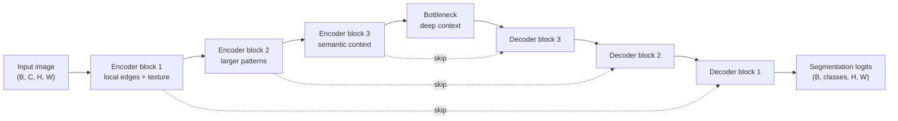

# U-Net

## Plain-Language Overview

U-Net is a segmentation architecture built around a simple idea: first compress
the image to understand context, then expand it back to the original resolution
while reusing fine details from earlier layers.

It became a core medical image segmentation baseline because medical boundaries
often require both global context and precise local information.

## What Problem It Solved

Early dense prediction models could produce pixel-level outputs, but medical
segmentation often needs sharper localization from limited annotated data. U-Net
made this easier by combining a contracting encoder, an expanding decoder, and
skip connections that copy high-resolution features into the decoder.

## Visual Architecture Schematic

This is an original schematic for this book, not a copied paper figure.

## Step-By-Step Walkthrough

1. The encoder applies convolution blocks and downsampling. Each stage reduces
   spatial resolution and increases feature channels.
2. The bottleneck processes the smallest feature map, where the model has the
   widest contextual view.
3. The decoder upsamples the feature map step by step.
4. At each decoder stage, the model concatenates the upsampled features with the
   matching encoder features.
5. A final 1x1 convolution maps decoder features to segmentation logits.

## What Changed Relative To FCN

U-Net keeps dense prediction but adds a symmetric encoder-decoder shape and
explicit skip connections between matching resolutions. These skip connections
help restore spatial detail that would otherwise be weakened by downsampling.

## Strengths

- Strong baseline for biomedical segmentation.
- Easy to understand and adapt.
- Preserves spatial detail through skip connections.
- Works with synthetic tests and small forward-pass demos without clinical data.

## Limitations

- The basic version is local-convolution dominated and may miss long-range
  context.
- The 2D version processes slices, not full 3D volumes.
- Strong real-world performance depends on data quality, preprocessing, loss
  choice, augmentation, and evaluation design.

## Implementation Status

| Field | Value |
| --- | --- |
| Status | implemented |
| Code | `src/medseg_architectures/models/unet.py` |
| Registry name | `unet2d` |
| Tests | `tests/test_model_shapes.py` |
| Demo | `demos/demo_forward_pass.py` |
| Data used in tests/demo | synthetic tensors only |

## Model Details

| Field | Value |
| --- | --- |
| Year | 2015 |
| Parent | FCN |
| Family | U-Net family |
| Paper title | U-Net: Convolutional Networks for Biomedical Image Segmentation |
| DOI | `10.1007/978-3-319-24574-4_28` |
| arXiv | `1505.04597` |

## Read The Original Paper

- DOI: [10.1007/978-3-319-24574-4_28](https://doi.org/10.1007/978-3-319-24574-4_28)
- arXiv: [1505.04597](https://arxiv.org/abs/1505.04597)
