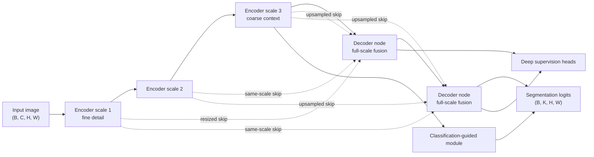

# UNet 3+

## Plain-Language Overview

UNet 3+ extends the U-Net skip-connection family. Instead of connecting a
decoder stage only to a same-depth encoder feature, it connects each decoder
node to feature maps from all encoder scales at the same time.

This makes the decoder see fine detail, middle-scale structure, and coarse
context together when it rebuilds the segmentation output.

## What Problem It Solved

U-Net uses direct same-resolution skip connections, and U-Net++ refines those
skip paths with nested dense nodes. UNet 3+ pushes the skip idea further by
making decoder fusion full-scale: each decoder node receives information from
all encoder scales, not just the matching-depth feature map.

The supplied source description also notes two training and prediction
additions: deep supervision on every decoder output and a classification-guided
module that reduces over-segmentation on images containing no target organ.

## Visual Architecture Schematic

This is an original schematic for this book, not a copied paper figure.



## Step-By-Step Walkthrough

1. The encoder creates feature maps at multiple spatial resolutions.
2. A decoder node gathers resized features from every encoder scale.
3. The node fuses same-scale, downsampled, and upsampled information into a
   full-scale representation.
4. Decoder outputs can receive deep supervision.
5. The classification-guided module can suppress target masks when the image
   contains no target organ.
6. The final decoder output is projected to segmentation logits.

## Minimum Architecture Form

Core building blocks:

- U-Net-style encoder levels.
- Decoder nodes that resize features from all encoder scales.
- Concatenation or fusion after full-scale feature alignment.
- Deep supervision heads on decoder outputs.
- A classification-guided branch for target-presence gating.
- A final segmentation head.

Tensor shape flow:

```text
Input image:          (B, C, H, W)
Fine encoder feature: (B, F, H, W)
Mid encoder feature:  (B, 2F, H/2, W/2)
Deep encoder feature: (B, 4F, H/4, W/4)
Full-scale decoder:   (B, G, H, W)
Output logits:        (B, K, H, W)
```

`B` is batch size, `C` is input channels, `F` and `G` are feature-channel
counts, and `K` is the number of output classes or masks. See
[Tensor Shape Notation](../foundations/how-to-read-an-architecture.md#tensor-shape-notation)
for the general notation used across the book.

Repo-authored pseudocode:

```text
encode the image at multiple scales
for each decoder scale:
    resize every encoder feature to the decoder scale
    concatenate the aligned full-scale features
    refine the fused feature with convolutions
attach deep supervision heads to decoder outputs
use classification guidance to suppress absent-target masks
return final segmentation logits
```

??? example "Minimum runnable PyTorch sketch"

    ```python
    import torch
    from torch import nn
    from torch.nn import functional as F


    def conv_block(in_channels: int, out_channels: int) -> nn.Sequential:
        return nn.Sequential(
            nn.Conv2d(in_channels, out_channels, kernel_size=3, padding=1),
            nn.ReLU(inplace=True),
        )


    class MinimumUNet3PlusStyleSegmenter(nn.Module):
        def __init__(self, in_channels: int, out_channels: int) -> None:
            super().__init__()
            self.enc1 = conv_block(in_channels, 8)
            self.enc2 = conv_block(8, 16)
            self.enc3 = conv_block(16, 32)
            self.fuse = conv_block(8 + 16 + 32, 16)
            self.out = nn.Conv2d(16, out_channels, kernel_size=1)
            self.presence = nn.Sequential(nn.AdaptiveAvgPool2d(1), nn.Flatten(), nn.Linear(32, 1))

        def forward(self, x: torch.Tensor) -> torch.Tensor:
            e1 = self.enc1(x)
            e2 = self.enc2(F.max_pool2d(e1, kernel_size=2))
            e3 = self.enc3(F.max_pool2d(e2, kernel_size=2))
            target_size = e1.shape[-2:]
            full_scale = torch.cat(
                (
                    e1,
                    F.interpolate(e2, size=target_size, mode="bilinear", align_corners=False),
                    F.interpolate(e3, size=target_size, mode="bilinear", align_corners=False),
                ),
                dim=1,
            )
            logits = self.out(self.fuse(full_scale))
            gate = torch.sigmoid(self.presence(e3)).view(x.shape[0], 1, 1, 1)
            return logits * gate


    model = MinimumUNet3PlusStyleSegmenter(in_channels=1, out_channels=2)
    image = torch.randn(1, 1, 32, 32)
    logits = model(image)
    assert logits.shape == (1, 2, 32, 32)
    ```

## Tensor-Shape Intuition

The defining shape move is feature alignment. A decoder node cannot concatenate
multi-scale tensors until they share the same spatial size, so shallow features
may be downsampled and deeper features may be upsampled to the decoder scale.

```text
Decoder target:       (B, *, H, W)
Fine skip aligned:    (B, F, H, W)
Mid skip aligned:     (B, 2F, H, W)
Deep skip aligned:    (B, 4F, H, W)
Fused decoder output: (B, G, H, W)
```

## Implementation Walkthrough

This repository does not provide a tested local UNet 3+ implementation. The
minimum code sketch above is educational only. It is not registered as a package
model, does not include a demo, does not load model weights, and does not claim
to reproduce the full paper.

## Learning Notes For Practitioners

- UNet 3+ completes the skip-connection sequence from U-Net to U-Net++ to
  full-scale skip fusion.
- The supplied source description highlights organs that appear at varying
  scales across patients as an important motivation.
- Full-scale skip fusion is a decoder design choice; it does not remove the need
  for careful preprocessing, target definition, loss choice, and validation.
- Deep supervision changes training signals, while classification guidance
  changes how absent-target cases are handled.

## What Changed Relative To U-Net++

U-Net++ builds nested dense skip pathways between encoder and decoder nodes.
UNet 3+ connects each decoder node to feature maps from all encoder scales
simultaneously, then adds deep supervision and a classification-guided module.

## Strengths

- Shows how decoder fusion can use all encoder scales at each decoder node.
- Fits the canonical skip-connection evolution arc: U-Net to U-Net++ to UNet 3+.
- The supplied source description notes that the accuracy improvement can come
  with fewer parameters than its predecessor.

## Limitations

- The local page is reference-only and does not include tested package code.
- The minimum sketch is not the full UNet 3+ architecture.
- Full-scale fusion adds tensor-alignment and memory-planning complexity.
- Reported paper behavior does not establish clinical readiness for a new
  modality, scanner, institution, or annotation protocol.

## Implementation Status

| Field | Value |
| --- | --- |
| Status | reference-only |
| Code in `src/` | No local `src/` implementation |
| Tests | No local tests |
| Demo | No local demo |
| Documentation-only page | Yes |
| Data scope | Synthetic examples only |
| Metadata ID | `unet3plus` |

!!! note "Educational scope"
    This repository is for education and research. This page does not claim
    clinical readiness.

## Model Details

| Field | Value |
| --- | --- |
| Year | 2020 |
| Parent | U-Net++ |
| Family | unet |
| Paper title | UNet 3+: A Full-Scale Connected UNet for Medical Image Segmentation |
| DOI | `10.1109/ICASSP40776.2020.9053405` |
| arXiv | `2004.08790` |
| Source note | Huang et al., ICASSP 2020 |

## Read The Original Paper

- DOI: [10.1109/ICASSP40776.2020.9053405](https://doi.org/10.1109/ICASSP40776.2020.9053405)
- arXiv: [2004.08790](https://arxiv.org/abs/2004.08790)
- Official code: [ZJUGiveLab/UNet-Version](https://github.com/ZJUGiveLab/UNet-Version)
