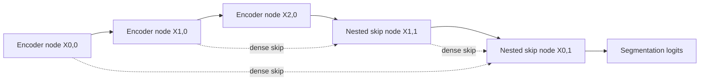

# U-Net++

## Plain-Language Overview

U-Net++ keeps the U-shaped encoder-decoder layout but replaces single direct
skip connections with nested dense skip pathways.

## What Problem It Solved

Direct U-Net skip connections join shallow encoder features with decoder
features. U-Net++ adds intermediate skip-processing nodes so the decoder receives
more refined features along the skip pathway.

## Visual Architecture Schematic

This is an original schematic for this book, not a copied paper figure.



## Step-By-Step Walkthrough

1. Encoder nodes produce features at multiple resolutions.
2. Decoder-like nested nodes upsample deeper features.
3. Each nested node concatenates features from earlier nodes at compatible
   resolutions.
4. The final shallow nested node produces segmentation logits.

## Minimum Architecture Form

Core building blocks:

- U-Net-style convolution blocks.
- Upsampling from deeper nodes.
- Dense concatenation between same-resolution skip nodes.
- A final segmentation head.

Tensor shape flow:

```text
Input image:        (B, C, H, W)
X0,0 shallow skip:  (B, F, H, W)
X1,0 deeper skip:   (B, 2F, H/2, W/2)
X0,1 nested skip:   (B, F, H, W)
Output logits:      (B, K, H, W)
```

Repo-authored pseudocode:

```text
build encoder nodes
upsample deep nodes toward shallow resolution
concatenate original and processed skip features
mix each concatenation with a convolution block
project final shallow nested node to logits
```

??? example "Minimum runnable PyTorch sketch"

    ```python
    import torch
    from torch import nn
    from torch.nn import functional as F


    def block(in_channels: int, out_channels: int) -> nn.Sequential:
        return nn.Sequential(
            nn.Conv2d(in_channels, out_channels, kernel_size=3, padding=1),
            nn.ReLU(inplace=True),
            nn.Conv2d(out_channels, out_channels, kernel_size=3, padding=1),
            nn.ReLU(inplace=True),
        )


    class MinimumUNetPP(nn.Module):
        def __init__(self, in_channels: int, out_channels: int) -> None:
            super().__init__()
            self.x00 = block(in_channels, 8)
            self.x10 = block(8, 16)
            self.x01 = block(8 + 16, 8)
            self.out = nn.Conv2d(8, out_channels, kernel_size=1)

        def forward(self, x: torch.Tensor) -> torch.Tensor:
            x00 = self.x00(x)
            x10 = self.x10(F.max_pool2d(x00, kernel_size=2))
            x10_up = F.interpolate(x10, size=x00.shape[-2:], mode="bilinear", align_corners=False)
            x01 = self.x01(torch.cat((x00, x10_up), dim=1))
            return self.out(x01)


    model = MinimumUNetPP(in_channels=1, out_channels=2)
    image = torch.randn(1, 1, 32, 32)
    logits = model(image)
    assert logits.shape == (1, 2, 32, 32)
    ```

## Implementation Walkthrough

This repository does not provide a tested local U-Net++ implementation yet. The
minimum code sketch above is educational only. It is not registered as a package
model, does not include a demo, and does not claim to reproduce the full paper.

## Learning Notes For Practitioners

- The minimum form shows the nested skip idea with one shallow nested node.
- Full U-Net++ variants can include more nested nodes and deep supervision.
- Future local implementation work should add tests that verify all skip paths
  keep compatible spatial sizes.

## What Changed Relative To U-Net

U-Net++ changes the skip pathway from one direct connection into a nested set of
intermediate feature-fusion nodes.

## Strengths

- Makes skip-connection refinement explicit.
- Keeps a familiar encoder-decoder shape while adding richer skip processing.

## Limitations

- The local page is reference-only and does not include tested package code.
- Nested skip paths add implementation complexity and memory use.

## Implementation Status

| Field | Value |
| --- | --- |
| Status | reference-only |
| Code in `src/` | No local `src/` implementation |
| Tests | No local tests |
| Demo | No local demo |
| Documentation-only page | Yes |
| Data scope | Synthetic examples only |
| Metadata ID | `unetpp` |

!!! note "Educational scope"
    This repository is for education and research. This page does not claim
    clinical readiness.

## Model Details

| Field | Value |
| --- | --- |
| Year | 2018 |
| Parent | U-Net |
| Family | U-Net family, skip variants |
| Paper title | UNet++: A Nested U-Net Architecture for Medical Image Segmentation |
| DOI | `10.1007/978-3-030-00889-5_1` |
| arXiv | `1807.10165` |

## Read The Original Paper

- DOI: [10.1007/978-3-030-00889-5_1](https://doi.org/10.1007/978-3-030-00889-5_1)
- arXiv: [1807.10165](https://arxiv.org/abs/1807.10165)
