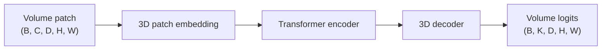

# UNETR

## Plain-Language Overview

UNETR uses a Transformer encoder for 3D medical image segmentation. A volume is
split into 3D patches, encoded as a token sequence, and decoded back into
volumetric segmentation logits.

## What Problem It Solved

UNETR brings Transformer-based context modeling to 3D segmentation while keeping
a decoder path that returns dense voxel-level predictions.

## Visual Architecture Schematic

This is an original schematic for this book, not a copied paper figure.



## Step-By-Step Walkthrough

1. Split a 3D input volume into patch tokens.
2. Run a Transformer encoder over the token sequence.
3. Reshape tokens back into a 3D feature grid.
4. Use a 3D decoder to restore volumetric logits.

## Minimum Architecture Form

Core building blocks:

- 3D patch embedding.
- Transformer encoder over patch tokens.
- 3D feature-grid reshape.
- 3D decoder projection.

Tensor shape flow:

```text
Input volume:      (B, C, D, H, W)
Patch grid:        (B, F, D/p, H/p, W/p)
Tokens:            (B, N, F)
Output logits:     (B, K, D, H, W)
```

Repo-authored pseudocode:

```text
embed 3D patches
flatten patch grid into tokens
encode tokens with a Transformer
reshape tokens into a 3D grid
upsample to voxel logits
```

??? example "Minimum runnable PyTorch sketch"

    ```python
    import torch
    from torch import nn


    class MinimumUNETR(nn.Module):
        def __init__(self, in_channels: int, out_channels: int, patch_size: int = 4) -> None:
            super().__init__()
            self.patch_size = patch_size
            self.patch = nn.Conv3d(in_channels, 16, kernel_size=patch_size, stride=patch_size)
            encoder_layer = nn.TransformerEncoderLayer(d_model=16, nhead=4, batch_first=True)
            self.transformer = nn.TransformerEncoder(encoder_layer, num_layers=1)
            self.decode = nn.ConvTranspose3d(16, 16, kernel_size=patch_size, stride=patch_size)
            self.out = nn.Conv3d(16, out_channels, kernel_size=1)

        def forward(self, x: torch.Tensor) -> torch.Tensor:
            grid = self.patch(x)
            batch, channels, depth, height, width = grid.shape
            tokens = grid.flatten(2).transpose(1, 2)
            tokens = self.transformer(tokens)
            grid = tokens.transpose(1, 2).reshape(batch, channels, depth, height, width)
            return self.out(self.decode(grid))


    model = MinimumUNETR(in_channels=1, out_channels=2)
    volume = torch.randn(1, 1, 16, 16, 16)
    logits = model(volume)
    assert logits.shape == (1, 2, 16, 16, 16)
    ```

## Implementation Walkthrough

This repository does not provide a tested local UNETR implementation yet. The
minimum code sketch above is educational only. It is not registered as a package
model, does not include a demo, and does not claim to reproduce the full paper.

## Learning Notes For Practitioners

- The minimum form shows the 3D patch-token bridge.
- Real implementations need decoder skip details, positional information, and
  careful volume-memory management.
- Future tests should cover patch divisibility and volumetric output shape.

## What Changed Relative To TransUNet

UNETR applies Transformer encoding directly to 3D volumetric segmentation.

## Strengths

- Makes 3D patch tokenization explicit.
- Keeps a dense 3D decoder target.

## Limitations

- The local page is reference-only and does not include tested package code.
- Tokenizing volumes can be memory intensive.

## Implementation Status

| Field | Value |
| --- | --- |
| Status | reference-only |
| Code in `src/` | No local `src/` implementation |
| Tests | No local tests |
| Demo | No local demo |
| Documentation-only page | Yes |
| Data scope | Synthetic examples only |
| Metadata ID | `unetr` |

!!! note "Educational scope"
    This repository is for education and research. This page does not claim
    clinical readiness.

## Model Details

| Field | Value |
| --- | --- |
| Year | 2022 |
| Parent | TransUNet |
| Family | 3D Transformer |
| Paper title | UNETR: Transformers for 3D Medical Image Segmentation |
| DOI | `10.1109/WACV51458.2022.00181` |
| arXiv | `2103.10504` |

## Read The Original Paper

- DOI: [10.1109/WACV51458.2022.00181](https://doi.org/10.1109/WACV51458.2022.00181)
- arXiv: [2103.10504](https://arxiv.org/abs/2103.10504)
