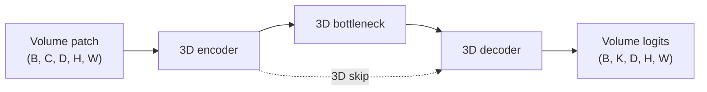

# V-Net

## Plain-Language Overview

V-Net adapts the encoder-decoder segmentation idea to 3D volumes. Instead of
processing one 2D slice at a time, the network uses 3D convolutions so depth,
height, and width are modeled together.

For the direct 2D U-Net-to-volume translation, see
[3D U-Net](3d-unet.md). V-Net is a related volumetric encoder-decoder branch
with its own design choices rather than a dependency of that page. Its most
important teaching points are full-volume thinking, a V-shaped 3D
encoder-decoder, and a Dice-style objective for highly imbalanced segmentation
targets.

## What Problem It Solved

Medical scans are often volumetric. A 2D slice model can segment each image
plane, but it cannot directly model whether anatomy continues, narrows, or
branches across neighboring slices. V-Net addresses that gap by using 3D
operations for dense segmentation of volume patches.

The original motivation was not just to make a larger 2D network. V-Net treated
segmentation as a volumetric prediction problem: the input is a 3D scan region,
the output is a 3D voxel mask, and the model learns local shape cues across
depth, height, and width together. That makes it a useful reference point for
tasks where the foreground structure is easier to identify from spatial
continuity than from a single slice.

V-Net also highlighted a training issue that is common in medical segmentation:
the foreground can occupy a small fraction of the volume. If a loss is dominated
by the many background voxels, the model can appear numerically successful while
still under-segmenting the structure of interest. Dice-style objectives compare
the predicted foreground region with the target foreground region, so they put
more direct pressure on overlap for imbalanced foreground/background problems.

## Visual Architecture Schematic

This is an original schematic for this book, not a copied paper figure.



## Step-By-Step Walkthrough

1. 3D convolution blocks extract local volumetric features.
2. Downsampling increases the receptive field across depth, height, and width.
3. The decoder upsamples and reuses encoder features through skip connections.
4. A final `1x1x1` convolution returns per-voxel logits.

## 3D U-Net vs V-Net

Both models belong to the 3D U-Net family in this book because both use
volumetric encoder-decoder segmentation. The practical distinction is that
[3D U-Net](3d-unet.md) is easiest to read as a direct dimensional upgrade of
U-Net, while V-Net is a parallel 3D design that emphasizes volumetric residual
blocks and Dice-style optimization.

| Topic | 3D U-Net | V-Net |
| --- | --- | --- |
| Input assumptions | 3D volume patches, with the original paper focused on dense predictions from sparse volumetric annotation. | 3D volume patches, with the original paper focused on fully convolutional volumetric medical segmentation. |
| Convolution type | Replaces U-Net's 2D convolution, pooling, upsampling, and output operations with 3D counterparts. | Uses 3D convolutional analysis and synthesis paths for voxelwise volume prediction. |
| Skip/fusion style | Keeps the familiar U-Net idea of matching encoder-to-decoder 3D skips. | Uses V-shaped encoder-decoder feature reuse with V-Net-specific block design rather than being only a literal 3D U-Net translation. |
| Loss emphasis | Often taught through sparse-label volumetric supervision and loss masking. | Strongly associated with a Dice-style objective for foreground/background imbalance. |
| Practical tradeoffs | Good starting point when you want the clearest extension from 2D U-Net to 3D tensors. | Good starting point when the task is volumetric, foreground is small, and overlap-oriented training behavior is central. |

## Minimum Architecture Form

Core building blocks:

- 3D convolution blocks.
- A 3D downsampling path.
- A 3D upsampling path with skip fusion.
- A `1x1x1` output projection.

Tensor shape flow:

```text
Input volume:     (B, C, D, H, W)
Encoder skip:     (B, F, D, H, W)
Bottleneck:       (B, 2F, D/2, H/2, W/2)
Output logits:    (B, K, D, H, W)
```

Repo-authored pseudocode:

```text
extract a 3D skip tensor
downsample to a smaller 3D feature map
process the bottleneck
upsample to the skip tensor size
concatenate skip and decoder features
project to per-voxel logits
```

??? example "Minimum runnable PyTorch sketch"

    ```python
    import torch
    from torch import nn


    class MinimumVNet(nn.Module):
        def __init__(self, in_channels: int, out_channels: int) -> None:
            super().__init__()
            self.enc = nn.Sequential(
                nn.Conv3d(in_channels, 8, kernel_size=3, padding=1),
                nn.ReLU(inplace=True),
            )
            self.down = nn.Conv3d(8, 16, kernel_size=3, stride=2, padding=1)
            self.up = nn.ConvTranspose3d(16, 8, kernel_size=2, stride=2)
            self.fuse = nn.Sequential(
                nn.Conv3d(16, 8, kernel_size=3, padding=1),
                nn.ReLU(inplace=True),
            )
            self.out = nn.Conv3d(8, out_channels, kernel_size=1)

        def forward(self, x: torch.Tensor) -> torch.Tensor:
            skip = self.enc(x)
            x = torch.relu(self.down(skip))
            x = self.up(x)
            if x.shape[-3:] != skip.shape[-3:]:
                x = nn.functional.interpolate(
                    x,
                    size=skip.shape[-3:],
                    mode="trilinear",
                    align_corners=False,
                )
            x = torch.cat((skip, x), dim=1)
            return self.out(self.fuse(x))


    model = MinimumVNet(in_channels=1, out_channels=2)
    volume = torch.randn(1, 1, 16, 32, 32)
    logits = model(volume)
    assert logits.shape == (1, 2, 16, 32, 32)
    ```

## Implementation Walkthrough

This repository does not provide a tested local V-Net implementation yet. The
minimum code sketch above is educational only. It is not registered as a package
model, does not include a demo, and does not claim to reproduce the full paper.

## Learning Notes For Practitioners

- The minimum form is intentionally small so the 3D tensor path is visible.
- V-Net is a useful starting point when the target is genuinely volumetric and
  a 2D slice model would miss through-plane context.
- Dice-style losses are useful when foreground voxels are rare compared with
  background voxels, but they do not remove the need for careful sampling,
  preprocessing, and validation metrics.
- Real 3D models need careful memory planning because volume tensors grow
  quickly across depth, height, width, channels, batch activations, and
  gradients.
- Patch size, batch size, feature width, and sliding-window inference strategy
  are architecture decisions, not just training details.
- Voxel spacing, orientation, cropping, and intensity normalization can change
  what the network sees as a local 3D pattern.
- Tests and demos for any future implementation should use small synthetic
  volumes unless a public, properly licensed dataset is configured.

## What Changed Relative To U-Net

V-Net moves the U-Net-style encoder-decoder idea from 2D image tensors to 3D
volume tensors. It is related to [3D U-Net](3d-unet.md), but it is not merely
the same page with a different name: V-Net is commonly taught for its
volumetric V-shaped design choices and Dice-style training objective, while 3D
U-Net is commonly taught as the direct 3D counterpart of the original U-Net
pattern.

## Strengths

- Models local structure across depth, height, and width.
- Fits volumetric segmentation tasks more directly than a slice-only 2D model.
- Makes overlap-oriented training central for imbalanced medical masks.
- Serves as a useful baseline family for organ, lesion, or anatomy segmentation
  where 3D context is important.

## Limitations

- The local page is reference-only and does not include tested package code.
- 3D convolutional models are more memory intensive than 2D slice models.
- Training often requires small patches, small batches, or both.
- Patch-based inference can introduce stitching and boundary considerations.
- Performance depends heavily on preprocessing choices such as voxel spacing,
  orientation, cropping, and intensity normalization.

## Implementation Status

| Field | Value |
| --- | --- |
| Status | reference-only |
| Code | Not implemented locally |
| Tests | Not implemented locally |
| Demo | Not implemented locally |
| Data used in examples | synthetic tensors only |
| Metadata ID | `vnet` |

!!! note "Educational scope"
    This repository is for education and research. This page does not claim
    clinical readiness.

## Model Details

| Field | Value |
| --- | --- |
| Year | 2016 |
| Parent | U-Net |
| Family | U-Net family, 3D |
| Paper title | Fully Convolutional Neural Networks for Volumetric Medical Image Segmentation |
| DOI | `10.1109/3DV.2016.79` |
| arXiv | `1606.04797` |

## Read The Original Paper

- DOI: [10.1109/3DV.2016.79](https://doi.org/10.1109/3DV.2016.79)
- arXiv: [1606.04797](https://arxiv.org/abs/1606.04797)
