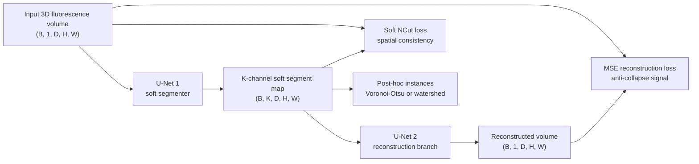

# WNet3D

## Plain-Language Overview

WNet3D is a self-supervised 3D cell segmentation architecture from the
CellSeg3D framework. It is designed for fluorescence microscopy settings where
unlabelled volumes are easier to collect than manually annotated 3D instance
masks.

The architecture trains two coupled U-Nets. The first U-Net turns the input
volume into a soft segmentation map. The second U-Net reconstructs the original
volume from that segmentation map. This reconstruction task pressures the
segmentation to preserve real image structure rather than collapse into an
arbitrary or single-region assignment.

This matters for microscopy because annotation is often the limiting resource.
WNet3D demonstrates a practical route: pretrain on unlabelled 3D confocal
stacks, then fine-tune with a small labelled set when labels become available.

## What Problem It Solved

3D instance masks are expensive to annotate. A conventional supervised 3D
segmenter needs labelled volumes before it can learn the target structure, and
that requirement can dominate the cost of a microscopy study.

WNet3D addresses that bottleneck by moving the main training signal to a
self-supervised objective. A soft normalized-cut loss encourages voxels with
similar local intensity patterns to stay together, while a reconstruction loss
keeps the segmentation informative enough to recreate the input image. Instance
IDs are then recovered after semantic segmentation by a non-neural
post-processing step such as Voronoi-Otsu labelling or connected-component
watershed.

## Visual Architecture Schematic

This is an original schematic for this book, not a copied paper figure.



## Step-By-Step Walkthrough

1. A single-channel 3D fluorescence volume enters the first U-Net.
2. The first U-Net predicts a `K`-channel soft segmentation map aligned with the
   input volume.
3. The second U-Net receives that soft segmentation map and reconstructs the
   original image volume.
4. Training combines a soft NCut loss on the segmentation map with an MSE
   reconstruction loss on the reconstructed image.
5. During inference, the soft segmentation map is converted into a semantic
   mask.
6. A post-processing step such as Voronoi-Otsu labelling or watershed converts
   the semantic output into instance labels.

## Key Modification

WNet3D replaces a fully supervised 3D instance-mask training setup with a
self-supervised NCut plus reconstruction objective. The NCut term encourages
locally coherent image regions to remain in the same segment. The
reconstruction term prevents the trivial solution where every voxel is assigned
to the same segment.

The architecture is W-shaped because it places two U-Net-style paths in series:
one U-Net maps image volume to soft segmentation, and the second maps soft
segmentation back to image volume. CellSeg3D is the broader toolbox and napari
workflow around this model; WNet3D is the core self-supervised architecture
documented here.

## Architecture Description

First U-Net:

- The first U-Net is the segmentation branch.
- It receives a 3D fluorescence volume with shape `(B, 1, D, H, W)`.
- It outputs a `K`-channel soft segment map with shape `(B, K, D, H, W)`.
- The `K` channels are soft region assignments, not final instance IDs.

Second U-Net:

- The second U-Net is the reconstruction branch.
- It receives the soft segmentation map from the first U-Net.
- It reconstructs the original input volume with shape `(B, 1, D, H, W)`.
- The reconstruction path makes the learned segmentation carry enough
  information to explain the input image.

NCut loss:

- The soft normalized-cut loss builds a differentiable brightness-affinity graph
  over 3D patches.
- It encourages spatially consistent regions by penalizing cuts through smooth
  or similar-intensity neighborhoods.
- Computing the affinity graph patch-wise keeps the objective tractable but
  makes training memory-sensitive for large volumes.

Reconstruction loss:

- The reconstruction loss compares the second U-Net output with the original
  input volume, typically with mean squared error.
- It prevents the segmentation branch from assigning all voxels to one segment,
  because a collapsed segmentation would not carry enough information to
  reconstruct the input image.

Post-hoc instance extraction:

- WNet3D produces a semantic or region-style segmentation representation.
- Instance IDs are derived afterward using Voronoi-Otsu labelling or
  connected-component watershed.
- This means some instance-separation failures can come from post-processing
  assumptions rather than from the learned soft segmentation itself.

## Minimum Architecture Form

Core building blocks:

- First 3D U-Net that maps the image volume to `K` soft segment channels.
- Second 3D U-Net that maps the soft segment map back to the input image space.
- Patch-based differentiable NCut objective over image affinities.
- Reconstruction objective between input volume and reconstructed volume.
- Post-hoc instance extraction using Voronoi-Otsu labelling or watershed.

Tensor shape flow:

```text
Input volume:       (B, 1, D, H, W)
U-Net 1 output:     (B, K, D, H, W)
U-Net 2 output:     (B, 1, D, H, W)
Training loss:      lambda * NCut(soft map, input)
                    + (1 - lambda) * MSE(reconstruction, input)
Inference labels:   soft map -> argmax -> binary mask -> instances
```

`B` is batch size, `K` is the configured number of soft segments, and `D`, `H`,
and `W` are depth, height, and width. See
[Tensor Shape Notation](../foundations/how-to-read-an-architecture.md#tensor-shape-notation)
for the general notation used across the book.

Repo-authored pseudocode:

```text
predict K-channel soft segment probabilities from the 3D image
reconstruct the input image from those soft segment probabilities
compute patch-wise NCut from image affinities and soft assignments
compute reconstruction MSE against the input image
optimize the weighted sum of NCut and reconstruction losses
convert soft segments to a semantic mask
run Voronoi-Otsu or watershed to produce instance IDs
```

??? example "Minimum educational PyTorch shape sketch"

    ```python
    import torch
    from torch import nn


    class MinimumWNet3D(nn.Module):
        """Shape-only sketch of WNet3D's two coupled 3D paths."""

        def __init__(self, segments: int) -> None:
            super().__init__()
            self.segmenter = nn.Sequential(
                nn.Conv3d(1, 8, kernel_size=3, padding=1),
                nn.ReLU(inplace=True),
                nn.Conv3d(8, segments, kernel_size=1),
                nn.Softmax(dim=1),
            )
            self.reconstructor = nn.Sequential(
                nn.Conv3d(segments, 8, kernel_size=3, padding=1),
                nn.ReLU(inplace=True),
                nn.Conv3d(8, 1, kernel_size=1),
            )

        def forward(self, volume: torch.Tensor) -> tuple[torch.Tensor, torch.Tensor]:
            soft_segments = self.segmenter(volume)
            reconstruction = self.reconstructor(soft_segments)
            return soft_segments, reconstruction


    model = MinimumWNet3D(segments=4)
    volume = torch.randn(1, 1, 8, 32, 32)
    soft_segments, reconstruction = model(volume)
    assert soft_segments.shape == (1, 4, 8, 32, 32)
    assert reconstruction.shape == (1, 1, 8, 32, 32)
    ```

This sketch only shows the W-shaped tensor contract. It does not implement the
CellSeg3D model, patch-wise NCut, CellSeg3D training workflow, or instance
post-processing.

## Tensor-Shape Intuition

WNet3D keeps the spatial shape aligned across the self-supervised tensor shape
walkthrough:

```text
Input:      1 x D x H x W volume
U-Net 1:    K x D x H x W soft segment map
U-Net 2:    1 x D x H x W reconstructed volume
Loss:       lambda * NCut(soft map, input)
            + (1 - lambda) * MSE(reconstruction, input)
Inference:  soft map -> argmax -> binary mask -> Voronoi-Otsu -> instances
```

The segmentation channels are intermediate soft assignments. They become useful
instance labels only after thresholding or semantic conversion plus a separate
instance extraction step.

## Implementation Walkthrough

This repository does not provide a tested local WNet3D implementation. The
shape sketch above is educational only. It is not registered as a package model,
does not include a demo, and does not claim to reproduce the full CellSeg3D
package behavior.

Approximating NCut for 3D volumes:

- The NCut objective needs a differentiable brightness-affinity graph that links
  nearby voxels according to image similarity and spatial proximity.
- Building that graph over an entire 3D volume is expensive, so WNet3D uses a
  patch-based approximation.
- The patch-based affinity calculation is the main reason memory use matters
  during training on large volumes.

Why reconstruction prevents collapse:

- NCut alone can prefer trivial assignments if all voxels are placed into one
  segment.
- The reconstruction branch makes that solution unhelpful because a single
  collapsed segment cannot encode enough image structure to rebuild the input.
- The weighted objective therefore balances coherent regions against
  information preservation.

Using CellSeg3D:

- CellSeg3D is the broader framework that exposes WNet3D.
- The official project provides a napari plugin, a Python API, and pretrained
  models.
- Use the upstream CellSeg3D package for real WNet3D training, inference, and
  model restoration rather than this reference-only page.

Fine-tuning protocol:

- Start by pretraining WNet3D on unlabelled 3D fluorescence stacks from the
  target imaging protocol.
- Inspect the semantic outputs and post-hoc instance extraction behavior.
- Fine-tune with at least one annotated volume when labels are available.
- Evaluate the final instance labels separately from the semantic segmentation
  map so post-processing failures are visible.

## Implementation Resources

- Official code: [AdaptiveMotorControlLab/CellSeg3D](https://github.com/AdaptiveMotorControlLab/CellSeg3D)

## Learning Notes For Practitioners

- WNet3D is a recommended starting point for 3D cell segmentation when annotated
  data is scarce: pretrain on unlabelled confocal stacks of cells, then
  fine-tune on a small annotated set.
- The NCut loss is sensitive to imaging artefacts such as photobleaching and
  uneven illumination. Apply illumination correction before training.
- The post-hoc Voronoi-Otsu instance step assumes roughly convex objects. For
  highly elongated cells, the instance extraction step, not necessarily the
  segmentation itself, is likely to be the failure point.
- Treat that failure mode as a concrete research gap: measure whether the soft
  segmentation separates foreground correctly before concluding that WNet3D has
  failed as a representation.

## What Changed Relative To Cellpose

Relative to [Cellpose](cellpose.md), WNet3D changes the annotation strategy.
Cellpose learns flow fields from annotated instance masks, then groups pixels or
voxels by following those flows. WNet3D learns from unlabelled volumes first,
using NCut and reconstruction to discover coherent regions before optional
fine-tuning.

The two methods also differ in their instance-recovery contract. Cellpose
predicts flow and cell probability maps that are directly tied to grouping by
flow convergence. WNet3D predicts soft semantic regions, then relies on
Voronoi-Otsu labelling or watershed to recover object IDs.

## Strengths

- Learns useful 3D segmentation structure from unlabelled fluorescence volumes.
- Reduces dependence on manually annotated 3D instance masks during pretraining.
- Keeps a U-Net-family encoder-decoder form that is familiar to medical imaging
  practitioners.
- Can be fine-tuned after self-supervised pretraining when a small labelled set
  becomes available.
- Separates representation learning from post-hoc instance extraction, making
  the failure source easier to inspect.

## Limitations

- The local page is reference-only and does not include tested package code.
- Patch-based NCut requires a differentiable brightness-affinity graph and can
  be memory-intensive for large 3D volumes.
- The method assumes useful boundaries can be inferred from local intensity
  patterns, so similar object and background fluorescence profiles are hard.
- Voronoi-Otsu instance extraction assumes object centers are identifiable as
  local intensity maxima.
- Roughly convex-object assumptions in post-processing can fail for highly
  elongated cells or uniformly labelled object shafts.
- Reported paper behavior does not establish clinical readiness for a new
  modality, annotation protocol, or deployment setting.

## Implementation Status

| Field | Value |
| --- | --- |
| Status | reference-only |
| Code in `src/` | No local `src/` implementation |
| Tests | No local tests |
| Demo | No local demo |
| Documentation-only page | Yes |
| Data scope | Synthetic examples only |
| Metadata ID | `wnet3d` |

!!! note "Educational scope"
    This repository is for education and research. This page does not claim
    clinical readiness.

## Model Details

| Field | Value |
| --- | --- |
| Year | 2024 |
| Parent | Cellpose |
| Family | instance-segmentation |
| Paper title | CellSeg3D: self-supervised 3D cell segmentation for fluorescence microscopy |
| Authors | Cyril Achard, Timokleia Kousi, Markus Frey, Maxime Vappiani, Thibault Bhend, Sebastián Sanchez Moran, Corinne Bhend, Nikita Dvornik, Frederique Bhend, Adrian Bhend, Shriya Bhend, Adrian Bhend, Mackenzie Mathis |
| Venue | eLife, 2024 |
| DOI | `10.7554/eLife.99848` |
| arXiv | `null` |

## Read The Original Paper

- DOI: [10.7554/eLife.99848](https://doi.org/10.7554/eLife.99848)
- Official code: [AdaptiveMotorControlLab/CellSeg3D](https://github.com/AdaptiveMotorControlLab/CellSeg3D)

```text
WNet3D citation
Title: CellSeg3D: self-supervised 3D cell segmentation for fluorescence microscopy
Authors: Cyril Achard, Timokleia Kousi, Markus Frey, Maxime Vappiani, Thibault Bhend, Sebastián Sanchez Moran, Corinne Bhend, Nikita Dvornik, Frederique Bhend, Adrian Bhend, Shriya Bhend, Adrian Bhend, Mackenzie Mathis
Venue: eLife, 2024
Year: 2024
DOI: 10.7554/eLife.99848
Official code: https://github.com/AdaptiveMotorControlLab/CellSeg3D
```
