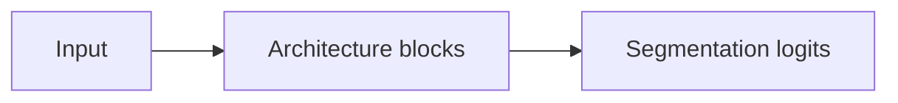

# Adding An Architecture

Use this checklist when adding a new architecture entry, chapter, or implementation.
The goal is to keep the book, metadata, code, tests, and demos aligned.

## Decision Checkpoint

Choose one status before editing files.

- [ ] `implemented`: the architecture has code, registry wiring, CPU-friendly
  shape tests, a synthetic demo, and a complete chapter.
- [ ] `reference-only`: the architecture is documented or tracked for learning
  and citation, but this repository does not provide tested code.
- [ ] `planned`: the project intends to add documentation or implementation
  later, but the work is not complete.
- [ ] `external-pipeline`: the entry is primarily an external framework or
  pipeline, not a model reimplemented here.
- [ ] `deprecated`: the entry is kept for historical context, but is no longer a
  project focus.

Do not mark an architecture as `implemented` until every implemented-architecture
item below is complete.

## Shared Checklist

- [ ] Verify the paper title, year, DOI, arXiv ID, and paper links from reliable
  sources. Do not invent missing metadata.
- [ ] Add or update the entry in `data/architectures.yml`.
- [ ] Set `implementation_status` to exactly one of `implemented`,
  `reference-only`, `planned`, `external-pipeline`, or `deprecated`.
- [ ] Include `slug`, `family`, `chapter_path`, and `paper_links`.
- [ ] Set `parent` to an existing architecture id or `null`.
- [ ] Describe the modification in neutral, source-supported language.
- [ ] Add only original repo-authored diagrams. Do not copy paper figures.
- [ ] Use synthetic data for tests and demos unless a public, properly licensed
  dataset is explicitly configured.
- [ ] Do not add private medical images, PHI, patient identifiers, DICOM headers,
  or clinical data.
- [ ] Update `ROADMAP.md` only when project-level direction, planned milestones,
  or active blockers change.

## Reference-Only Checklist

- [ ] Set `code_path: null`.
- [ ] Set `tests: false`.
- [ ] Set `demo: false`.
- [ ] Leave `chapter_path: null` if no chapter exists yet.
- [ ] If adding a chapter, include the chapter sections listed below, but make the
  implementation status clear.
- [ ] Update `docs/architectures/index.md` if the architecture should appear in
  the rendered architecture index.
- [ ] Update `docs/references.md` if references are maintained manually for the
  new entry.

## Planned, External-Pipeline, Or Deprecated Checklist

- [ ] Set `code_path: null` unless local educational code exists and the status
  is intentionally changed to `implemented`.
- [ ] Set `tests: false` and `demo: false` unless local tests and demos exist.
- [ ] Explain the status clearly in the architecture page if a page exists.
- [ ] Link to the original paper or upstream project when appropriate.
- [ ] Avoid implying that this repository provides a clinical-ready pipeline.

## Implemented Checklist

- [ ] Add model code under `src/medseg_architectures/models/`.
- [ ] Add educational docstrings that explain the model purpose, expected tensor
  shapes, important blocks, and output contract.
- [ ] Export the model from `src/medseg_architectures/models/__init__.py`.
- [ ] Register the constructor in `src/medseg_architectures/registry.py`.
- [ ] Add or update registry tests.
- [ ] Add CPU-friendly shape tests using synthetic tensors.
- [ ] Include at least one odd spatial shape when shape preservation matters.
- [ ] Add or update a synthetic demo that runs a forward pass without clinical
  data.
- [ ] Set `code_path` to the implementation file.
- [ ] Set `tests: true` and `demo: true`.
- [ ] Set `chapter_path` to the architecture chapter.
- [ ] Add `Implementation Walkthrough` and `Learning Notes For Practitioners` to
  the chapter.
- [ ] Add curated, collapsible code excerpts for the important implementation
  pieces.
- [ ] Add optional per-architecture supporting pages for full code, cookbook
  recipes, or live examples when they improve the learning value.
- [ ] Update `README.md` if the implementation should appear in the current
  implementation status table.

## Chapter Section Checklist

Use the U-Net chapter as the reference structure.

- [ ] `# Architecture Name`
- [ ] `## Plain-Language Overview`
- [ ] `## What Problem It Solved`
- [ ] `## Visual Architecture Schematic`
- [ ] `## Step-By-Step Walkthrough`
- [ ] `## What Changed Relative To Parent`
- [ ] `## Strengths`
- [ ] `## Limitations`
- [ ] `## Implementation Status`
- [ ] `## Model Details`
- [ ] `## Read The Original Paper`

Implemented chapters must also include:

- [ ] `## Implementation Walkthrough`
- [ ] `## Learning Notes For Practitioners`
- [ ] Collapsible code excerpts for important implementation pieces.
- [ ] Links to supporting pages when the architecture has full-code, cookbook,
  or live-example pages.

If the parent architecture is not known or the architecture starts a new family,
use `## What Changed Relative To Earlier Segmentation Models` instead of forcing
an inaccurate parent comparison.

When the parent is known, replace `Parent` with the specific architecture name in
the final chapter heading, such as `## What Changed Relative To FCN`.

## Code Excerpt Guidelines

Implemented architecture overview chapters should include small, curated code
excerpts in the `Implementation Walkthrough`. Use collapsible blocks for
overview excerpts that are longer than a few lines, and explain why the excerpt
matters before the toggle.

```markdown
The encoder stores high-resolution skip tensors before pooling so the decoder can
reuse spatial detail.

??? example "Code: encoder skip storage"

    ```python
    skips: list[torch.Tensor] = []

    for down_block in self.down_blocks:
        x = down_block(x)
        skips.append(x)
        x = self.pool(x)
    ```
```

Use these rules:

- [ ] Copy only repo-authored snippets from the implementation.
- [ ] Keep snippets short and focused on architecture behavior.
- [ ] Pair every snippet with prose explaining purpose, tensor flow, or tradeoff.
- [ ] Keep full source code on a supporting page instead of inside the overview
  chapter when the chapter would become too long.
- [ ] Show full source code directly on `code.md` supporting pages with a normal
  fenced code block, not a collapsible block.
- [ ] Do not replace the explanatory excerpts with an unstructured source dump.
- [ ] Keep snippets synchronized when implementation code changes.

## Supporting Pages

Implemented architectures can have a nested supporting area beside the overview
chapter. Use this when a full code listing, cookbook, or live example would make
the main architecture page too long.

Recommended structure:

```text
docs/architectures/architecture-slug.md
docs/architectures/architecture-slug/code.md
docs/architectures/architecture-slug/cookbook.md
docs/architectures/architecture-slug/live-example.md
```

Use the overview page for the architecture explanation and curated snippets.
Use supporting pages for:

- [ ] complete implementation code copied from repo-authored source;
- [ ] practical cookbook recipes based on synthetic tensors;
- [ ] live or executable examples that do not use clinical data.

Full-code supporting pages should show the source directly so readers can search
and scan the implementation without opening a toggle.

Keep `chapter_path` pointed at the overview chapter, such as
`docs/architectures/architecture-slug.md`.

## Metadata Skeleton

```yaml
- id: architecture_id
  slug: architecture-slug
  name: Architecture Name
  year: 2026
  family: Architecture family
  parent: parent_id_or_null
  chapter_path: docs/architectures/architecture-slug.md
  paper_title: "Exact Paper Title"
  doi: null
  arxiv: null
  paper_links:
    - kind: arxiv
      label: arXiv
      url: https://arxiv.org/abs/0000.00000
  modification: One sentence describing the architectural change.
  technical_summary: >
    Short technical summary for readers who know segmentation architectures.
  understandable_summary: >
    Short plain-language summary for the book and indexes.
  implementation_status: reference-only
  code_path: null
  tests: false
  demo: false
```

For implemented architectures, set:

```yaml
implementation_status: implemented
code_path: src/medseg_architectures/models/architecture_slug.py
tests: true
demo: true
```

## Chapter Skeleton

````markdown
# Architecture Name

## Plain-Language Overview

Explain the core idea in direct language.

## What Problem It Solved

Describe the limitation or gap this architecture addressed.

## Visual Architecture Schematic

This is an original schematic for this book, not a copied paper figure.



## Step-By-Step Walkthrough

1. Describe the input path.
2. Describe the main representation changes.
3. Describe the output path.

## Implementation Walkthrough

For implemented architectures, explain the repo implementation, module
structure, tensor shape flow, and any intentional simplifications.

Add collapsible code excerpts for important implementation pieces.

??? example "Code: important implementation piece"

    ```python
    # Short, repo-authored snippet.
    ```

## Implementation Resources

Link to deeper supporting pages when they exist.

- [Full Code](architecture-slug/code.md)
- [Cookbook](architecture-slug/cookbook.md)
- [Live Example](architecture-slug/live-example.md)

## Learning Notes For Practitioners

For implemented architectures, explain practical choices such as logits,
channel counts, synthetic tests, and shape contracts.

## What Changed Relative To Parent

Explain the architectural change relative to the parent architecture. Rename
this section if there is no accurate parent comparison.

## Strengths

- Add source-supported strengths.

## Limitations

- Add limitations and implementation boundaries.

## Implementation Status

| Field | Value |
| --- | --- |
| Status | reference-only |
| Code | Not implemented |
| Tests | Not implemented |
| Demo | Not implemented |
| Data used in tests/demo | synthetic tensors only, if implemented |

## Model Details

| Field | Value |
| --- | --- |
| Year | 2026 |
| Parent | Parent architecture or None |
| Family | Architecture family |
| Paper title | Exact Paper Title |
| DOI | `null` |
| arXiv | `null` |

## Read The Original Paper

- DOI: add link if available
- arXiv: add link if available
````

## Validation Commands

Run the relevant checks before considering the task done.

```sh
uv run --python 3.11 python scripts/validate_references.py
uv run --python 3.11 python scripts/validate_architecture_metadata.py
uv run --python 3.11 pytest
uv run --python 3.11 ruff check .
uv run --python 3.11 --group docs mkdocs build --strict
```

For implemented architectures, also run the synthetic demo:

```sh
uv run --python 3.11 python demos/demo_forward_pass.py
```
