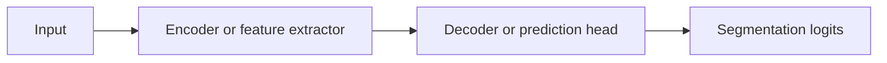

# Architecture Page Template

Copy this template when adding a new architecture page. Delete sections that
truly do not apply, but keep status, lineage, limitations, implementation
boundaries, and references.

````markdown
# Architecture Name

## Plain-Language Overview

Explain what this architecture is and why it matters in direct language.

## What Problem It Solved

Describe the limitation or gap this architecture addressed. Keep claims
source-supported and avoid unsupported benchmark language.

## Visual Architecture Schematic

This should be an original schematic for this book, not a copied paper figure.



## Step-By-Step Walkthrough

1. Describe the input path.
2. Describe the main representation changes.
3. Describe the output path.

## Minimum Architecture Form

Core building blocks:

- List the smallest set of blocks needed to see the architecture idea.

Tensor shape flow:

```text
Input:         (B, C, H, W)
Key feature:   (B, F, H/2, W/2)
Output logits: (B, K, H, W)
```

Briefly explain any symbols that are specific to this architecture. At minimum,
link readers to [Tensor Shape Notation](../foundations/how-to-read-an-architecture.md#tensor-shape-notation)
and define local symbols such as `F` for feature channels, `N` for token count,
or `p` for patch size.

Repo-authored pseudocode:

```text
describe the minimum data movement in a few lines
avoid claiming this is a full reproduction
return raw logits with the expected segmentation shape
```

??? example "Minimum runnable PyTorch sketch"

    ```python
    # Keep this synthetic, CPU-small, and educational.
    # Reference-only pages can include a sketch here without adding package code.
    ```

## Tensor-Shape Intuition

For 2D segmentation:

```text
Input:  (B, C, H, W)
Output: (B, K, H, W)
```

For 3D segmentation:

```text
Input:  (B, C, D, H, W)
Output: (B, K, D, H, W)
```

Where `B` is batch size, `C` is input channels or modalities, `K` is output
classes or masks, and `D`, `H`, and `W` are spatial dimensions. Define any
architecture-specific symbols near the shape table, and link readers to
[Tensor Shape Notation](../foundations/how-to-read-an-architecture.md#tensor-shape-notation)
for the general explanation.

## Implementation Walkthrough

For implemented architectures, explain the repo implementation, module
structure, tensor shape flow, and intentional simplifications.

Add curated, collapsible code excerpts for important implementation pieces.

??? example "Code: important implementation piece"

    ```python
    # Short, repo-authored snippet.
    ```

For reference-only, planned, external-pipeline, or deprecated entries, explain
that local implementation code is not provided.

## Implementation Resources

Link to deeper supporting pages when they exist. Replace these literal example
paths with links only after the pages exist:

- Full Code: `architecture-slug/code.md`
- Cookbook: `architecture-slug/cookbook.md`
- Live Example: `architecture-slug/live-example.md`

## Learning Notes For Practitioners

For implemented architectures, explain practical choices such as logits,
channel counts, synthetic tests, shape contracts, and known simplifications.

## What Changed Relative To Parent

Explain the architectural change relative to the parent architecture. Rename
this section if there is no accurate parent comparison.

## Strengths

- Add source-supported strengths.

## Limitations

- Add limitations and implementation boundaries.
- State when the local implementation is educational rather than complete.

## Implementation Status

| Field | Value |
| --- | --- |
| Status | reference-only |
| Code in `src/` | No local `src/` implementation |
| Tests | No local tests |
| Demo | No local demo |
| Documentation-only page | Yes |
| Data scope | synthetic tensors only, if implemented |
| Metadata ID | architecture-id |

!!! note "Educational scope"
    This repository is for education and research. This page does not claim
    clinical readiness.

## Model Details

| Field | Value |
| --- | --- |
| Year | 2026 |
| Parent | Parent architecture or None |
| Family | Architecture family |
| Paper title | Exact Paper Title |
| DOI | `null` |
| arXiv | `null` |

## Read The Original Paper

- DOI: add link if available
- arXiv: add link if available
````
