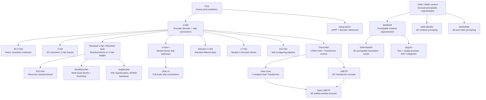

# Architecture Lineage

This map is a conceptual learning guide, not a strict genealogy. Arrows mean
"this architecture builds on, modifies, or is best understood after" the parent
idea.

## Main Branches

| Branch | Main Idea | Examples |
| --- | --- | --- |
| Dense prediction | Convert classification CNNs into pixel-level predictors. | [FCN](../architectures/fcn.md) |
| General CV context modules | Add multi-scale context and lightweight boundary refinement to dense prediction. | [DeepLabv3+](../architectures/deeplabv3plus.md) |
| U-Net family | Combine encoder context with decoder localization through skip connections. | [U-Net](../architectures/unet.md), [3D U-Net](../architectures/3d-unet.md), [V-Net](../architectures/vnet.md), [Residual U-Net / ResUNet-style variants](../architectures/resunet-style-variants.md), [R2U-Net](../architectures/r2unet.md), [MultiResUNet](../architectures/multiresunet.md), [SegResNet](../architectures/segresnet.md), [U-Net++](../architectures/unetpp.md), [UNet 3+](../architectures/unet3plus.md), [Attention U-Net](../architectures/attention-unet.md), [U²-Net](../architectures/u2net.md) |
| Pipeline self-configuration | Improve the whole segmentation pipeline, not only the model block. | [nnU-Net](../architectures/nnunet.md) |
| Transformer hybrids | Add attention-based global context to segmentation architectures. | [TransUNet](../architectures/transunet.md), [Swin-Unet](../architectures/swin-unet.md), [UNETR](../architectures/unetr.md), [Swin UNETR](../architectures/swin-unetr.md) |
| Promptable foundation models | Use prompts and broad pretraining for medical segmentation workflows. | [MedSAM](../architectures/medsam.md), [SAM-Med2D](../architectures/sam-med2d.md), [SAM-Med3D](../architectures/sam-med3d.md), [SegVol](../architectures/segvol.md), [MedSAM2](../architectures/medsam2.md) |

## Reading Order

Read [FCN](../architectures/fcn.md) first to understand dense prediction. Read
[DeepLabv3+](../architectures/deeplabv3plus.md) when you want general
computer-vision context for atrous convolution, ASPP, multi-scale context, and
boundary-refining decoders. Then read U-Net because many medical segmentation
variants are easier to understand as modifications of its encoder-decoder
shape. After that, split into 3D models such as
[3D U-Net](../architectures/3d-unet.md) and [V-Net](../architectures/vnet.md),
residual block variants such as
[Residual U-Net / ResUNet-style variants](../architectures/resunet-style-variants.md),
[R2U-Net](../architectures/r2unet.md), and
[MultiResUNet](../architectures/multiresunet.md), volumetric residual variants
such as [SegResNet](../architectures/segresnet.md), skip-connection variants
such as [U-Net++](../architectures/unetpp.md), [UNet 3+](../architectures/unet3plus.md),
and [Attention U-Net](../architectures/attention-unet.md), block-nesting
variants such as [U²-Net](../architectures/u2net.md), pipeline methods such as
[nnU-Net](../architectures/nnunet.md), and Transformer/foundation-model
branches. In the Transformer branch, read [TransUNet](../architectures/transunet.md)
for the CNN/Transformer hybrid bridge, [Swin-Unet](../architectures/swin-unet.md)
for shifted-window U-shaped 2D segmentation, [UNETR](../architectures/unetr.md)
for 3D Transformer encoding, and [Swin UNETR](../architectures/swin-unetr.md)
for shifted-window Transformer encoding in 3D. In the promptable branch, read
[MedSAM](../architectures/medsam.md) for the basic medical SAM-style interface,
[SAM-Med2D](../architectures/sam-med2d.md) for 2D medical adaptation, and
[SAM-Med3D](../architectures/sam-med3d.md) and [SegVol](../architectures/segvol.md)
for native volumetric promptable branches before [MedSAM2](../architectures/medsam2.md)
for 3D image and video-style prompting.
