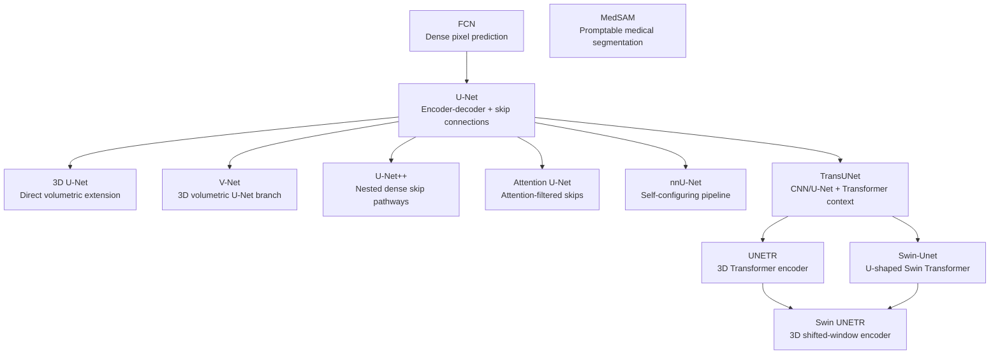

# Architecture Lineage

This map is a conceptual learning guide, not a strict genealogy. Arrows mean
"this architecture builds on, modifies, or is best understood after" the parent
idea.

## Main Branches

| Branch | Main Idea | Examples |
| --- | --- | --- |
| Dense prediction | Convert classification CNNs into pixel-level predictors. | FCN |
| U-Net family | Combine encoder context with decoder localization through skip connections. | [U-Net](../architectures/unet.md), [3D U-Net](../architectures/3d-unet.md), [V-Net](../architectures/vnet.md), U-Net++, Attention U-Net |
| Pipeline self-configuration | Improve the whole segmentation pipeline, not only the model block. | nnU-Net |
| Transformer hybrids | Add attention-based global context to segmentation architectures. | TransUNet, Swin-Unet, UNETR, Swin UNETR |
| Promptable foundation models | Use prompts and broad pretraining for medical segmentation workflows. | MedSAM |

## Reading Order

Read FCN first to understand dense prediction. Then read U-Net because many
medical segmentation variants are easier to understand as modifications of its
encoder-decoder shape. After that, split into 3D models such as
[3D U-Net](../architectures/3d-unet.md) and [V-Net](../architectures/vnet.md),
skip-connection variants, pipeline methods, and Transformer/foundation-model
branches. In the Transformer branch, read [TransUNet](../architectures/transunet.md)
for the CNN/Transformer hybrid bridge, [Swin-Unet](../architectures/swin-unet.md)
for shifted-window U-shaped 2D segmentation, [UNETR](../architectures/unetr.md)
for 3D Transformer encoding, and [Swin UNETR](../architectures/swin-unetr.md)
for shifted-window Transformer encoding in 3D.
