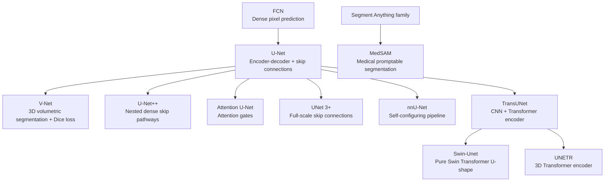

The best way to build this is as a **research-to-code repository**, not just a README. Make the README the front door, but keep the architecture metadata, summaries, tests, demos, and references in structured files so Codex can maintain them consistently.

Codex is a good fit for this because the CLI/IDE agent can inspect your repository, edit files, and run commands locally; OpenAI’s Codex docs also recommend giving it explicit **goal, context, constraints, and “done when” criteria** for better results. ([OpenAI Developers][1])

## Revised implementation strategy

Start with a lean, verifiable first milestone instead of building the full repository at once. The first milestone should create the research-to-code scaffold, the architecture metadata registry, one working `UNet2D` implementation, CPU-only shape tests, one synthetic Python demo, and basic metadata validation.

Treat the repository as two related things:

- a **reference catalog** for important medical image segmentation architectures
- an **implementation repository** for models that have tested code in `src/`

Every architecture in `data/architectures.yml` must declare whether it is `reference-only` or `implemented`. A reference-only entry can appear in the README, lineage diagram, and summaries, but it must not be presented as working code.

For v1, use plain PyTorch, pytest, and PyYAML. Delay MONAI, TorchIO, notebooks, public dataset scripts, and CI until the baseline project shape is stable. Synthetic data is the default for demos and tests; do not add private medical images, PHI, patient identifiers, DICOM headers, or clinical data. This project is for research and education, not clinical diagnosis.

Track completed work, current decisions, planned work, and blockers in `tracker.md` as the project evolves.

## 1. Recommended project structure

Use this as the eventual project structure. Do not create every file in the first milestone; start with the lean v1 scaffold described above, then add the remaining modules, docs, and demos as each architecture milestone needs them.

```text
medical-image-segmentation-architectures/
├── README.md
├── AGENTS.md
├── CITATION.cff
├── LICENSE
├── pyproject.toml
├── data/
│   └── architectures.yml
├── docs/
│   ├── architecture_lineage.md
│   ├── references.md
│   ├── summaries/
│   │   ├── unet.md
│   │   ├── unetpp.md
│   │   ├── attention_unet.md
│   │   ├── transunet.md
│   │   └── medsam.md
│   └── diagrams/
│       └── architecture_lineage.mmd
├── src/
│   └── medseg_architectures/
│       ├── __init__.py
│       ├── models/
│       │   ├── unet.py
│       │   ├── unetpp.py
│       │   ├── attention_unet.py
│       │   └── blocks.py
│       ├── losses.py
│       ├── metrics.py
│       └── registry.py
├── tests/
│   ├── test_model_shapes.py
│   ├── test_losses.py
│   ├── test_metrics.py
│   └── test_architecture_registry.py
├── demos/
│   ├── demo_synthetic_2d.ipynb
│   ├── demo_forward_pass.py
│   └── demo_readme_architecture_graph.py
└── scripts/
    ├── generate_readme_sections.py
    ├── generate_mermaid_diagram.py
    └── validate_references.py
```

The important idea: **do not hand-maintain everything in the README**. Keep architecture facts in `data/architectures.yml`, then generate the README table and diagram from that file. The registry should distinguish `reference-only` entries from `implemented` entries so documentation never implies code exists before it does.

## 2. Use `AGENTS.md` so Codex follows your rules

Codex supports repository-level `AGENTS.md` files that it reads before doing work, which makes it ideal for storing durable repo instructions like test commands, citation rules, and documentation conventions. ([OpenAI Developers][2])

Create this first:

```md
# AGENTS.md

## Project goal

This repository documents and implements important medical image segmentation architectures and their major modifications.

## Rules for Codex

- Do not invent paper titles, authors, DOIs, arXiv IDs, or claims.
- Every architecture in README.md must have an entry in data/architectures.yml.
- Every implemented architecture must have:
  - a model file under src/medseg_architectures/models/
  - a shape test under tests/test_model_shapes.py
  - a short demo under demos/
- Use synthetic data for tests and demos unless a public, properly licensed dataset is explicitly configured.
- Do not add private medical images, PHI, patient identifiers, DICOM headers, or clinical data to the repo.
- Keep tracker.md current when work is completed, plans change, or blockers are discovered.
- Keep tests CPU-friendly and fast.
- After code changes, run:
  - python -m pytest
- After documentation changes, run:
  - python scripts/validate_references.py
  - python scripts/generate_mermaid_diagram.py

## Documentation standard

Each architecture must include:

- technical summary
- understandable summary
- key modification relative to parent architecture
- paper reference
- DOI or arXiv ID
- implementation status
- limitations
- test/demo status

## Definition of done

A task is done only when the README, architecture registry, diagrams, tests, and references are consistent.
```

## 3. Start Codex in the repository

For the CLI route:

```bash
mkdir medical-image-segmentation-architectures
cd medical-image-segmentation-architectures
git init

npm i -g @openai/codex
codex
```

OpenAI’s current quickstart says Codex can be used from the app, IDE extension, CLI, or cloud; the CLI can be installed with npm or Homebrew and then launched with `codex`. ([OpenAI Developers][3])

For this project, I would use **local Codex CLI or IDE mode**, especially if you ever work near medical data. OpenAI notes HIPAA-compliant Codex use is supported only for eligible ChatGPT Enterprise workspaces when Codex is used in local environments, so keep demos synthetic or public/de-identified unless your environment is approved. ([OpenAI][4])

## 4. Use a structured architecture registry

Create `data/architectures.yml` like this:

```yaml
architectures:
  - id: fcn
    name: Fully Convolutional Network
    year: 2015
    parent: null
    paper_title: Fully Convolutional Networks for Semantic Segmentation
    doi: 10.1109/CVPR.2015.7298965
    arxiv: 1411.4038
    modification: Converts classification CNNs into pixel-to-pixel dense prediction networks.
    technical_summary: >
      FCN replaces fully connected layers with convolutional layers and upsamples
      coarse feature maps to produce dense segmentation maps.
    understandable_summary: >
      Instead of giving one label for an image, FCN gives a label for every pixel.
    implementation_status: reference-only
    code_path: null
    tests: false

  - id: unet
    name: U-Net
    year: 2015
    parent: fcn
    paper_title: "U-Net: Convolutional Networks for Biomedical Image Segmentation"
    doi: 10.1007/978-3-319-24574-4_28
    arxiv: 1505.04597
    modification: Adds a symmetric encoder-decoder with skip connections for precise localization.
    technical_summary: >
      U-Net uses a contracting path to capture context and an expanding path to recover
      spatial resolution, combining encoder and decoder features through skip connections.
    understandable_summary: >
      U-Net looks at the whole image for context while keeping fine details so it can
      draw accurate medical boundaries.
    implementation_status: implemented
    code_path: src/medseg_architectures/models/unet.py
    tests: true
```

This lets Codex add future architectures safely without breaking the README.

## 5. Build the README around a generated architecture map

GitHub supports Mermaid diagrams directly in Markdown files, so a Mermaid graph is the easiest way to show architecture branches inside the README. ([GitHub Docs][5])

Example README section:

````md
## Architecture lineage map

This diagram is a conceptual map of architectural influence and modifications, not a strict historical genealogy.


````

Do not make the diagram too detailed in the README. Put deeper explanations in `docs/architecture_lineage.md`.

## 6. Starter architecture reference list

Use this as your initial scope:

| Architecture    | Why include it                                                                                        | Reference metadata to store                                               |
| --------------- | ----------------------------------------------------------------------------------------------------- | ------------------------------------------------------------------------- |
| FCN             | General deep segmentation foundation: dense pixel prediction from CNNs.                               | DOI: `10.1109/CVPR.2015.7298965`, arXiv: `1411.4038`. ([arXiv][6])        |
| U-Net           | Core medical image segmentation baseline: contracting path, expanding path, skip connections.         | DOI: `10.1007/978-3-319-24574-4_28`, arXiv: `1505.04597`. ([Springer][7]) |
| V-Net           | 3D volumetric medical segmentation and Dice-style objective.                                          | DOI: `10.1109/3DV.2016.79`, arXiv: `1606.04797`. ([arXiv][8])             |
| U-Net++         | Shows nested dense skip pathways and deep supervision.                                                | DOI: `10.1007/978-3-030-00889-5_1`, arXiv: `1807.10165`. ([Springer][9])  |
| Attention U-Net | Adds attention gates to suppress irrelevant regions and focus on target structures.                   | arXiv: `1804.03999`. ([arXiv][10])                                        |
| UNet 3+         | Adds full-scale skip connections and deep supervision.                                                | arXiv: `2004.08790`. ([arXiv][11])                                        |
| nnU-Net         | Important because it reframes progress as pipeline self-configuration, not just architecture novelty. | DOI: `10.1038/s41592-020-01008-z`, arXiv: `1809.10486`. ([Nature][12])    |
| TransUNet       | Combines CNN/U-Net localization with Transformer global context.                                      | arXiv: `2102.04306`. ([arXiv][13])                                        |
| Swin-Unet       | Uses a U-shaped pure Transformer design with Swin Transformer blocks.                                 | arXiv: `2105.05537`. ([arXiv][14])                                        |
| UNETR           | Important 3D Transformer-based medical segmentation architecture.                                     | DOI: `10.1109/WACV51458.2022.00181`, arXiv: `2103.10504`. ([arXiv][15])   |
| MedSAM          | Represents the newer foundation-model/promptable segmentation branch for medical images.              | DOI: `10.1038/s41467-024-44824-z`, arXiv: `2304.12306`. ([Nature][16])    |

## 7. README layout

Use this README structure:

```md
# Medical Image Segmentation Architectures

## Purpose

A research-to-code map of major medical image segmentation architectures, showing how U-Net-style, Transformer-style, self-configuring, and foundation-model approaches evolved.

## Architecture lineage map

Mermaid diagram here.

## Implemented models

Generated table:
- architecture
- parent
- key modification
- code path
- test status
- demo status
- paper DOI/arXiv

## Quick start

Installation commands.

## Run a demo

Command for synthetic demo.

## Run tests

pytest command.

## Architecture summaries

### U-Net

Technical summary:
...

Understandable summary:
...

Modification:
...

Limitations:
...

Reference:
...

## Datasets

Explain that demos use synthetic data by default.
Mention optional public datasets.

## Reproducibility

- Python version
- dependency versions
- seeds
- hardware notes
- test commands

## Safety and limitations

This repository is for research and education, not clinical diagnosis.

## Citation

How to cite this repository and the original papers.
```

## 8. Code strategy

Start with **small, correct implementations**, not full training pipelines. The first implementation milestone should be a minimal `UNet2D`; other architectures can remain `reference-only` until their code, tests, and demos exist.

For the first implemented architecture, add:

```text
src/medseg_architectures/models/unet.py
tests/test_model_shapes.py
demos/demo_forward_pass.py
docs/summaries/unet.md
```

Your first tests should be shape and sanity tests:

```python
def test_unet_2d_output_shape():
    model = UNet2D(in_channels=1, out_channels=3, features=(16, 32, 64))
    x = torch.randn(2, 1, 128, 128)
    y = model(x)
    assert y.shape == (2, 3, 128, 128)
```

Add tests for:

```text
- forward pass shape
- odd/even image size handling
- binary vs multiclass output channels
- Dice loss returns finite value
- metric functions return expected values on toy masks
- model registry can instantiate every implemented architecture
```

Do **not** train full models inside normal tests. Use a plain Python demo script first; notebooks can be added later when the core project is stable.

## 9. Library choice

Use **plain PyTorch first**. The first milestone should keep dependencies small so the model implementation, metadata registry, tests, and documentation pattern are easy to review.

MONAI is a good later addition because it is a PyTorch-based open-source framework for healthcare imaging AI, and it is designed around standardized deep-learning workflows for medical imaging. ([MONAI][17])

TorchIO is also useful later for 3D preprocessing, augmentation, and patch-based sampling because it focuses on loading, preprocessing, augmenting, and sampling 3D medical images in PyTorch workflows. ([TorchIO][18])

Recommended v1 dependency direction:

```toml
# pyproject.toml
[project]
name = "medseg-architectures"
version = "0.1.0"
requires-python = ">=3.10"
dependencies = [
  "torch",
  "numpy",
  "pyyaml"
]

[project.optional-dependencies]
dev = [
  "pytest",
  "ruff"
]
```

Add MONAI, TorchIO, matplotlib, rich, mypy, and Jupyter only when a concrete milestone needs them.

## 10. Dataset/demo strategy

Start with **synthetic masks** so tests are safe and reproducible:

```text
- circles
- ellipses
- rectangles
- random blobs
- noisy background
```

Do not add private medical images, PHI, patient identifiers, DICOM headers, or clinical data. The project should remain safe to publish and run locally without any clinical data.

Then add optional public datasets later. The Medical Segmentation Decathlon is a good candidate because it was created to provide open medical imaging datasets across multiple segmentation tasks with standardized validation. ([Medical Decathlon][19])

Do not make public dataset download required for tests. Put dataset support behind optional scripts:

```text
scripts/download_msd_task.py
configs/datasets/msd_spleen.yaml
configs/datasets/msd_heart.yaml
```

## 11. Git branch strategy

Use Git branches for development, but do **not** keep every model as a permanent Git branch.

Better:

```text
main
├── feature/unet-baseline
├── feature/unetpp
├── feature/attention-unet
├── feature/transunet-docs
└── feature/readme-diagram-generator
```

Merge each one after:

```text
- architecture registry updated
- README generated
- tests passing
- demo added
- reference validated
```

The “branches” of architectures should live in the **Mermaid diagram and architecture registry**, not as long-lived Git branches.

## 12. Best Codex task sequence

Paste these into Codex one at a time.

### Prompt 1: scaffold the lean v1 repository

```text
Create the initial repository structure for a Python project called medical-image-segmentation-architectures.

Goal:
Set up a lean research-to-code project for medical image segmentation architectures.

Create:
- pyproject.toml
- README.md skeleton
- AGENTS.md
- src/medseg_architectures/
- tests/
- tests/test_architecture_registry.py
- demos/
- docs/
- data/architectures.yml
- tracker.md
- scripts/validate_references.py

Constraints:
- Use plain PyTorch, pytest, and PyYAML for v1.
- Do not add MONAI, TorchIO, notebooks, dataset downloaders, or heavy training code yet.
- Use synthetic data only.
- README should explain the project goal and include a placeholder Mermaid diagram.
- architecture metadata must live in data/architectures.yml.
- Every architecture entry must have implementation_status set to reference-only or implemented.
- tracker.md must log completed work, decisions, planned work, and blockers.

Done when:
- python -m pytest runs successfully
- README has the planned sections
- data/architectures.yml contains FCN, U-Net, V-Net, U-Net++, Attention U-Net, nnU-Net, TransUNet, Swin-Unet, UNETR, and MedSAM as reference entries
- scripts/validate_references.py verifies required metadata fields
```

### Prompt 2: implement the U-Net baseline

```text
Implement a clean, minimal 2D U-Net in src/medseg_architectures/models/unet.py.

Requirements:
- PyTorch nn.Module
- configurable in_channels, out_channels, feature sizes
- preserves input height/width in output
- simple DoubleConv blocks
- no training loop
- include docstrings

Also add:
- tests/test_model_shapes.py with shape tests
- demos/demo_forward_pass.py that runs a synthetic tensor through the model
- update data/architectures.yml to mark U-Net as implemented
- update tracker.md with the completed work and any follow-up items

Done when:
- python -m pytest passes
- python demos/demo_forward_pass.py runs
```

### Prompt 3: generate the README diagram from YAML

```text
Implement scripts/generate_mermaid_diagram.py.

Goal:
Read data/architectures.yml and generate docs/diagrams/architecture_lineage.mmd.

Rules:
- Use each architecture id, name, parent, and modification.
- If parent is null, make it a root node.
- Create Mermaid graph TD syntax.
- Keep labels short.
- Do not overwrite README automatically yet.

Also update README.md to include the generated Mermaid diagram manually.

Done when:
- python scripts/generate_mermaid_diagram.py creates the file
- the Mermaid syntax is valid-looking
- python -m pytest passes
```

### Prompt 4: add technical and understandable summaries

```text
For each architecture in data/architectures.yml, add two summary fields:
- technical_summary
- understandable_summary

Rules:
- Do not invent unsupported claims.
- Keep technical summaries precise.
- Keep understandable summaries readable for a non-specialist.
- Mention limitations where appropriate.
- Include DOI or arXiv ID when available.

Then create docs/summaries/*.md files from the YAML entries.

Done when:
- every architecture has both summaries
- scripts/validate_references.py verifies required fields are present
```

### Prompt 5: add CI

```text
Add a GitHub Actions workflow for this Python project.

Run:
- python -m pytest
- python scripts/validate_references.py
- python scripts/generate_mermaid_diagram.py

Use a normal Python setup.
Do not require GPU.
Do not download datasets.

Done when:
- workflow file exists under .github/workflows/tests.yml
- local pytest still passes
```

### Prompt 6: evaluate optional medical-imaging libraries

```text
Evaluate whether MONAI and TorchIO should be added now.

Goal:
Add them only if the next milestone needs medical-imaging-specific preprocessing, augmentation, patch sampling, or 3D workflows.

Rules:
- Do not add dependencies just because they are common in the field.
- Keep tests CPU-only.
- Do not download datasets in tests.
- Update README.md, pyproject.toml, and tracker.md if dependencies are added.

Done when:
- the decision is recorded in tracker.md
- dependency changes, if any, are justified by a concrete milestone
```

## 13. What “good” looks like

Your project is strong when someone can open the README and immediately see:

```text
1. What medical image segmentation is.
2. How FCN, U-Net, V-Net, U-Net++, Attention U-Net, nnU-Net, Transformers, and MedSAM relate.
3. What each architecture changed.
4. Which ones are implemented in the repo.
5. Which tests and demos prove the implementation works.
6. Which paper introduced each idea.
7. A technical explanation and a plain-language explanation.
```

Start with **U-Net + the registry + the diagram generator**. Once that foundation is clean, adding U-Net++, Attention U-Net, TransUNet, and others becomes repetitive and Codex will be much more reliable.

[1]: https://developers.openai.com/codex/cli "CLI – Codex | OpenAI Developers"
[2]: https://developers.openai.com/codex/guides/agents-md "Custom instructions with AGENTS.md – Codex | OpenAI Developers"
[3]: https://developers.openai.com/codex/quickstart "Quickstart – Codex | OpenAI Developers"
[4]: https://openai.com/index/work-with-codex-from-anywhere/ "Work with Codex from anywhere | OpenAI"
[5]: https://docs.github.com/en/get-started/writing-on-github/working-with-advanced-formatting/creating-diagrams?utm_source=chatgpt.com "Creating diagrams - GitHub Docs"
[6]: https://arxiv.org/abs/1411.4038?utm_source=chatgpt.com "Fully Convolutional Networks for Semantic Segmentation"
[7]: https://link.springer.com/chapter/10.1007/978-3-319-24574-4_28?utm_source=chatgpt.com "U-Net: Convolutional Networks for Biomedical Image Segmentation ..."
[8]: https://arxiv.org/abs/1606.04797?utm_source=chatgpt.com "V-Net: Fully Convolutional Neural Networks for Volumetric Medical Image Segmentation"
[9]: https://link.springer.com/chapter/10.1007/978-3-030-00889-5_1?utm_source=chatgpt.com "UNet++: A Nested U-Net Architecture for Medical Image Segmentation"
[10]: https://arxiv.org/abs/1804.03999?utm_source=chatgpt.com "Attention U-Net: Learning Where to Look for the Pancreas"
[11]: https://arxiv.org/abs/2004.08790?utm_source=chatgpt.com "UNet 3+: A Full-Scale Connected UNet for Medical Image Segmentation"
[12]: https://www.nature.com/articles/s41592-020-01008-z?utm_source=chatgpt.com "nnU-Net: a self-configuring method for deep learning-based biomedical ..."
[13]: https://arxiv.org/abs/2102.04306?utm_source=chatgpt.com "TransUNet: Transformers Make Strong Encoders for Medical Image Segmentation"
[14]: https://arxiv.org/abs/2105.05537?utm_source=chatgpt.com "Swin-Unet: Unet-like Pure Transformer for Medical Image Segmentation"
[15]: https://arxiv.org/abs/2103.10504?utm_source=chatgpt.com "UNETR: Transformers for 3D Medical Image Segmentation"
[16]: https://www.nature.com/articles/s41467-024-44824-z?utm_source=chatgpt.com "Segment anything in medical images - Nature Communications"
[17]: https://monai.readthedocs.io/en/latest/?utm_source=chatgpt.com "Project MONAI — MONAI 0 Documentation"
[18]: https://docs.torchio.org/?utm_source=chatgpt.com "TorchIO - TorchIO"
[19]: https://medicaldecathlon.com/?utm_source=chatgpt.com "Medical Segmentation Decathlon"
